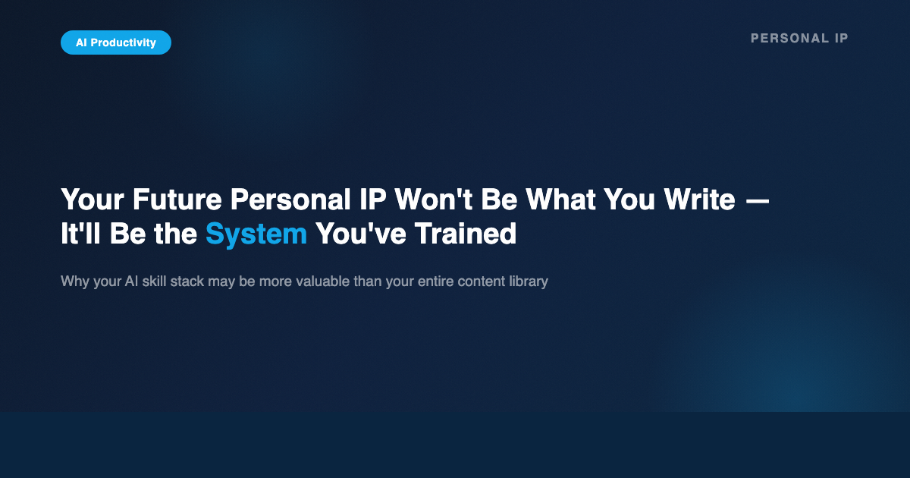
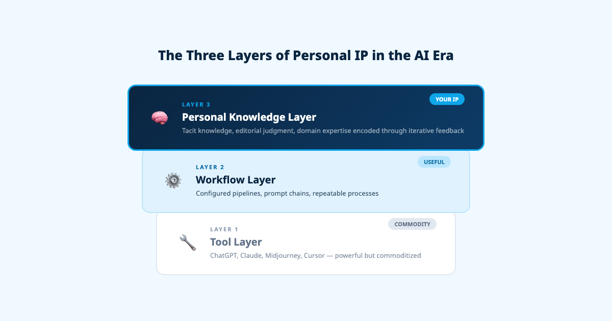
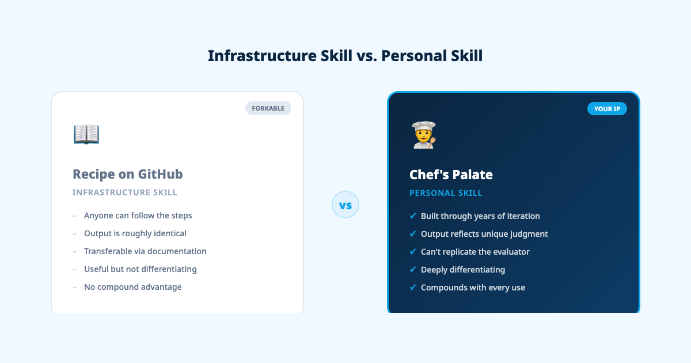
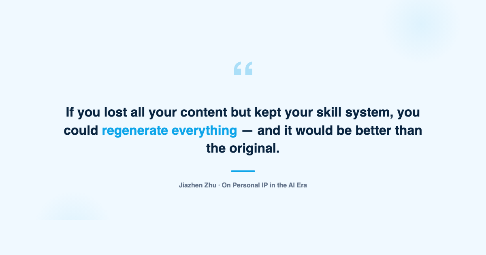

# Your Future Personal IP Won't Be What You Write — It'll Be the System You've Trained

## How the AI era is creating a new layer of intellectual property that compounds with every interaction — and why your skill stack matters more than your content library

---

For a decade, "personal IP" meant one thing: content. The articles you wrote, the videos you produced, the courses you sold, the speaking engagements you booked. Your brand was the sum of your public output. The advice was simple — publish consistently, find your voice, build an audience, and let the compound interest of content do its work.

That model isn't dying. But it's becoming the floor, not the ceiling.

I've spent 10+ years building data and AI products, I'm finishing my MBA at NYU Stern, and I guest lecture in computer science. I spend $450 a month on AI tools. And over the past 20 days, I produced a daily article series breaking down YC's legendary startup lectures — not by writing each one from scratch, but by building a system that could generate publication-ready content from my expertise and editorial judgment.

The most valuable thing I created during those 20 days wasn't the articles. It was the system behind them.

This article is about why that distinction matters — and why your future competitive advantage may depend less on what you publish and more on the depth of the personal systems you've trained.

---

## The Three Layers of Personal IP in the AI Era

Before AI, personal IP had two components: your knowledge (what you know) and your content (what you publish). The knowledge lived in your head. The content lived on platforms. The gap between the two was bridged by effort — the hours spent turning insight into publishable output.

AI introduces a third layer: the workflow system. This is the space between your knowledge and your content — the operational layer where your expertise gets encoded into repeatable processes that an AI can execute.

Think of it as a stack:

**Layer 1: Tool Layer.** These are the AI tools themselves — ChatGPT, Claude, Midjourney, Cursor. Everyone has access to them. They're powerful, but they're commodities. Using GPT-4 doesn't differentiate you any more than using Google Docs did in 2010.

**Layer 2: Workflow Layer.** This is where you configure, prompt, and chain tools together into repeatable processes. A content pipeline. A research workflow. An analysis framework. These workflows are more valuable than raw tools because they encode decisions about sequence, quality, and output format. But they're still largely transferable — someone could watch your process and replicate it.

**Layer 3: Personal Knowledge Layer.** This is where it gets interesting. This layer contains the tacit knowledge, editorial judgment, quality standards, and domain expertise that you've encoded into your AI systems through iterative feedback. It's the accumulation of every correction, every preference, every "no, not like that — like this" that shapes how your system performs.

Layer 3 is the new IP. And it's nearly impossible to replicate.

---

## Infrastructure Skills vs. Personal Skills

Not all AI skills are created equal. I've come to think about them in two categories.

**Infrastructure skills** are generic, transferable capabilities. A code review agent. A translation workflow. A PDF-to-summary converter. An automated email sorter. These are valuable — they save time and reduce friction. But anyone with moderate technical ability can build them. They're the equivalent of knowing how to use Excel: useful, expected, not differentiating.

**Personal skills** are something different entirely. They are your tacit knowledge externalized into a system that only you could have trained. Your editorial voice. Your analytical framework. Your quality standards. Your domain-specific judgment about what matters and what doesn't.

The metaphor I keep returning to is cooking. An infrastructure skill is a recipe posted on GitHub — anyone can follow it, and the output will be roughly the same. A personal skill is a chef's palate — developed over years of tasting, adjusting, failing, and refining. You can share the recipe. You cannot share the palate.

This distinction matters because it determines which AI capabilities create lasting advantage and which don't. If your AI workflow could be replicated by anyone who reads a tutorial, it's infrastructure. If it contains the accumulated weight of your professional judgment, it's personal IP.

---

## Why Personal Skills Can't Truly Be Forked

There's a tempting objection here: if the skill is just a file — a set of instructions, preferences, and rules — can't someone just copy it?

Technically, yes. Practically, no. And the gap between technically and practically is where the value lives.

Three dynamics make personal skills resistant to replication:

**1. The recipe vs. the palate.** You can copy my skill file. You'll get my rules, my preferences, my formatting standards. What you won't get is the ability to evaluate whether the output meets the standard. When my system generates a piece of content, I know instantly whether it sounds right — not because of the rules, but because of the decade of experience that produced the rules. The file is the recipe. The judgment is the palate. And the palate is what makes the recipe work.

**2. The compound effect.** Every piece of feedback I give my system gets encoded. "Don't use that phrasing — it sounds like a student, not a practitioner." "The slide overflow needs to be caught before export, not after." "Platform strategy for this channel requires posting at 18:30, not 9:00 AM." Each correction is small. But after hundreds of iterations, the system reflects a depth of operational knowledge that no single prompt could replicate. It's the difference between a first draft and a twentieth draft — except the drafts are the system itself.

**3. The widening gap.** Because personal skills compound, the gap between someone who started encoding their expertise six months ago and someone who starts today widens over time. My system today reflects 20 days of intensive, daily iteration on a specific content series. If you started the same project tomorrow with a copy of my skill file, you'd still be 20 days of feedback behind — and the quality gap would be visible in every output.

---

## Case Study: 20 Days, One Skill File, 20 Articles

Let me make this concrete.

I recently completed a 20-day series breaking down every lecture in YC's startup course. Each day, I published a long-form article on Medium, a LinkedIn post, and supporting visual assets. The entire operation ran through a single skill file — a document that encoded my editorial standards, content structure, design preferences, platform strategy, and quality checks.

On Day 1, the skill file was basic. It had my formatting preferences, a rough article structure, and some notes on tone. The output was good but required significant manual editing.

By Day 10, the skill file had absorbed dozens of corrections. "Use '今日拆解' not '今天学了什么' — the second sounds like a student taking notes, the first sounds like a practitioner dissecting a topic." "Always check slide content for overflow after rendering — don't wait for me to catch it." "Warm colors outperform cool colors on cover images. Dark backgrounds outperform white."

By Day 20, the system produced publication-ready content with minimal intervention. Not because the AI got smarter — but because the skill file got deeper. It encoded my voice, my standards, my platform knowledge, and my quality thresholds in a way that no generic prompt could approximate.

That skill file is now the most valuable artifact of the entire project. The 20 articles are the output. The skill file is the machine that generates the output. And the machine keeps improving.

---

## The Counterintuitive Truth: The System Is More Valuable Than the Content

This is the part that feels counterintuitive: the system you train may be more valuable than anything it produces.

Articles get read and forgotten. Videos get watched and archived. Courses get completed and shelved. Content has a half-life. It decays. The SEO value fades. The social engagement drops. What was relevant last month feels stale next quarter.

But the system that produces the content doesn't decay — it compounds. Every iteration makes it better. Every feedback loop tightens the output quality. Every new project you run through the system adds another layer of encoded expertise.

Think about it this way: if you lost all your published content tomorrow but kept your skill system, you could regenerate everything — and the regenerated version would be better than the original, because the system has continued to improve. If you lost your skill system but kept all your content, you'd have a library of static assets and no way to efficiently create more.

The system is the generative asset. The content is the artifact. And in the AI era, the generative asset is what compounds.

---

## What This Means for Your Career

If this framing is correct, it changes how you should think about professional development.

**Start encoding your expertise now.** Every day you spend working with AI without systematically capturing your feedback, preferences, and quality standards is a day of compound growth you're leaving on the table. The person who starts building their personal skill stack today will have an insurmountable advantage in two years.

**Invest in personal skills, not just infrastructure skills.** Learning to use AI tools is table stakes. Building generic workflows is useful but not differentiating. The real value is in encoding the domain-specific, experience-driven judgment that makes you uniquely good at what you do.

**Treat feedback as investment.** Every time you correct an AI output — every "not like that, like this" — you're making a deposit into a compounding account. The people who treat AI interaction as throwaway are missing the most valuable part of the exchange.

**Think in systems, not outputs.** The question is no longer "how many articles can I write?" It's "how deep is the system that generates my articles?" The depth of your system determines the quality of everything it produces — and quality, at scale, is the only sustainable advantage.

---

## Conclusion: Your Competitive Advantage Is Your Skill Stack

The personal IP landscape is shifting. Content still matters — it's how people find you, trust you, and decide to work with you. But underneath the content layer, a new form of intellectual property is emerging: the personal systems you've trained through iterative interaction with AI.

These systems encode your expertise in a way that's resistant to replication, compounds over time, and generates value at a scale that manual effort cannot match. They are, in the most literal sense, your professional knowledge made operational.

Your competitive advantage in the AI era won't be what you publish. It will be the depth of your personal skill stack — the accumulated weight of every correction, every preference, every judgment call you've encoded into the systems that work alongside you.

The people who understand this are already building. The gap is already widening. And the best time to start was six months ago. The second best time is today.

---

*Jiazhen Zhu builds data and AI products. 10+ years in the industry, MBA at NYU Stern, CS guest lecturer. For more on AI productivity and personal systems, [subscribe on Substack](https://substack.com/@jiazhenzhu).*