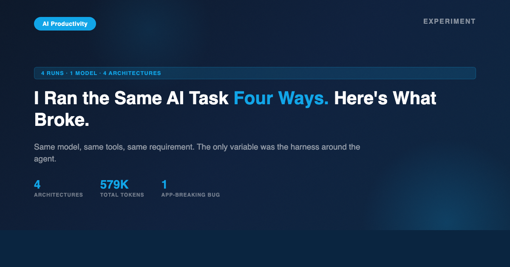
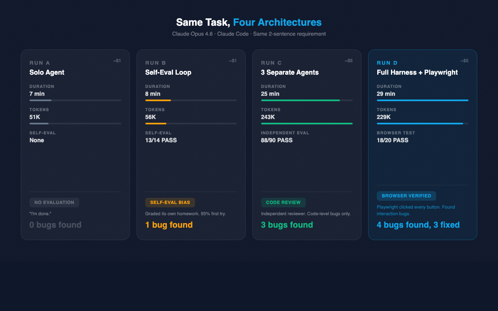
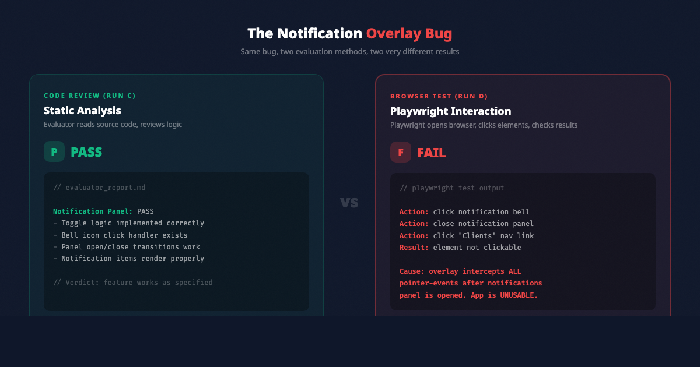

# I Ran One AI Task Through 4 Harness Architectures. Here's What Broke.

## Same model, same tools, same two-sentence requirement. Four architectures. Four very different outcomes.



---

You've probably used an AI agent to build something — a web app, a report, an analysis. The agent says "Done!" You open it, click around, and... half of it is broken. The AI was confident. The output was wrong.

This is the problem that **harness design** solves.

Anthropic recently published a deep dive on this exact topic: [Harness Design for Long-Running Application Development](https://www.anthropic.com/engineering/harness-design-long-running-apps). Their key finding? A solo agent produced a broken app for $9 in 20 minutes. A three-agent harness with a planner, generator, and Playwright-based evaluator produced a working app for $200 in 6 hours. Same model. Same task. The only difference was the architecture around it.

I wanted to test this myself. So I ran my own experiment — four architectures, same task, same model — to see if the theory holds in practice.

---

## What Is Harness Design — and Why Does It Matter?

Prompt engineering is about what you say to the model. Harness design is about what you build *around* it.

A harness is the scaffolding that controls how an AI agent plans, executes, evaluates, and iterates. It includes:

- **Agent decomposition:** How many agents, what role each plays
- **Artifact contracts:** What one agent produces for the next (specs, reports, test scripts)
- **Evaluation strategy:** Self-eval vs. independent eval vs. browser-based testing
- **Feedback loops:** Whether failures get routed back for fixes

The metaphor I keep coming back to: the model is the engine. The harness is the car. You can have a 500-horsepower engine, but without steering, brakes, and suspension, you're not getting anywhere safely.

**Why does this matter now?** Because AI agents are getting powerful enough to attempt complex, multi-hour tasks — but they still can't reliably evaluate their own work. Anthropic's research team [found](https://www.anthropic.com/engineering/harness-design-long-running-apps) that agents consistently praise their own output even when it's mediocre. LangChain [showed](https://blog.langchain.com/improving-deep-agents-with-harness-engineering/) that changing only the harness — not the model — improved benchmark scores from 52.8% to 66.5%.

The model isn't the bottleneck anymore. The architecture around it is.

**Prompt Engineering vs. Harness Design:**

- **Scope:** Single turn vs. multi-step, long-running workflows
- **What changes:** The model's instructions vs. the system around the model
- **Failure mode:** Bad output vs. cascading failures, premature completion
- **Analogy:** Writing a better recipe vs. building the kitchen

I ran an experiment to see exactly how much the harness matters.

---

## The Experiment

The task: build an Operator Dashboard -- a web-based interface for career coaches who manage multiple job-seeking clients through AI tools. Think Shopify merchant dashboard for career services.

The requirement was exactly two sentences long. Deliberately vague. The kind of brief you'd hand to a contractor and say "build this."

I ran it four times:

- **Run A:** One agent, no guardrails
- **Run B:** One agent with a self-evaluation loop
- **Run C:** Three separate agents (planner, generator, evaluator)
- **Run D:** Three agents plus Playwright browser testing and a feedback-fix cycle

Same model (Claude Opus 4.6). Same tools (Claude Code). Same two-sentence input. The *only* variable was the prompt architecture -- how I structured the agents around the task.

---

## Results: The Four Runs



Here's what happened across all four architectures:

**Run A — Solo Agent** (7 min, 51K tokens, ~$1)
One agent, no guardrails. Output: "I'm done." No evaluation. Zero bugs found because nobody checked.

**Run B — Self-Eval Loop** (8 min, 56K tokens, ~$1)
Same agent evaluates its own work. Self-assessed 13/14 features as PASS. Found 1 bug. Classic self-evaluation bias — the generator always thinks it's perfect.

**Run C — Three Separate Agents** (25 min, 243K tokens, ~$5)
Planner + Generator + independent Evaluator (code review only). Generator claimed 90/90 PASS. Independent evaluator found 88/90 with 3 code-level bugs. Better, but still only reading code — not using the product.

**Run D — Full Harness + Playwright** (29 min, 229K tokens, ~$5)
Three agents plus real browser testing and a feedback-fix cycle. Generator claimed 90/90 PASS. Playwright browser test: 18/20 PASS with 4 interaction-level bugs, including one that broke the entire app. Three rounds of fix cycles resolved 3 of 4 bugs.

A few things jump out.

**Run A finished fast and found nothing.** Seven minutes, "I'm done," no evaluation. It's the equivalent of a contractor saying "it's built" without ever testing the doors.

**Run B's self-eval was suspiciously clean.** 93% pass rate on first try. The agent decomposed the task into 14 features, built each one, checked its own work, and declared success. This is textbook self-evaluation bias -- a well-documented phenomenon in AI research.

**Run C added genuine value through separation.** Three independent agents meant the evaluator had never seen the code before. It found 3 real bugs and rated the output 8/10. But it was still reviewing *code*, not *behavior*.

**Run D found what code review cannot.** The Playwright browser tests actually clicked buttons, opened panels, and navigated pages. It discovered interaction bugs that were invisible in code.

---

## The Notification Overlay Bug

This is the finding that changed my thinking about evaluation.



Run D's Playwright evaluator discovered that after opening the notification panel, an invisible overlay element remained active on the page. This overlay intercepted *all pointer events* -- meaning after viewing your notifications, you couldn't click anything. The entire application was frozen.

Here's how each evaluation layer handled it:

- **Generator self-eval:** "PASS -- notification panel opens and closes correctly"
- **Run C code reviewer:** "PASS -- toggle logic is correctly implemented"
- **Run D Playwright:** "FAIL -- overlay intercepts all clicks after opening notifications"

The generator was right that the notification panel *opened*. The code reviewer was right that the toggle logic *looked correct*. But neither of them tried to click a button *after* closing the notification panel.

Only Playwright -- actually running in a browser, actually clicking elements -- could discover that the overlay's CSS `pointer-events` property wasn't being reset.

This bug made the app completely unusable after a single interaction with notifications. And no amount of code review would have caught it.

---

## Why Self-Evaluation Fails

My experiment confirmed what Anthropic's research has shown: AI models are unreliable self-evaluators.

In their work on [building effective agents](https://www.anthropic.com/engineering/building-effective-agents) and [evaluating AI systems](https://www.anthropic.com/research/evaluating-ai-systems), Anthropic highlights a core challenge: when the same model (or the same context window) generates and evaluates, it inherits its own blind spots.

Run B demonstrated this perfectly. The agent built a feature, then immediately evaluated it *within the same conversation context*. It had all the justifications for its design choices fresh in memory. Of course it passed itself -- it was grading its own homework.

Run C partially solved this by using a separate agent for evaluation. Different context, no memory of the build decisions. But it was still limited to code review -- reading source files and reasoning about whether the logic was correct.

Run D completed the picture by adding behavioral testing. The Playwright scripts didn't read code at all. They opened a browser, clicked elements, checked if the right things happened. This is the evaluation layer that catches state bugs, interaction bugs, and UX blockers.

The progression:

```
Run A: "I'm done" (no evaluation)
Run B: "I checked myself, 93% pass" (self-evaluation bias)
Run C: "Independent reviewer says 98% pass" (code review only)
Run D: "Browser test says 90% pass, found overlay bug
        that breaks the entire app" (interaction testing)
```

Notice the paradox: the *highest-fidelity* evaluation method produced the *lowest* score. That's not because the code was worse. It's because the testing was better.

---

## The Harness Is Just Prompt Architecture

Here's the insight that surprised me most: the entire difference between these four runs is just prompts.

```
Run A:  [Requirement] --> [Solo Agent] --> [Output]

Run B:  [Requirement] --> [Agent as Generator]
                      --> [Same Agent as Evaluator] --> [Output]

Run C:  [Requirement] --> [Planner Agent]    --> spec.md
                          [Generator Agent]  --> app/
                          [Evaluator Agent]  --> report.md

Run D:  [Requirement] --> [Planner]    --> spec.md
                          [Generator]  --> app/
                          [Evaluator]  --> Playwright tests
                          [Generator]  <-- fix feedback
                          [Evaluator]  --> re-test
                          (repeat until passing)
```

No custom frameworks. No fine-tuning. No specialized models. Just different prompts orchestrating the same model into different roles, producing different artifacts, with different evaluation strategies.

The planner prompt told the agent to *only* write a spec and not build anything. The generator prompt told it to read the spec and build sprint-by-sprint. The evaluator prompt told it to be "skeptical" and "assume the generator is overconfident."

The prompts *are* the harness.

This means harness design is accessible to anyone who can write structured prompts. You don't need a framework or a platform. You need a clear mental model of agent decomposition, artifact contracts, and evaluation strategies.

---

## When to Use Which Architecture

Not every task needs a full harness. Here's my practical guide based on this experiment:

**Solo Agent (Run A pattern)** -- Use for exploration, prototyping, or tasks where correctness doesn't matter much. Quick brainstorms, first drafts, "show me what's possible."

**Self-Eval Loop (Run B pattern)** -- Use for structured generation where you want feature decomposition and progress tracking, but the stakes are low. Blog posts, content outlines, simple scripts. Know that the eval is biased.

**Independent Eval (Run C pattern)** -- Use when correctness matters and bugs are costly. Code generation, data pipelines, anything that will be deployed. The separate evaluator perspective catches real issues.

**Full Harness with Browser Testing (Run D pattern)** -- Use for user-facing applications, interactive UIs, or anything where interaction bugs are unacceptable. The extra time and tokens pay for themselves in bug discovery.

The cost difference between Run C and Run D was negligible (~$5 each). But the confidence difference was enormous. Run D found and fixed 3 bugs that Run C's architecture couldn't even detect.

If you're building anything users will click on, browser-based evaluation isn't optional. It's where the real bugs live.

---

## Conclusion

The experiment taught me one thing clearly: the gap between a good AI output and a reliable AI output isn't about the model. It's about the harness.

Same engine, four cars. One had no steering. One had a speedometer that always read "perfect." One had a mechanic who could look at the engine. And one had a test driver who actually took it on the road.

The test driver found the bug that made the car undrivable.

If you're investing in AI capabilities, invest in harness design. The model will keep improving on its own. The architecture around it -- that's your job.

---

*Jiazhen Zhu has spent 10+ years building data and AI products at major tech companies, holds an MBA from NYU Stern, and serves as adjunct faculty teaching data courses at Northeastern University. He writes about AI productivity systems and the operational side of working with AI agents.*

*For more experiments and frameworks like this, subscribe on [Substack](https://substack.com/@jiazhenzhu).*
