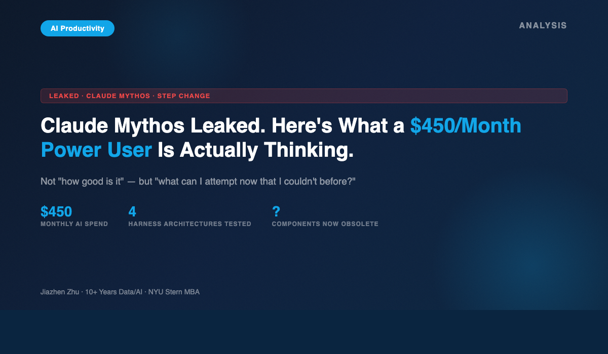
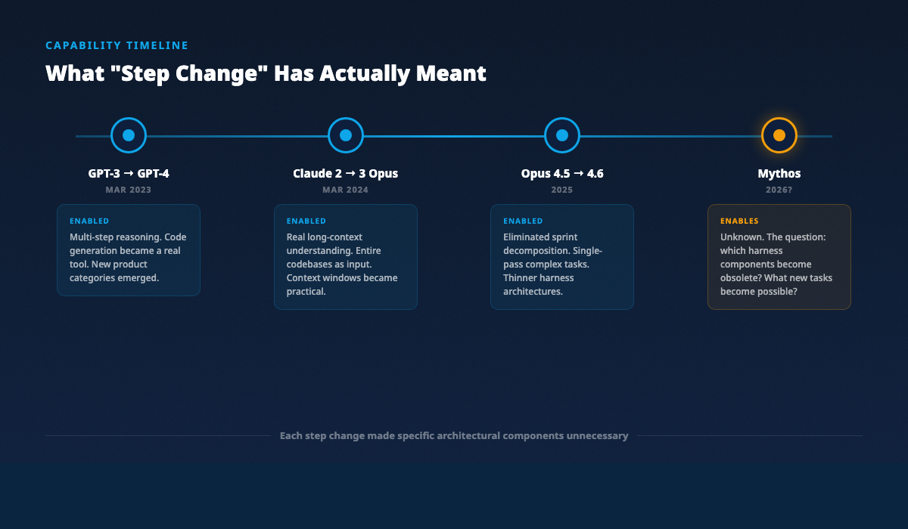
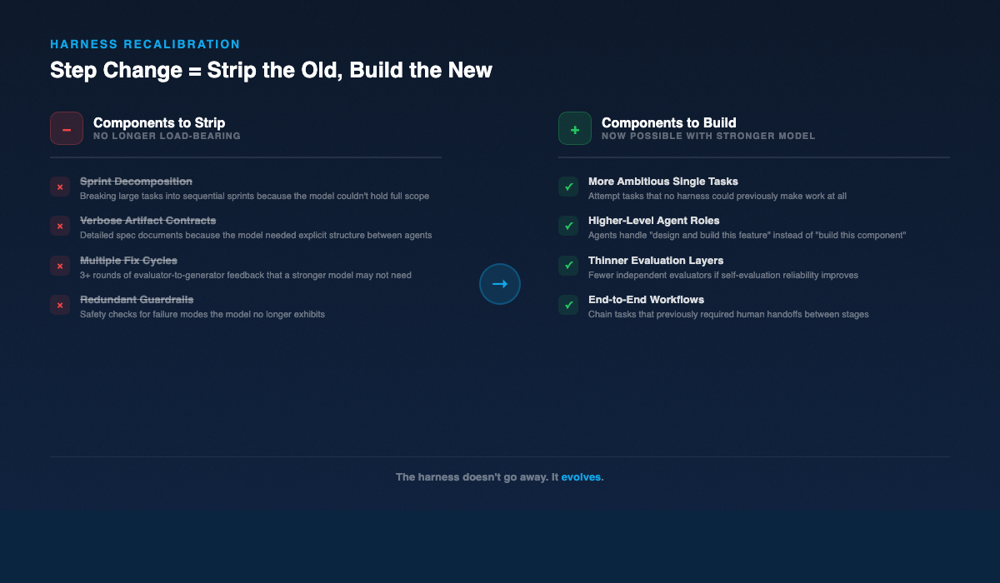

# Claude Mythos Leaked. Here's What a $450/Month Power User Is Actually Thinking About.

## It's not "how good is it." It's "what can I attempt now that I couldn't before."

---

Anthropic accidentally leaked details about their next model this week. "Claude Mythos" — described internally as a "step change" in capabilities. Currently testing with early access customers. Anthropic acknowledged it publicly after the leak spread.

My first reaction wasn't excitement. It was a question.

I spend $450 a month on AI tools, most of it on Claude. I've built multi-agent harness architectures around it. I've run systematic experiments to map its failure modes. Last week, I published [the results of running the same task through four different architectures](https://medium.com/@JiazhenZhu/i-ran-one-ai-task-through-4-harness-architectures-heres-what-broke-0758b68229dc) — same model, same tools, same two-sentence requirement. The harness mattered more than the model.

So when I hear "step change," I don't think *cool, better AI*. I think: **which parts of my workflow just became obsolete?**

---

## What We Know About Mythos

Not much, honestly. And I want to be careful here — I'm not a journalist chasing scoops. I'm a practitioner analyzing impact.

What's been reported (Fortune, Bloomberg, TechCrunch, March 26-28):

- Anthropic leaked details about a model called "Claude Mythos"
- It's described as a "step change" in capabilities
- It's currently in early access testing
- Anthropic acknowledged the leak publicly
- This comes alongside news that Anthropic is considering an IPO by October 2026
- Claude's paid subscriptions have more than doubled this year

That's the fact layer. Everything beyond that is speculation, and I'll leave the speculation to people who get paid for it.

What I can do is analyze what "step change" has meant historically — and what it means for how practitioners should prepare.

---

## What "Step Change" Has Actually Meant

The phrase "step change" gets thrown around a lot. But in AI capabilities, it has a specific practical meaning: **a model improvement that enables new categories of tasks, not just better performance on existing ones.**

Here's what real step changes looked like:

**GPT-3 to GPT-4 (March 2023):** Not just better text. Suddenly, multi-step reasoning worked. Code generation went from "interesting demo" to "useful tool." Entire product categories — AI coding assistants, document analysis tools, complex chatbots — became viable overnight.

**Claude 2 to Claude 3 Opus (March 2024):** Long-context understanding became real. You could give the model an entire codebase and get coherent analysis back. The "context window" went from a technical spec to a practical workflow feature.

**Claude Opus 4.5 to Claude Opus 4.6:** This is the one I felt personally. Opus 4.6 eliminated the need for sprint decomposition in my multi-agent harnesses. Tasks that previously required breaking work into 3-5 sequential sprints could be completed in a single pass. An entire layer of my harness architecture — the planner agent that wrote sprint specs — became dead weight.

Each step change didn't just make outputs better. It made specific architectural components unnecessary while making more ambitious architectures possible.

---

## The Real Question for Practitioners

The tech press is asking "how good is Mythos?" That's the wrong question.

The right question is: **what can I attempt now that I couldn't before?**

And its corollary: **what am I currently building that I no longer need?**

This is the part that most commentary misses. A step change in model capabilities doesn't just add power. It restructures the entire landscape of what's worth building around the model.

Anthropic's own research on [harness design for long-running applications](https://www.anthropic.com/engineering/harness-design-long-running-apps) makes this point implicitly. Their recommended architectures — planner/generator/evaluator pipelines, Playwright-based testing loops, artifact contracts between agents — all encode assumptions about what the model can and can't do reliably.

Every guardrail exists because the model failed at something. When the model stops failing at that thing, the guardrail becomes friction.

---

## Harness Design Doesn't Become Obsolete. It Becomes More Interesting.

Last week's experiment gave me a clear framework: **every harness component encodes an assumption about model limitations. When the model improves, re-audit the harness.**

Here's what that looks like in practice.

My four-architecture experiment tested: solo agent, self-eval loop, three-agent pipeline, and full harness with Playwright browser testing. The full harness found an app-breaking overlay bug that no other architecture caught.

But some components of that harness existed specifically because of Opus 4.6's limitations:

- **Sprint decomposition** — breaking a large task into sequential sprints because the model couldn't hold the full scope. Opus 4.6 already made this less necessary. If Mythos is a genuine step change, it might eliminate it entirely.
- **Verbose artifact contracts** — detailed spec documents passed between agents because the model needed explicit structure. A stronger model might work from a briefer spec.
- **Multiple fix cycles** — my evaluator-to-generator feedback loop ran three rounds. A better model might need one.

At the same time, a step change opens *new* harness possibilities:

- **More ambitious single tasks** — if the model can handle larger scope, you can attempt tasks that no harness could previously make work
- **Higher-level agent roles** — instead of "build this component," agents could handle "design and build this entire feature"
- **Thinner evaluation layers** — if self-evaluation improves, you might need fewer independent evaluators (though I'd still verify this empirically before trusting it)

The harness doesn't go away. It evolves. The components that compensated for yesterday's limitations get stripped out. New components that leverage tomorrow's capabilities get added.

---

## What I'm Planning When Mythos Drops

I have a concrete plan:

**Step 1: Re-run the exact same experiment.** Same task. Same two-sentence requirement. Same four architectures. New model. This gives me a direct comparison: which components still matter, and which ones Mythos has outgrown.

**Step 2: Test the boundaries.** Give the solo agent (Run A architecture) a task that previously required the full harness (Run D). See if the model alone can now handle what used to need three agents and Playwright testing.

**Step 3: Design a new harness.** Based on the results, build a harness that's calibrated to the new model's actual capabilities — not the old model's limitations.

This is the practitioner's response to a model upgrade. Not "great, everything is better now." But: **the calibration has shifted. Time to re-measure.**

---

## The Timing Is Interesting

This leak didn't happen in a vacuum. March 2026 has seen 12+ major model releases across the industry. Claude's paid subscriptions have more than doubled. Anthropic is eyeing an IPO.

The competitive pressure is real. And for practitioners, that pressure is actually good news. It means capability step changes are coming faster, which means the gap between "yesterday's best harness" and "today's optimal harness" is widening faster too.

If you're not regularly re-auditing your AI workflows against current model capabilities, you're accumulating architectural debt. You're paying the cost of guardrails that no longer guard anything.

---

## Conclusion

Model upgrades don't make harness design obsolete. They make it more interesting.

Every step change is an invitation to strip away the scaffolding you no longer need and build something more ambitious with the freed-up budget of capabilities.

I don't know yet what Mythos can do. Nobody outside Anthropic's early access program does. But I know exactly what I'll do when I get access: re-run my experiments, re-measure the boundaries, and rebuild my harnesses for a model that's moved the line.

That's the practitioner's job. Not to be impressed by capability announcements. To recalibrate.

---

*Jiazhen Zhu has spent 10+ years building data and AI products at major tech companies, holds an MBA from NYU Stern, and serves as adjunct faculty teaching data courses at Northeastern University. He writes about AI productivity systems and the operational side of working with AI agents.*

*For more experiments and frameworks like this, subscribe on [Substack](https://substack.com/@jiazhenzhu).*
