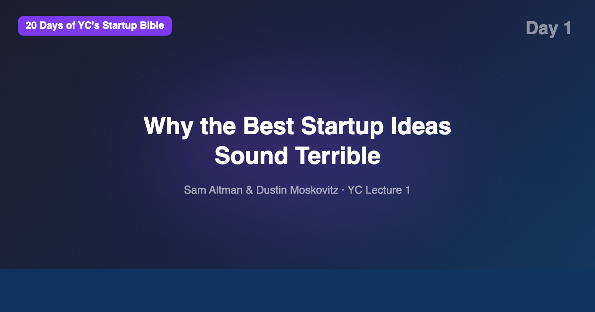
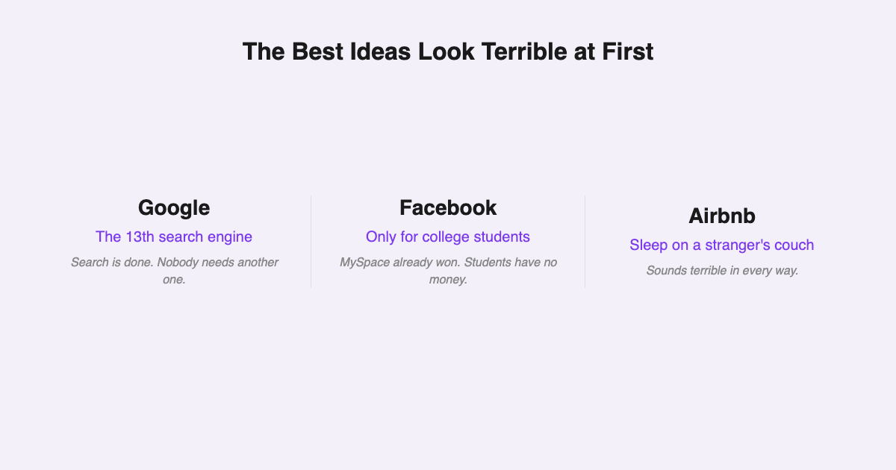
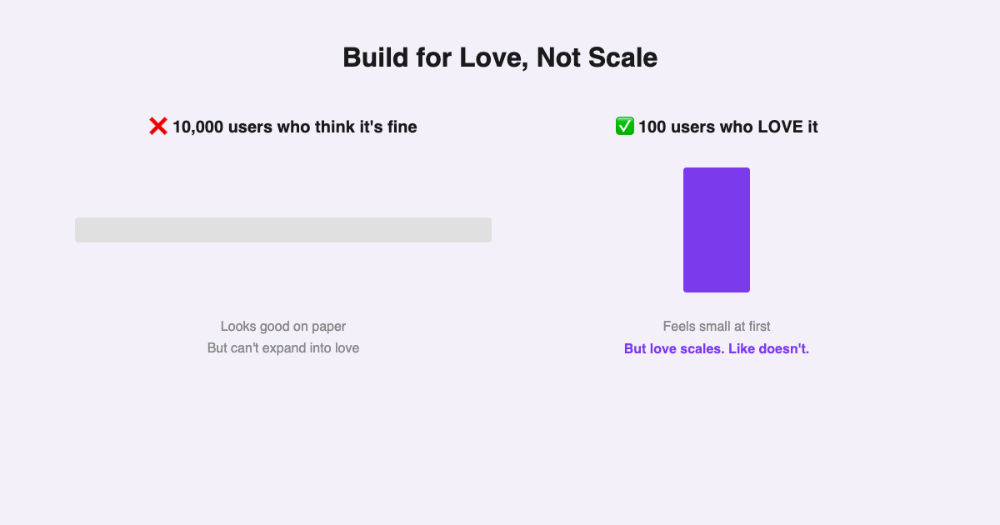
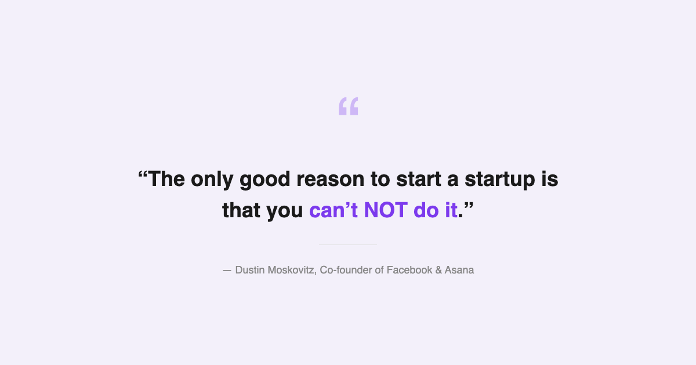

# YC's Startup Lesson #1: Why the Best Ideas Sound Terrible

## Sam Altman and Dustin Moskovitz on ideas, products, and the only good reason to start a company

*Day 1 of "20 Days of YC's Startup Bible" — a daily breakdown of Stanford's legendary CS183B lecture series.*

---

## Introduction

It's 6 AM and I'm sitting at my desk with a cup of coffee and a lecture from 2014 that has shaped more billion-dollar companies than any MBA textbook. This is Lecture 1 of Y Combinator's "How to Start a Startup" — Sam Altman and Dustin Moskovitz speaking to a packed auditorium at Stanford.

I've spent 10+ years building data and AI products in US tech. I'm currently finishing my MBA at NYU Stern and teaching CS as a guest lecturer. I've built data platforms, shipped AI features, and advised teams on technical strategy. And yet, within the first ten minutes of this lecture, Sam Altman said something that made me rethink everything I thought I knew about starting a company.

He shared a formula:

**Success = Idea x Product x Team x Execution x Luck**

Most of these scale from 1 to 10. But luck? Luck scales from 0 to 10,000. You can't control it, but you can put yourself in the best position to benefit from it — by getting the other four right.

This article is what I took away from Lecture 1. If you're thinking about starting something, or even if you're just curious about what makes great companies work, keep reading.

---

## Ideas Matter More Than You Think

Here's a belief I held for years: *"Ideas don't matter. Just start building, and you'll pivot your way to something good."*

Sam Altman disagrees — strongly.

He argues that the pivot myth has become dangerously popular. Yes, pivots happen. But great companies almost always start with a great idea. The idea doesn't have to be fully formed, but the seed has to be there. You need a market that's going to be large in 10 years. You need a thesis about the world that most people don't yet agree with.

Altman says the best framework is to think about the idea first and the startup second. Too many founders ask "What company should I start?" when they should be asking "What problem am I uniquely obsessed with?"

This hit me hard. I've been guilty of the "solution looking for a problem" approach more times than I'd like to admit. The lecture made me realize that the idea isn't just a starting point — it's the foundation that everything else is built on. A mediocre idea with great execution is still a mediocre company.

---

## The Best Ideas Look Like Bad Ideas

This was the most counterintuitive insight from the lecture, and arguably the most important one.

Altman explains that the best startup ideas share a strange quality: they sound terrible at first. And there's a logical reason for this. If an idea sounds obviously great, someone with more resources has already built it. The billion-dollar opportunities are hiding in the ideas that make smart people say, "That will never work."

The examples are now legendary:

- **Google** was the 13th search engine. Investors in the late '90s thought search was done — AltaVista, Yahoo, Lycos had it covered. Who needs another search engine?
- **Facebook** was a social network limited to college students with .edu email addresses. The TAM was tiny by design. It sounded like a niche toy.
- **Airbnb** asked people to sleep on strangers' air mattresses. Investors literally laughed at the pitch. Who would ever do that?

Each of these ideas had two properties: they sounded bad to most people, but they were actually good. That's the sweet spot. You want an idea in the intersection of "sounds bad" and "is actually good" — because that's where you get time and space to build before competitors notice.

This section of the lecture brought up a personal memory that still stings a little.

A few years ago, I had an idea for a shared kitchen platform — a marketplace where home cooks could rent commercial kitchen space by the hour. I thought it was brilliant. But when I dug into the legal complexity — health codes, liability, permits varying city by city — I got scared and dropped it. Looking back, those legal barriers were exactly the kind of moat that would have protected the business. The complexity that scared me away was the feature, not the bug.

I didn't have the conviction to push through an idea that "sounded bad." Lesson learned.

---

## Build for 100 Fans, Not 10,000 Users

Altman presents a framework that I think every founder should tattoo on their forearm:

**It is better to build something that 100 people love than something that 10,000 people kind of like.**

This feels wrong at first. Wouldn't you rather have 10,000 users? But Altman explains that love scales and like doesn't. If 100 people are obsessed with your product — if they'd be genuinely devastated if it disappeared — you have something real. You can grow from there. Word of mouth kicks in. Those 100 people become your evangelists.

But if 10,000 people think your product is "fine" — if they'd shrug and move on if it shut down — you have nothing. You have vanity metrics. You have a growth chart that's about to flatten.

Paul Graham calls this "making something people want," but Altman upgrades it to "making something people *love*." The bar is higher than most founders realize.

Practically, this means: talk to your users. Obsessively. Don't hide behind analytics dashboards. Get on the phone. Read every support ticket. Build features that your most passionate users are begging for, even if the majority of users haven't asked for them.

---

## The Only Good Reason to Start a Startup

Dustin Moskovitz, co-founder of Facebook and Asana, delivers the most sobering part of the lecture. His message is simple: **do not start a startup unless you can't not do it.**

He systematically dismantles every common reason people give for starting a company:

- **"I want to be my own boss."** You're not. As a startup CEO, everyone is your boss — your customers, your investors, your employees, the press. You have less autonomy, not more.
- **"I want flexibility."** You'll work harder than you ever have. The flexibility is an illusion.
- **"I want to get rich."** Joining an established growth-stage company often produces better financial outcomes. Moskovitz points out that Bret Taylor built Google Maps as employee #1,500. The impact and the compensation were enormous — without the existential risk of founding.
- **"I want impact."** Again, late-stage companies offer massive impact. You don't need to be a founder to change the world.

Then he gets real about the dark side. Founder depression is pervasive. Ben Horowitz says the number one job of a CEO is managing your own psychology. The stress isn't the glamorous kind you see in TechCrunch profiles. It's the "lying awake at 3 AM wondering if you can make payroll" kind.

So when should you start a company? Only when you feel a specific, almost irrational pull toward a problem. When you feel like you are the right person to solve it, the world genuinely needs it solved, and you simply cannot walk away from it.

This resonated with me deeply. I've been working on a chat-to-data project — a tool that lets non-technical users query databases using natural language. It started as a weekend experiment, but it's become the thing I think about in the shower, on my commute, during lectures. It's the kind of mission-driven excitement that Moskovitz is describing. I don't know if it's a startup. But I know I can't stop working on it. And according to this lecture, that's exactly the right signal.

---

## What Surprised Me Most

I expected this lecture to be about tactics — how to incorporate, how to find co-founders, how to raise money. Instead, it was almost entirely about mindset.

The biggest surprise was how much time Altman and Moskovitz spent *discouraging* people from starting startups. This is Y Combinator — the most famous startup accelerator in the world — and their opening lecture is essentially a warning label. "Don't do this unless you absolutely have to."

That level of honesty is rare. And it made me trust everything else they said a lot more.

The other surprise was the emphasis on ideas over execution. The current startup zeitgeist says execution is everything. Altman doesn't deny that execution matters — it's one of the four factors in his formula — but he insists that starting with a great idea is non-negotiable. You can't execute your way out of a bad idea.

---

## The AI/Data Angle

One thing Altman couldn't have predicted in 2014 is how dramatically AI has changed the startup landscape. His advice to "build something that a small number of users love" is even more relevant now — because AI has made it possible for a tiny team to build products that used to require 50 engineers.

From my experience building data products, I'd add a nuance to his framework: in the age of AI, the moat isn't the technology — it's the data and the domain insight. Everyone has access to the same LLMs. The founders who win will be the ones who deeply understand a specific problem, not the ones with the best prompt engineering.

This reframes the "idea vs. execution" debate. In 2014, execution meant hiring a great engineering team. In 2026, execution increasingly means having the right data strategy and knowing which AI capabilities to leverage where.

---

## Key Takeaways

- **Success = Idea x Product x Team x Execution x Luck.** You control four of these. Luck (0-10,000x) is the wild card, but a great foundation maximizes your odds.
- **Ideas matter more than the pivot myth suggests.** Great companies almost always start with a strong initial insight.
- **The best ideas sound terrible.** If everyone thinks your idea is great, the window is already closed.
- **Build for love, not scale.** 100 passionate users beat 10,000 indifferent ones.
- **CEO is not "the boss."** Everyone — customers, employees, investors — is your boss.
- **Only start if you can't NOT do it.** Passion, world-need, and personal fit must all align.
- **Founder mental health is a real concern.** Managing your own psychology is job #1.
- **Joining a growth-stage company is a legitimate path to impact.** Not everyone needs to be a founder.

---

## What's Next

This is Day 1 of my "20 Days of YC's Startup Bible" series, where I'm breaking down all 20 lectures from Stanford's CS183B. Tomorrow is **Day 2: Teams and Execution** — Sam Altman's deep dive into co-founder dynamics, hiring, and why you should fire fast.

If you're building something — especially at the intersection of AI, data, and a domain you care about — [subscribe to my newsletter](https://substack.com/@jiazhenzhu). I go deeper there, with angles I don't publish on Medium.

**Follow along for the full series. Day 2 drops tomorrow.**

---

## Resources

- [Watch Lecture 1 on YouTube](https://www.youtube.com/watch?v=CBYhVcO4WgI&list=PL5q_lef6zVkaTY_cT1k7qFNF2TidHCe-1) — Full 50-minute lecture
- [Annotated Transcript on Genius](https://genius.com/Sam-altman-lecture-1-how-to-start-a-startup-annotated) — Read along with community highlights
