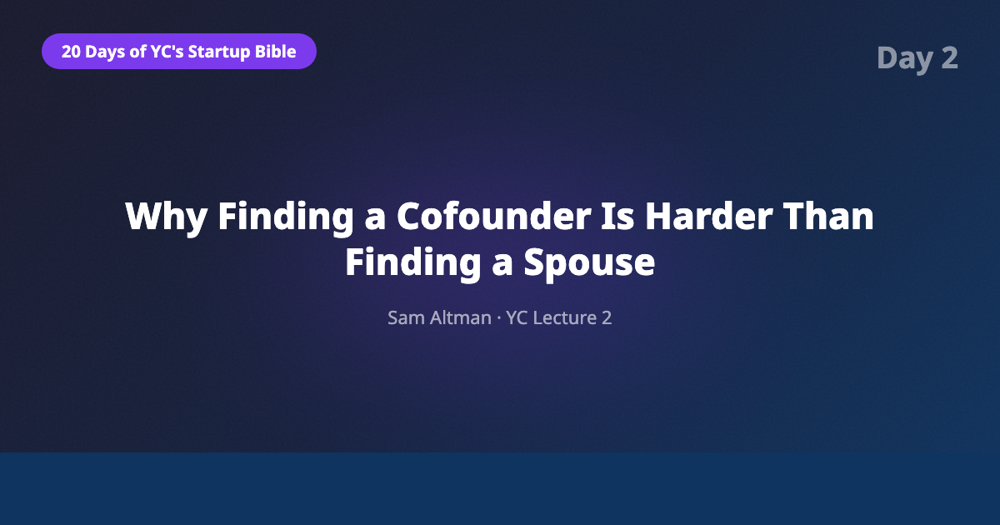
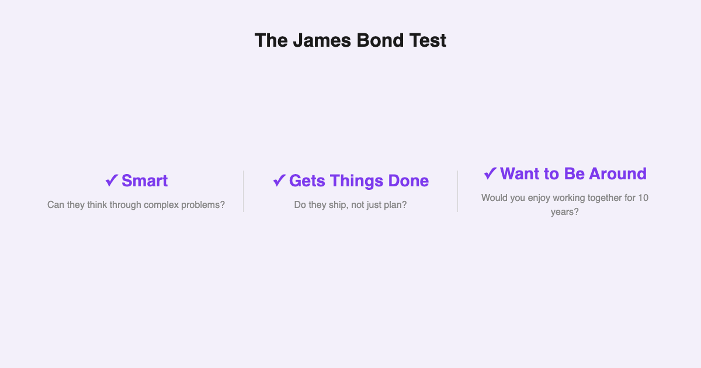
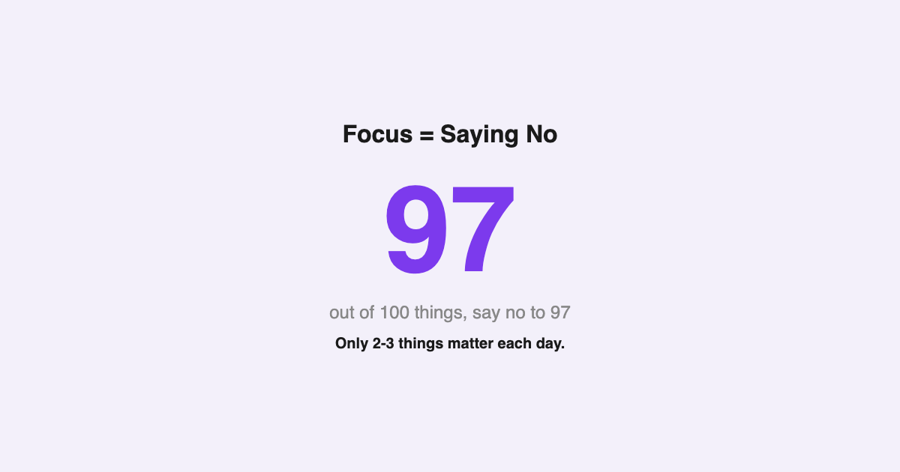
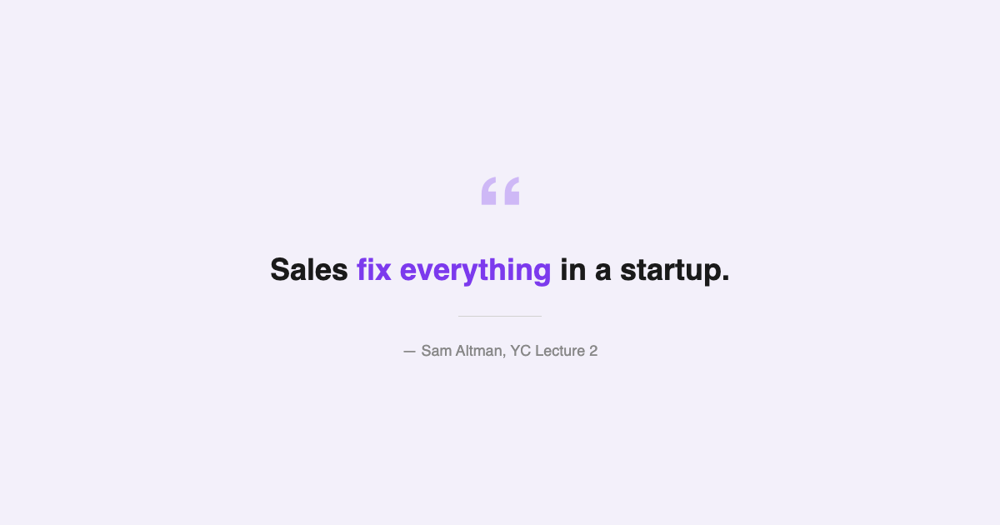

# YC's Startup Lesson #2: Why Finding a Cofounder Is Harder Than Finding a Spouse

## Sam Altman on hiring, execution, and the 0.99 vs 1.01 difference between failure and success

---

## Introduction

This is Day 2 of my deep dive into Y Combinator's legendary "How to Start a Startup" lecture series — pressure-testing each lesson against a decade of building data and AI products, an MBA from NYU Stern, and years of guest lecturing in computer science.

Lecture 2 is Sam Altman's second installment, covering the other half of the startup equation: teams and execution. If Lecture 1 was about *what* to build, this one is about *who* builds it and *how* they get it done.

What struck me most isn't the advice itself — much of it sounds like common sense. It's how violently it contradicts standard corporate practice. Almost everything I was taught about scaling teams, managing projects, and "strategic planning" gets dismantled in 45 minutes.

Let me walk through the key frameworks and what they mean for anyone building in 2026.

---

## The James Bond Test for Cofounders

Altman's cofounder criteria are disarmingly simple. You need someone who is:

1. **Smart**
2. **Gets things done**
3. **Someone you genuinely want to spend time with**

He calls it the "James Bond test" — would this person be able to get things done in a difficult, ambiguous environment? Not in theory. In practice.

Finding two out of three is easy. Smart people who get things done but are miserable to work with? Everywhere. Brilliant, fun people who never ship? Also everywhere. The Venn diagram of all three is vanishingly small.

This is why Altman says finding a cofounder is harder than finding a spouse. With a spouse, you optimize primarily for compatibility and shared values. With a cofounder, you need deep compatibility AND complementary execution skills AND aligned ambition AND the ability to disagree productively under extreme stress.

From my own experience: the best partnerships I've seen in data and AI weren't between two technical people or two business people. They were between someone who understood the problem domain at a visceral level and someone who could build systems to solve it. The magic happens in the overlap.

One detail that often gets overlooked: Altman strongly advises against solo founding. The data backs him up — YC's most successful companies almost always have cofounders. The startup journey is too brutal, too lonely, and too full of moments where you need someone to talk you off the ledge (or talk you *onto* one).

---

## Be Proud of How Few Employees You Have

This is the section that should make every startup founder uncomfortable.

Altman tells the story of Airbnb's early days: it took them **five months** to hire their first employee. After their entire first year, they had **two** employees total. Not because they couldn't attract talent — because they understood something most founders don't.

Every early hire either multiplies or divides your velocity.

The instinct to hire is one of the most dangerous impulses in a startup. It feels productive. It looks like progress. Investors love hearing "we're scaling the team." But every person you add creates communication overhead, coordination costs, and — most critically — dilutes the intensity of focus that makes startups competitive.

Altman's advice: **be proud of how few employees you have.** Track the ratio of output to headcount obsessively.

In 2026, this principle has been supercharged by AI. A two-person team with the right AI stack can now build, test, and deploy products that would have required 15–20 engineers five years ago. Code generation, automated testing, AI-assisted design, natural language interfaces for data analysis — the leverage available to small teams is unprecedented.

I've seen this firsthand. Teams I work with that embrace AI tooling deeply are shipping at velocities that would have seemed absurd in 2020. The constraint isn't headcount anymore. It's clarity of thought and speed of decision-making — which, ironically, get worse as you add people.

The Airbnb lesson isn't just "hire slowly." It's that the *cost* of a bad early hire is catastrophic, and the *benefit* of staying small is compounding.

---

## Say No 97 Times Out of 100

Altman's execution framework comes down to one brutal metric: say no to 97 out of 100 things.

This sounds extreme until you watch a startup die from "yes." Every partnership opportunity, every feature request, every conference invitation, every "quick meeting" — they all feel important in isolation. In aggregate, they kill you.

The best founders I've worked with share this trait: they are almost pathologically focused. They can articulate exactly what they're building, exactly who it's for, and exactly what they're NOT doing. The "not doing" list is always longer.

Now, here's where 2026 complicates things. Generative AI tools genuinely let you do more simultaneously. You can prototype faster, analyze markets faster, generate content faster. The temptation to say "yes" to more things has never been greater because the *cost* of each individual "yes" has dropped.

But Altman's framework still holds — maybe even more so. The bottleneck was never "can we build this?" It was always "should we build this?" AI makes execution cheaper but doesn't make strategy easier. If anything, the ability to build anything quickly makes focus MORE important, not less. The teams that win aren't the ones building the most things. They're the ones building the RIGHT thing with relentless intensity.

---

## Sales Fix Everything

This might be the most underappreciated section of the entire lecture.

When momentum sags — and it will — Altman's advice isn't to hold an all-hands meeting, write a blog post about company values, or redesign the roadmap. It's simpler and harder:

**Get a small win. Then another. Then another.**

Specifically: get a paying customer. Not a free user. Not a "design partner." Someone who gives you money for your product. This is the hardest thing in a startup and the most important.

Altman describes a flywheel: a paying customer creates momentum. Momentum attracts talent. Talent improves the product. A better product attracts more customers. The cycle compounds.

The inverse is also true. Without revenue, everything feels theoretical. Team morale drifts. Debates become academic. The urgency that makes startups special evaporates.

From a decade in data and AI: the number of technically impressive products I've seen die because nobody figured out how to sell them is staggering. Conversely, the number of "ugly" MVPs that succeeded because the founder was relentless about getting paying users is equally striking. Distribution beats product almost every time — at least in the early days.

---

## The AI/Data Angle: How 2026 Changes the Equation

Altman delivered this lecture in 2014. Twelve years later, the landscape has shifted dramatically, but the core principles have aged remarkably well — with one massive update.

**The cofounder you need has changed.**

In 2014, the default startup team was "a business person and a technical person." The technical cofounder's job was primarily to write code. In 2026, AI can handle a significant portion of code generation, testing, and even architecture decisions.

The cofounder you need now isn't "someone who can code." It's **someone who understands the problem deeply.** Domain expertise, customer empathy, and the ability to make judgment calls about what to build — these are the skills that AI can't replicate.

**Small teams have even more leverage.**

The Airbnb "two employees in year one" story sounded impressive in 2014. In 2026, it should be the *default* expectation. With AI-augmented development, a founding team of 2–3 people can realistically build and launch a product that serves thousands of users. The excuses for premature hiring have evaporated.

**Focus is the ultimate competitive advantage.**

When everyone has access to the same AI tools, the differentiator isn't capability — it's direction. The team that says no to 97 things and executes furiously on the remaining 3 will outperform the team that tries to do 20 things "because AI makes it possible."

---

## What Surprised Me Most

Two things caught me off guard revisiting this lecture:

**YC actively discourages big teams.** This runs counter to virtually every piece of advice in corporate America, where headcount is a proxy for importance and "scaling" means "hiring." YC's position is that the best startups are small, fast, and intensely focused — and that adding people is a cost, not a benefit, until product-market fit is undeniable.

**The emphasis on saying no.** I expected the lecture to be about hustle — doing more, moving faster, grinding harder. Instead, the core message is almost Zen-like: do less, but do it with terrifying intensity. The discipline to say no is framed not as a nice-to-have but as the single most important execution skill.

---

## Key Takeaways

- **Cofounder selection is the highest-leverage decision you'll make.** Smart + gets things done + want to spend time with. All three, non-negotiable.
- **Stay small as long as possible.** Every early hire should feel painful to justify. In 2026, AI makes this easier than ever.
- **Say no to almost everything.** Focus isn't about doing more efficiently — it's about doing less, deliberately.
- **Sales fix everything.** When in doubt, get a paying customer. Revenue solves problems that strategy decks can't.
- **The cofounder equation has shifted.** In the AI era, deep domain understanding matters more than raw technical ability.
- **0.99 vs 1.01 compounds dramatically.** Small, consistent improvements beat grand plans every time.

---

## What's Next

Tomorrow is Day 3: Paul Graham on the counterintuitive parts of startups. If Altman's lecture was about the mechanics of teams and execution, Graham's is about the mindset shifts that separate successful founders from everyone else. It's one of the most-watched lectures in the series for a reason.

If you're following along, [subscribe to my newsletter](https://substack.com/@jiazhenzhu) so you don't miss the next breakdown.

---

## Resources

- **Lecture Video:** [Sam Altman — Teams and Execution (Lecture 2)](https://www.youtube.com/watch?v=CVfnkM44Urs&list=PL5q_lef6zVkaTY_cT1k7qFNF2TidHCe-1&index=2)
- **Annotated Transcript:** [Genius — Lecture 2: Ideas, Products, Teams, and Execution Part II](https://genius.com/Sam-altman-lecture-2-ideas-products-teams-and-execution-part-ii-annotated)
