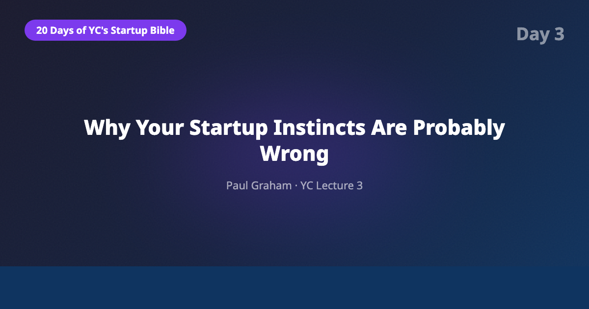
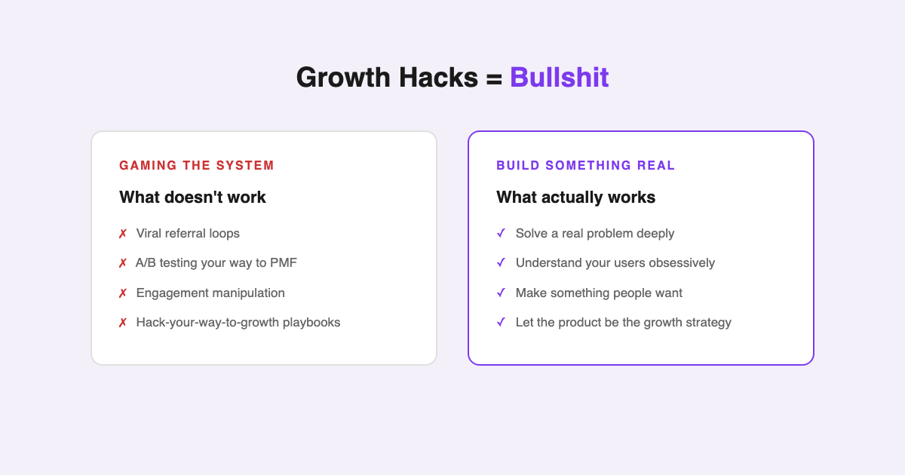
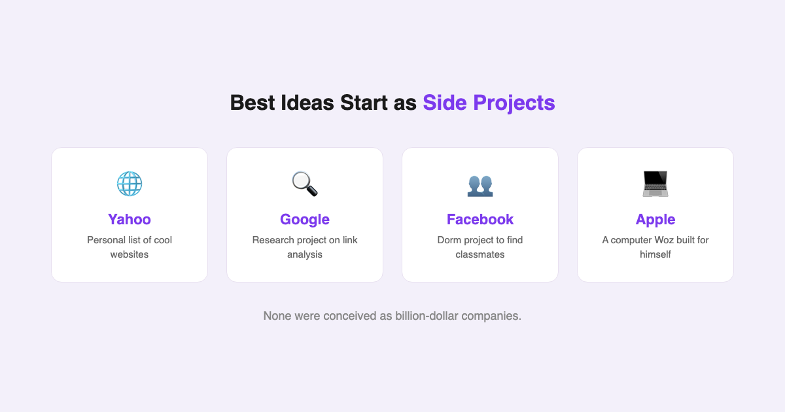

# YC's Startup Lesson #3: Why Your Startup Instincts Are Probably Wrong

## Paul Graham on the counterintuitive parts of startups, growth hacks, and how the best ideas actually emerge

---

## Introduction

This is Day 3 of my deep dive into Y Combinator's legendary "How to Start a Startup" lecture series — re-examining each lesson against a decade of building data and AI products, an MBA from NYU Stern, and years of guest lecturing in computer science.

Lecture 3 is Paul Graham — YC co-founder, essayist, creator of Viaweb (which became Yahoo Store), and the person who ran YC for its first nine years. If anyone has earned the right to tell founders their instincts are wrong, it's him.

Graham's central thesis is disarmingly simple: startups are counterintuitive. Almost everything you think you know about building a company is wrong, and the faster you accept that, the better your odds. He draws a comparison to skiing — when you first start, every instinct tells you to lean back. That instinct will send you straight into a tree.

Having spent over a decade shipping data products and AI features in tech, I expected to disagree with at least some of this. I didn't. What surprised me is how much of Graham's 2014 advice has only become MORE true in 2026.

---

## The Skiing Metaphor: Your Instincts Will Betray You

Graham opens with an analogy that stuck with me: startups are counterintuitive in the same way skiing is. When you're hurtling down a mountain and want to slow down, every instinct screams "lean back." But leaning back is exactly what makes you lose control. You have to lean forward — into the fear, into the speed.

Startups work the same way. The "obvious" moves — extensive planning, polished pitches, elaborate growth strategies — often do more harm than good. The counterintuitive move is to focus obsessively on making something people actually want, even when it feels too simple.

There's one critical exception to the "don't trust your instincts" rule: **people**. Graham argues that your gut feeling about whether someone is trustworthy, capable, or genuine is usually right. When you meet a potential cofounder or early employee and something feels off, trust that signal. The data from thousands of YC companies backs this up — founders who ignored red flags about people almost always regretted it.

This resonates deeply with what I've observed in corporate tech. The best hiring decisions I've seen weren't made by the most rigorous interview processes. They were made by people who paid attention to their instincts about character and drive.

---

## Growth Hacks Are Bullshit

Graham doesn't sugarcoat this one. His position: growth hacks are bullshit, and anyone selling them is either deluded or running a con.

The reasoning is elegant. Users are like sharks — and I don't mean the predatory kind. Graham means that sharks are remarkably simple in their detection mechanism. They sense whether something is meat or not meat. There's no tricking them with a clever wrapper or a viral coefficient.

Users work the same way. They detect whether your product solves a real problem for them. If it does, they'll use it. If it doesn't, no amount of A/B testing, referral programs, or "viral loops" will save you. Gaming the system stops working because the system IS the users, and users can't be gamed at scale.

This is the insight that separates real operators from startup theater. In my MBA classes at Stern, we studied growth frameworks, customer acquisition funnels, and retention metrics. All of those matter — but only AFTER you have something people genuinely want. The sequence matters enormously. Framework before product-market fit is cosplay.

I've seen this pattern repeatedly in data and AI products. The ones that grow aren't the ones with the cleverest onboarding flows. They're the ones where users say "wait, it does THAT?" and immediately tell colleagues. The product IS the growth strategy.

---

## The Side Project Theory of Great Ideas

This might be the most important section of the entire lecture, and it's the one that gets the least attention.

Graham argues that the best startup ideas don't come from sitting down and brainstorming "what should I start a company around?" They come from side projects — things built out of genuine curiosity or personal frustration, with no commercial intent whatsoever.

The evidence is overwhelming:
- **Yahoo** started as Jerry Yang and David Filo's personal list of interesting websites
- **Google** started as a research project about link analysis
- **Facebook** started as a dorm room project to see who was in your classes
- **Apple** started as Wozniak building a computer he wanted to use

None of these were conceived as billion-dollar companies. They were conceived as "wouldn't it be cool if..."

Graham's explanation for why this works: when you deliberately try to think of startup ideas, you unconsciously filter for things that "sound like startup ideas." You optimize for impressiveness, for market size narratives, for things you can pitch to investors. You end up with what Graham calls "sitcom startup ideas" — ideas that sound plausible on a TV show but have no connection to a real problem anyone actually has.

When you build something for yourself out of curiosity, there's no filter. You're solving YOUR problem. And if you're an interesting person working on interesting things, there's a good chance other people have the same problem.

This connects directly to my own experience. The best products I've been part of building in data and AI were never the result of top-down strategic planning. They started as someone saying "I keep running into this problem, and it's driving me crazy." The ones that started with a market analysis and a TAM slide? Most of those are dead.

Graham calls the alternative "playing house" — going through the motions of startup life without actually building anything meaningful. Getting an LLC, designing business cards, renting office space, attending networking events. All the APPEARANCE of progress with none of the substance. I've seen this in corporate settings too — teams that spend months on strategy documents and roadmap presentations while shipping nothing.

---

## The AI/Data Angle: Why "Just Learn" Is the Ultimate AI-Era Advice

Graham's lecture culminates in possibly the simplest advice in the entire YC series: **just learn.** Get deeply, genuinely good at something. Follow your curiosity. The startup ideas will emerge naturally.

In 2026, this advice has taken on a dimension Graham couldn't have predicted. AI has made execution dramatically cheaper. You can prototype in hours what used to take weeks. You can analyze markets, generate content, build interfaces, and test hypotheses faster than ever before.

But AI hasn't made UNDERSTANDING cheaper. It hasn't automated curiosity. It hasn't made domain expertise obsolete — if anything, it's made it more valuable. When everyone has access to the same AI coding assistants and the same AI design tools, the differentiator is knowing WHAT to build. That comes from deep expertise, not from tools.

As someone who spends $450/month on AI tools and uses them daily for everything from code generation to data analysis, I can confirm: AI amplifies expertise. It doesn't replace it. A domain expert with AI tools is unstoppable. A generalist with AI tools is just faster at building the wrong thing.

This is why Graham's "just learn" advice is more relevant than ever. In a world where building is cheap, the bottleneck is insight. The bottleneck is knowing which problems matter, which solutions will work, and which customers are worth serving. That knowledge comes from years of deep work in a domain — exactly the kind of thing you can't shortcut or hack.

The intrapreneurship angle is worth noting here too. You don't have to quit your job to apply this thinking. Some of the most impactful "startup-like" work happens inside companies, where you have resources, customers, and infrastructure. The ideas still come from the same place: noticing a problem that nobody else is solving and being unable to stop thinking about it.

---

## What Surprised Me Most

Two things caught me off guard revisiting this lecture.

**Graham's dismissal of startup expertise.** He explicitly says you don't need to know about startups to succeed at one. You need to know about users. This is heresy in the startup ecosystem, where there's a billion-dollar industry built around teaching people "how to startup." Graham's position is that this entire industry is mostly noise. What matters is understanding your users at a level deeper than anyone else.

**The "don't start in college" advice.** Graham — who runs a program that has funded college-age founders — actively discourages starting a startup in college. His reasoning is practical: college is the best time to follow intellectual curiosity without commercial pressure, and that curiosity is what generates the best ideas later. Starting a company too early short-circuits this process. I suspect he's also seen too many talented young people drop out for mediocre ideas, but the deeper point is about protecting the conditions that produce great ideas in the first place.

---

## Key Takeaways

- **Startups are counterintuitive.** Trust your instincts about people, but question your instincts about everything else.
- **Growth hacks are bullshit.** Users are like sharks — they detect whether your product is real. You can't game your way to product-market fit.
- **The best ideas come from side projects.** Stop trying to "think of startup ideas." Build things out of curiosity and frustration.
- **"Playing house" is the biggest trap.** Going through startup motions without building real value is worse than doing nothing.
- **Just learn.** Deep domain expertise is the ultimate startup preparation, especially in the AI era where execution is cheap but insight is rare.
- **AI amplifies expertise, not effort.** In 2026, knowing what to build matters more than knowing how to build it.

---

## What's Next

Tomorrow is Day 4: Adora Cheung on building product and talking to users. If Graham's lecture was about the philosophy of startups — what to trust, what to ignore, where ideas come from — Cheung's is about the mechanics: how to actually talk to users, how to measure whether your product is working, and how to iterate without losing your mind.

If you want deeper analysis and angles I don't publish here, [subscribe to my Substack](https://substack.com/@jiazhenzhu). I go deeper there, with angles I don't publish on Medium.

---

## Resources

- **Lecture Video:** [Paul Graham — Counterintuitive Parts of Startups (Lecture 3)](https://www.youtube.com/watch?v=ii1jcLg-eIQ&list=PL5q_lef6zVkaTY_cT1k7qFNF2TidHCe-1&index=4)
- **Annotated Transcript:** [Genius — Lecture 3: Counterintuitive Parts of Startups and How to Have Ideas](https://genius.com/Paul-graham-lecture-3-counterintuitive-parts-of-startups-and-how-to-have-ideas-annotated)
