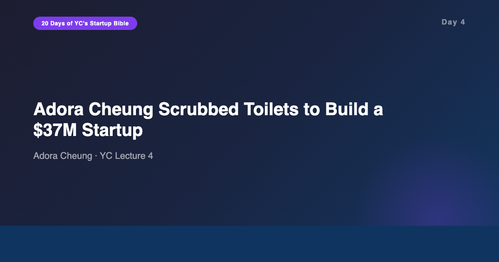
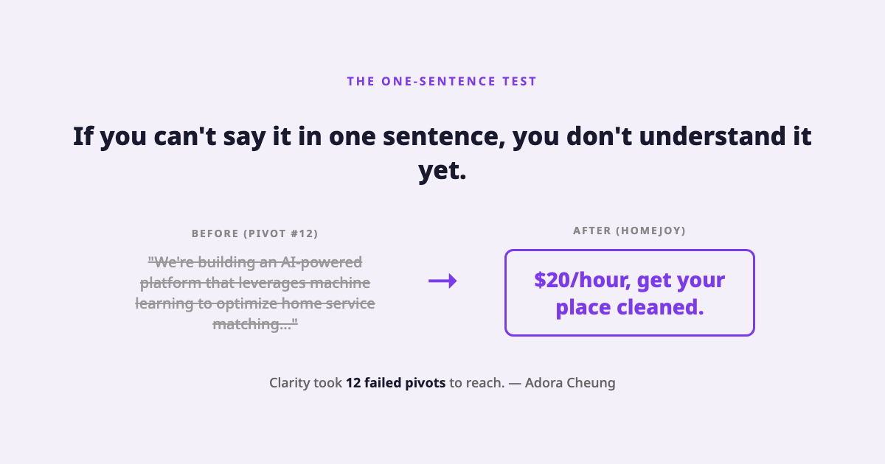
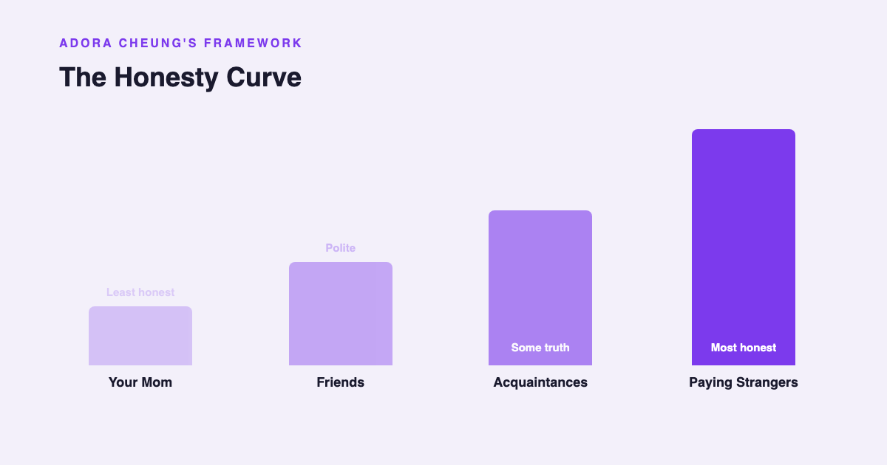
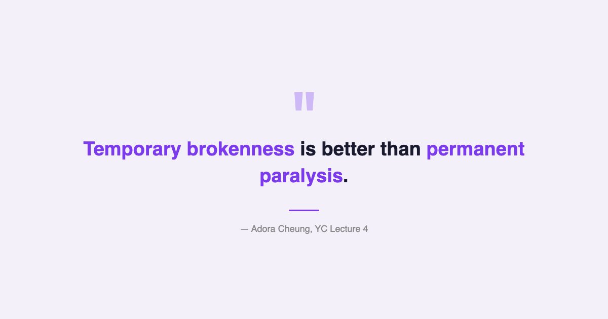

# YC's Startup Lesson #4: Adora Cheung Scrubbed Toilets to Build a $37M Startup

## On becoming a cog, the honesty curve, and why you should never automate what you haven't done by hand

---

This is Day 4 of my 20-day series breaking down YC's legendary startup lecture series. Today we're revisiting Adora Cheung's talk on building product, talking to users, and growing — a lecture that's part tactical playbook, part war story from someone who pivoted 12 times before finding product-market fit.

Adora co-founded Homejoy, a home cleaning marketplace that went through YC in 2010, raised $37M, and scaled to multiple cities. But before any of that, she did something radical: she became a house cleaner. Not as a founder doing "customer research." As an actual employee, scrubbing floors and dealing with difficult clients.

After a decade building data and AI products, finishing an MBA at Stern, and guest lecturing in CS, I've sat through hundreds of hours on user research methodology. Surveys. Interviews. Journey maps. Persona workshops. Adora's approach makes all of that feel like theater. She didn't study the industry. She became a cog in it.

---

## Become a Cog in the Machine

Adora's first piece of advice is the most visceral: before you build anything, go work in the industry you're trying to disrupt. Not as a consultant. Not as a "researcher." As the lowest person on the totem pole.

She literally worked as a house cleaner. She experienced every pain point firsthand — the scheduling chaos, the inconsistent pricing, the clients who haggled or ghosted, the physical exhaustion, the lack of any system connecting cleaners to customers efficiently.

This wasn't a weekend experiment. She committed to understanding the industry from the inside. And that immersion gave her something no amount of user interviews could provide: gut-level intuition about what was broken and what mattered.

The result was a deceptively simple positioning: "$20/hour, get your place cleaned." One sentence. That clarity didn't come from a branding workshop — it came from 12 failed pivots and months of firsthand experience. She knew exactly what customers wanted because she'd been on both sides of the transaction.

Most founders skip this step. They observe the industry from the outside, conduct interviews, build personas, and then wonder why their product feels slightly off. Adora's argument is that the "slightly off" problem is unfixable without direct experience. You can't interview your way to intuition.

---

## The Honesty Curve

This is the framework from the lecture that stuck with me the most.

Adora draws a simple curve of feedback honesty. At the bottom: your mom. She'll tell you everything is great. Slightly better: your friends. They'll be politely encouraging. Better still: acquaintances. They might offer some real criticism.

But at the top of the honesty curve? Strangers who pay you.

When someone hands over their credit card, the dynamic shifts completely. They're no longer being polite. They have expectations. If your product doesn't meet those expectations, they'll tell you — or worse, they'll silently churn. Either way, you get the truth.

This framework reframed something I've experienced repeatedly in enterprise data products. Internal stakeholders — colleagues, friendly early adopters within the company — will tolerate a clunky dashboard because they know the team behind it. They'll make excuses. "It's still early." "I'm sure they'll fix that." But the moment you put that same product in front of a paying external customer, every rough edge becomes visible. The politeness buffer disappears.

Adora's point is that founders should seek out the top of the honesty curve as fast as possible. Don't spend months getting validation from friends and family. Get a stranger to pay you. Even $1. Because that dollar comes with a level of honest feedback that no amount of friendly conversation can provide.

Cash flow, even tiny cash flow, is also psychologically important. Adora emphasizes that getting even small amounts of revenue early on can be incredibly energizing for a founding team. It's not about the money — it's about proof that someone in the real world values what you're building enough to pay for it.

---

## Don't Build Frankenstein Products

Adora warns against what she calls "Frankenstein products" — the kind of software that gets built when founders listen to every piece of user feedback and try to incorporate all of it.

User A wants a scheduling feature. User B wants invoicing. User C wants a messaging system. User D wants analytics. If you build all of it, you end up with a bloated, incoherent product that doesn't do any single thing well. It's alive, technically — but it's a monster.

Her advice: resist the urge to over-build. Start with the narrowest possible use case, nail it, and expand only when you have clear evidence that expansion is what users need. Not what they say they want — what they actually need, as demonstrated by their behavior.

This connects directly to her "don't over-automate" principle. Before you build a feature, do the process manually. If you're building a cleaning marketplace, don't automate scheduling on day one. Schedule manually. Call the cleaners yourself. Handle the payments by hand. You'll learn things that no product spec could capture — the edge cases, the timing sensitivities, the emotional dynamics of the transaction.

Only after you've done it manually fifty times should you even think about automating it. Because by then, you'll know exactly what to automate and what to leave human.

---

## The AI/Data Angle

Adora's lecture is from 2014, but her "become a cog" advice is more relevant in the AI era than it might seem at first glance.

There's a temptation in AI product development to skip the manual phase entirely. Why would you manually process data when you can train a model? Why would you manually handle customer requests when you can build a chatbot? The tools make automation so accessible that the manual step feels like a waste of time.

But here's what I've learned building AI and data products for over a decade: the manual phase is where you develop the judgment that makes automation work. If you've never manually labeled data, you won't build good labeling guidelines for your annotation team. If you've never manually answered customer support tickets, your chatbot will handle the easy cases and catastrophically mishandle the hard ones.

In the AI era, "become a cog" doesn't mean you literally need to scrub floors. But it means you need firsthand experience with the problem you're solving. Use the existing tools. Feel the friction. Understand the workarounds people have built. That hands-on understanding is what separates AI products that actually work from the ones that demo well but fail in production.

The honesty curve applies to AI products too. Internal demos get applause. Pilot users are polite. But paying customers using your AI in their daily workflow will find every failure mode within a week. Seek that feedback early.

And the Frankenstein warning is particularly urgent for AI products. It's tempting to add "AI-powered" everything — AI search, AI recommendations, AI analytics, AI content generation — all in the same product. The result is usually a product that does none of those things well. Pick one AI capability, make it genuinely excellent, and expand from there.

---

## What Surprised Me Most

The line that caught me off guard was "temporary brokenness is better than permanent paralysis."

Most of the startup advice I've absorbed over the years — in MBA programs, in corporate product development, in engineering culture — pushes toward polish. Ship quality. Test thoroughly. Don't embarrass yourself. But Adora is saying the opposite: ship it broken. Get it in front of users. Fix it in real-time based on real usage.

Her guerrilla marketing story drives this home. Early Homejoy growth came from standing on street corners in the summer heat, handing out ice-cold water bottles with Homejoy branding to sweaty passersby. No sophisticated marketing funnel. No A/B tested landing page. Just cold water and a coupon.

It's a good reminder that sophistication is overrated in the early days. Do the scrappy thing. Do the thing that doesn't scale. You can optimize later — but only if you survive long enough to get there.

---

## Key Takeaways

- **Become a cog.** Work in the industry you're disrupting, at the ground level, before building anything.
- **One sentence or you don't understand it.** If you can't describe your product in one sentence, you haven't found clarity yet.
- **The honesty curve is real.** Paying strangers give the most honest feedback. Seek that signal early.
- **Don't automate what you haven't done manually.** The manual phase builds judgment that no spec can capture.
- **Temporary brokenness > permanent paralysis.** Ship it broken. Fix it live.
- **Avoid Frankenstein products.** Don't build every feature users request. Nail one thing first.
- **Growth types matter.** Sticky, viral, and paid growth each have different mechanics. Know which one fits your product.
- **In AI, the manual phase builds the judgment that makes automation work.** Don't skip it.

---

## What's Next

**Day 5:** Peter Thiel on business strategy and monopoly theory — why competition is for losers, and how to build something nobody else can replicate.

If you're following along with this series, [subscribe to my newsletter](https://substack.com/@jiazhenzhu) where I go deeper, with angles I don't publish on Medium.

---

## Resources

- **Video:** [YC Lecture 4 — Adora Cheung: Building Product, Talking to Users, and Growing](https://www.youtube.com/watch?v=yP176MBG9Tk)
- **Transcript:** [Adora Cheung Lecture 4 (Annotated) — Genius](https://genius.com/Adora-cheung-lecture-4-building-product-talking-to-users-and-growing-annotated)
