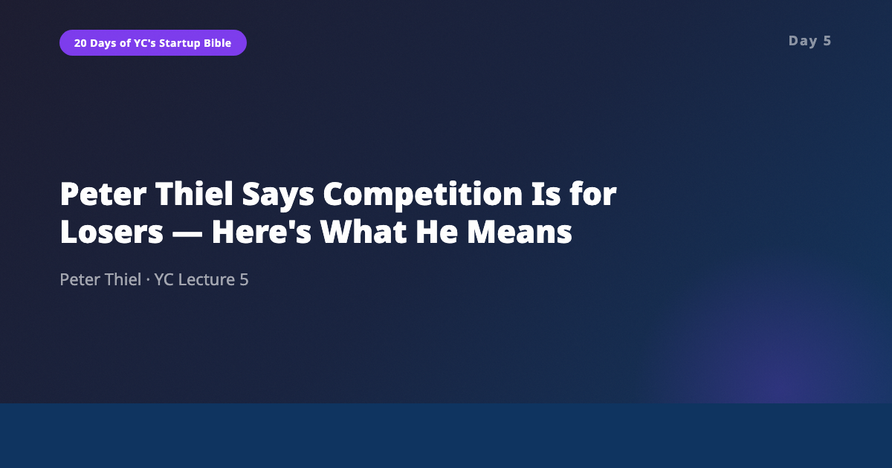
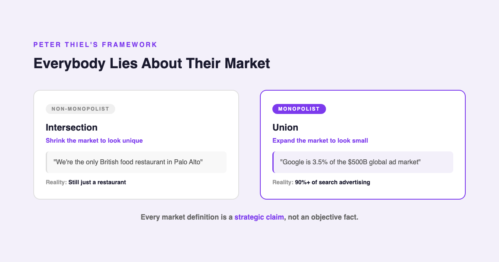
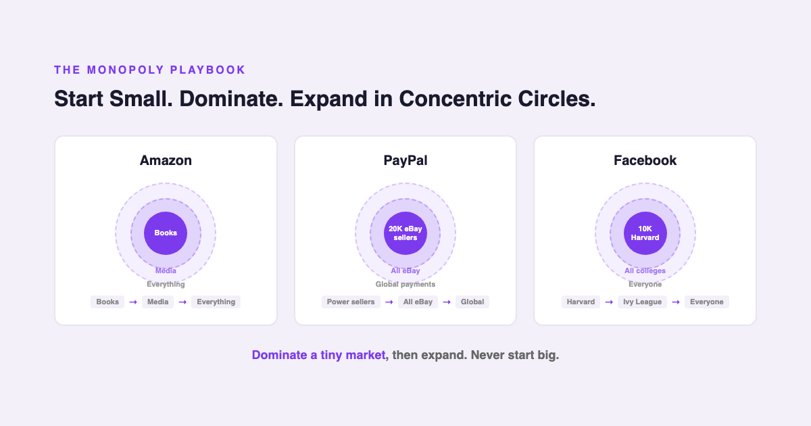
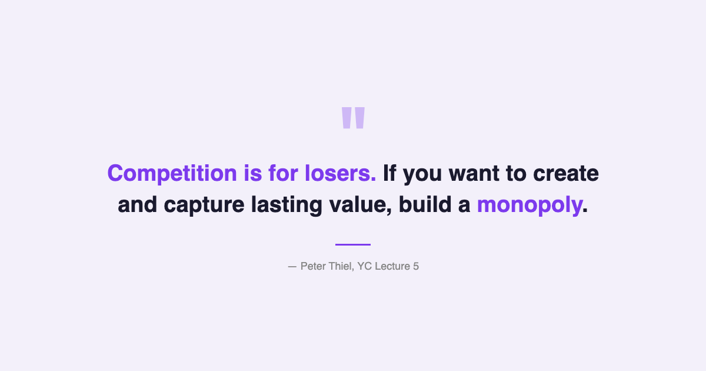

# YC's Startup Lesson #5: Peter Thiel Says Competition Is for Losers — Here's What He Means

## On monopoly lies, starting absurdly small, and why 250 years of innovation mostly made zero profit

---

This is Day 5 of my 20-day series breaking down YC's legendary startup lecture series. Today we're revisiting Peter Thiel's talk on business strategy and monopoly theory — arguably the most contrarian lecture in the entire course.

Thiel co-founded PayPal and Palantir, started Founders Fund, and was Facebook's first outside investor. His core thesis is simple and uncomfortable: competition is a sign you're doing something wrong. The goal isn't to build a better product in an existing market. The goal is to build something so different that competition becomes irrelevant.

After ten years building data and AI products, I've watched this play out repeatedly. The companies that won the markets I worked in didn't win by outcompeting — they won by redefining the category so thoroughly that the old players didn't even realize they'd lost until it was over.

---

## Value Creation Is Not Value Capture

Thiel opens with a distinction that seems obvious but has enormous implications: creating value and capturing value are completely independent variables.

The U.S. airline industry generates hundreds of billions in revenue and moves millions of people. It creates enormous value. But airlines capture almost none of it — margins are razor-thin, competition is brutal, and the industry has collectively lost money over its entire history.

Google, by comparison, creates less total value than the airline industry. But it captures a massive percentage of the value it creates. The difference isn't about working harder or being smarter. It's about market structure.

This distinction reframed something I've been thinking about in enterprise AI. Many companies are building AI features that create genuine value for their users — but they're building them in markets where every competitor offers the same capability. Value creation is high. Value capture is approaching zero. The AI feature becomes table stakes, not a differentiator.

Thiel's framework suggests that the question isn't "does this create value?" but "can we capture a meaningful share of the value we create?" Those are very different questions, and most founders only ask the first one.

---

## Everybody Lies About Their Market

This is the section that made me sit up.

Thiel argues there are really only two types of businesses: monopolies and perfect competitors. Almost nothing exists in between. But you'd never know it from listening to founders or executives talk, because both sides lie — in opposite directions.

**Non-monopolists** define their market as narrowly as possible to sound unique. "We're the only British food restaurant in Palo Alto." By intersecting enough categories — British, food, Palo Alto, restaurant — you can always make yourself sound like a monopoly. But you're still a restaurant, competing with every other restaurant in town for the same dinner budget.

**Monopolists** define their market as broadly as possible to avoid scrutiny. Google describes itself as a technology company competing in the $500 billion global advertising market, where it holds a modest 3.5%. But if you define the market as "search advertising," Google owns over 90%. The broad framing is a deliberate narrative choice.

I see this constantly in AI. Startups pitch themselves as "the only AI-powered [extremely specific niche] platform," which is the non-monopolist intersection play. Meanwhile, the actual monopolists — the foundation model providers — describe themselves as general-purpose technology companies competing in a vast, fragmented market.

Once you see this pattern, you can't unsee it. Every market definition is a strategic claim, not an objective fact. The next time someone tells you their market size, ask yourself: are they shrinking the definition to look special, or expanding it to look small?

---

## Start Absurdly Small, Then Expand in Concentric Circles

This is Thiel's most actionable insight and the one that resonated most with me personally.

Every great monopoly started by dominating a tiny market:

- **Amazon** started with books — not "all of e-commerce," just books. Then expanded to media, then electronics, then everything.
- **eBay** started with Pez dispenser collectors. Not "online auctions." Pez dispensers.
- **PayPal** started with 20,000 eBay power sellers. Not "online payments." Twenty thousand specific people.
- **Facebook** started with 10,000 Harvard students. Not "social networking." One campus.

The pattern is always the same: find a small, well-defined group of people with an intense need. Dominate that group completely. Then expand to the adjacent group. Then the next. Concentric circles, radiating outward.

This is the part that hit me hardest because it's the most practical advice in the entire lecture, and it's the part most founders ignore. Everyone wants to be big from the start. Everyone wants to address "the $50 billion market." But Thiel's point is that addressing a huge market on day one means you address no one well enough to matter.

In my own experience building data products, the most successful launches targeted absurdly narrow user segments — a specific team at a specific type of company with a specific workflow problem. Once you own that narrow segment, expanding becomes natural. But trying to be everything for everyone from the start is a recipe for building something that's sort of useful for nobody in particular.

---

## The AI/Data Angle

Thiel's lecture is from 2014, but his monopoly framework is almost eerily relevant to the current AI landscape.

Right now, most AI startups are building horizontal products — chatbots, writing assistants, code generators, image tools — that compete directly with each other and, increasingly, with the foundation model providers themselves. It's a classic value-creation-without-capture scenario. The technology creates enormous value, but the market structure makes it nearly impossible for any single company to capture a meaningful share.

The companies that will win in AI, if Thiel's framework holds, are the ones that pick an absurdly small market and dominate it completely. Not "AI for healthcare" — that's too broad. "AI for reading radiology scans at rural hospitals with outdated PACS systems" — that's a market you can own.

Thiel's four characteristics of monopoly also map well onto AI:

1. **Proprietary technology** (10x improvement): Foundation models provide this, but so can fine-tuned vertical models that dramatically outperform general-purpose ones on specific tasks.
2. **Network effects:** AI products that get better with more users — where each user's data improves the model for everyone — have a built-in moat.
3. **Economies of scale:** Training costs are massive and favor large players, but inference costs for specialized models can create scale advantages for focused startups.
4. **Brand:** In AI, trust is the brand. When a hospital trusts your radiology AI, switching costs become enormous.

His "last mover advantage" concept matters here too. Thiel argues that 75-85% of a company's value comes from cash flows more than 10 years out. In AI, everyone is focused on who's first — first to market, first to ship, first to raise. But Thiel would say durability matters far more than speed. The question isn't who builds the first AI product in a category. It's who builds the one that's still dominant a decade from now.

---

## What Surprised Me Most

Thiel makes a striking historical claim: in 250 years of technological innovation since the Industrial Revolution, the inventors and innovators captured almost none of the value they created. Almost zero percent. The only two categories that consistently made money were vertically integrated complex monopolies (Ford, Standard Oil, and more recently Tesla and SpaceX) and software.

That stopped me cold. We celebrate innovation as the engine of wealth creation, but Thiel's point is that innovation creates wealth for society while delivering almost nothing to the innovator — unless they build a monopoly. The Wright brothers died with modest estates. The steam engine pioneers went bankrupt. Eli Whitney made almost nothing from the cotton gin.

The implication for anyone building in tech right now is sobering. If you're building something innovative but structurally competitive, history says you'll create value and someone else will capture it. Innovation alone isn't enough. Market structure is everything.

---

## Key Takeaways

- **Value creation and value capture are independent.** Creating value doesn't mean you'll capture any of it. Market structure determines capture.
- **There are only monopolies and competitors.** Almost nothing in between. And both sides lie about which one they are.
- **Watch the market definition.** Non-monopolists shrink their market (intersection). Monopolists expand it (union). Every market size claim is a strategic narrative.
- **Start absurdly small.** Amazon: books. PayPal: 20K eBay sellers. Facebook: Harvard. Dominate a tiny market, then expand in concentric circles.
- **Four monopoly characteristics:** Proprietary tech (10x better), network effects, economies of scale, brand.
- **Last mover > first mover.** 75-85% of value comes from cash flows 10+ years out. Durability beats speed.
- **In 250 years of innovation, Y is almost always zero.** Only vertically integrated monopolies and software consistently captured value.
- **In AI, pick a narrow wedge.** Horizontal AI products face perfect competition. Vertical dominance is the path to monopoly.

---

## What's Next

**Day 6:** Alex Schultz on growth — the metrics that actually matter, why retention is the single most important thing, and what most founders get wrong about scaling.

If you're following along with this series, [subscribe to my newsletter](https://substack.com/@jiazhenzhu) where I go deeper, with angles I don't publish on Medium.

---

## Resources

- **Video:** [YC Lecture 5 — Peter Thiel: Business Strategy and Monopoly Theory](https://www.youtube.com/watch?v=5_0dVHMpJlo&list=PL5q_lef6zVkaTY_cT1k7qFNF2TidHCe-1&index=5)
- **Transcript:** [Peter Thiel Lecture 5 (Annotated) — Genius](https://genius.com/Peter-thiel-lecture-5-business-strategy-and-monopoly-theory-annotated)
