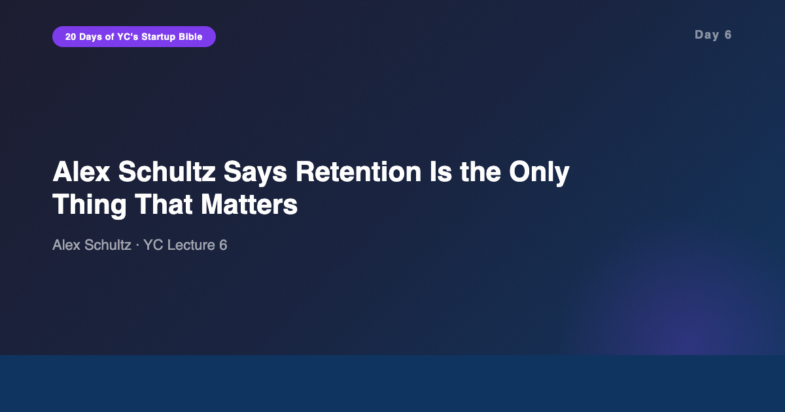
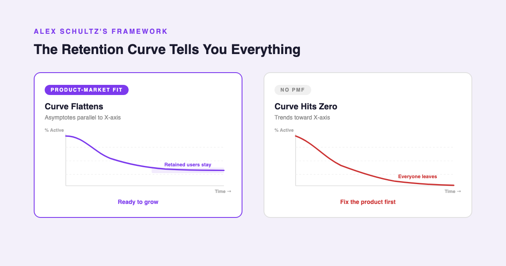
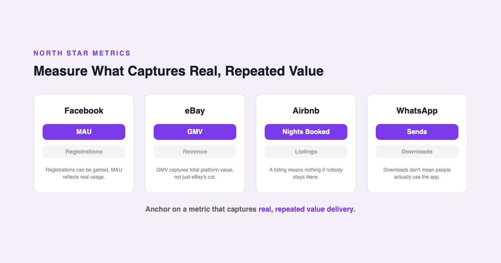
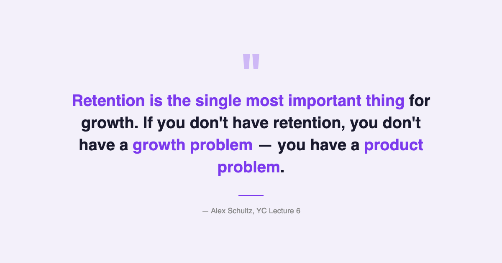

# YC's Startup Lesson #6: Alex Schultz Says Retention Is the Only Thing That Matters

## Facebook's VP of Growth on why you can't hack your way to scale — and the retention curve that tells you whether to keep going

---

This is Day 6 of my 20-day series breaking down YC's legendary startup lecture series. Today we're revisiting Alex Schultz's talk on growth. Schultz ran growth at Facebook for years, scaling it from a hundred million users to over a billion — and his central argument is that almost everything founders believe about growth is wrong.

After ten years building data and AI products, I've watched teams pour resources into acquisition funnels, referral programs, and viral loops while ignoring the only number that actually predicts survival: retention. Schultz's lecture is a masterclass in why that instinct is backwards, and what to do instead.

---

## Retention Is the Only Foundation for Growth

Schultz opens with a claim that's deceptively simple and extremely uncomfortable: if you don't have retention, you don't have a product worth growing.

His methodology is elegant. Plot a retention curve — percentage of users still active over time — broken down by cohort (the week or month they signed up). If that curve eventually flattens out, running parallel to the X-axis, you have product-market fit. Some percentage of people who try your product stick with it permanently. That's the foundation you can build on.

If the curve trends toward zero, nothing you do on growth will save you. No viral loop, no growth hack, no paid acquisition strategy will matter, because every user you bring in eventually leaves. You're filling a leaky bucket.

The part that resonated most with me: you don't need massive scale to see the curve shape. Schultz says ten thousand users is enough. I've experienced this firsthand building data products. When we had a small batch of internal users who kept coming back every day without being prompted, that told us more about product-market fit than any market analysis or user survey ever could. Even with a tiny sample, you can see whether the product works — whether it's worth continuing to build.

Different verticals also have very different retention benchmarks. Schultz points out that ecommerce companies with 20-30% monthly retention are doing well. Social media products need 80%+ retention from their first batch of users. Knowing what "good" looks like for your category is essential — otherwise you're either celebrating mediocrity or abandoning something that's actually working.

---

## Your North Star Metric Is Probably Wrong

Schultz's second major framework is about choosing the right metric to optimize — your North Star Metric. And his point is that most companies pick the wrong one.

The examples are instructive:

- **Facebook** uses MAU (monthly active users), not registrations. Registrations can be gamed and don't reflect whether people actually use the product.
- **eBay** uses GMV (gross merchandise volume), not revenue. GMV captures the total value flowing through the platform, which is a better indicator of platform health than the cut eBay takes.
- **Airbnb** uses nights booked, not listings or revenue. A listing means nothing if no one stays there.
- **WhatsApp** uses message sends. Not downloads, not sign-ups — actual usage.

The pattern: every great growth team anchors on a metric that captures real, repeated value delivery to users. Not vanity metrics. Not top-of-funnel numbers that feel good but don't predict retention or revenue.

Schultz makes another point that's easy to miss: the CEO must be the head of growth. Not a VP, not a growth team lead. The CEO. Because the North Star Metric should drive every decision the company makes, and only the CEO has the authority to enforce that across all functions.

This connects to his broader argument that startups should NOT have a separate growth team. At a startup, the entire company is the growth team. Having a separate growth function creates the illusion that growth is someone else's job — when in reality, growth is the output of a product that retains users, a metric that captures real value, and an organization aligned around both.

---

## The Magic Moment and the Marginal User

Schultz introduces a concept he calls the "magic moment" — the single experience that converts a casual visitor into a retained user. Every product has one, and all growth efforts should be designed to get new users to that moment as fast as possible.

The examples are vivid:

- **Facebook:** Seeing your friend's face. The internal benchmark was getting a new user to 10 friends in 14 days.
- **eBay:** Finding a unique, hard-to-find collectible that you couldn't get anywhere else.
- **Airbnb:** Walking through the door of the place you booked and realizing it's real and amazing.

The magic moment is not a feature. It's an emotional experience — the instant the product's value becomes visceral and personal. Everything else in the product funnel exists to make that moment happen sooner.

But here's the counterintuitive part: Schultz says you should NOT optimize for power users. Power users have already found the magic moment. They're already retained. The real growth comes from marginal users — the ones who didn't get the notification, didn't find their friends, are about to churn. These are the users who are on the fence, and a small improvement in their experience produces outsized gains.

This is a profound shift in thinking. Most product teams build for their most engaged users because those users give the loudest feedback. But the marginal user is where growth lives — and the marginal user, by definition, is the one who isn't asking for anything because they're about to leave.

---

## The AI/Data Angle

Schultz's lecture is from 2014, but the retention-first framework is even more relevant in the AI era — and one area he touches on briefly has exploded in importance: SEO.

Schultz mentions that Facebook changed one directory structure and got a 100X increase in SEO traffic. That single anecdote captures something I've been thinking about a lot: the intersection of AI and SEO is becoming one of the most consequential growth levers for startups.

Traditional SEO required manual keyword research, link-building campaigns, and content strategies that took months to execute. AI is reshaping all of this. Large language models can now generate keyword clusters, optimize content at scale, analyze search intent with much more nuance than keyword density tools ever could, and even predict which content structures will rank before you publish. The companies that figure out AI-powered SEO early will have an enormous compounding advantage.

But Schultz's deeper point about retention still applies. SEO can drive traffic, but if your retention curve trends toward zero, that traffic is worthless. AI can help you acquire users faster — through smarter SEO, better-targeted notifications, more personalized onboarding — but it cannot fix a product that doesn't retain. The fundamental sequence hasn't changed: retention first, then growth.

His framework for notifications is also worth revisiting through an AI lens. Schultz argues against generic newsletters — "newsletters are stupid," in his words — and advocates for triggered, event-based notifications. Turn on notifications for low-engaged users, not high-engaged ones. The first "like" notification for a new user is a magic moment. AI makes this kind of personalized, behavioral notification dramatically easier to build. Instead of rule-based triggers, you can model each user's likelihood of churning and intervene at exactly the right moment with exactly the right message.

---

## What Surprised Me Most

Schultz casually drops that Facebook was NOT viral. The company that everyone cites as the canonical example of viral growth actually grew through word of mouth, not viral mechanics.

He breaks down the virality formula — Payload times Conversion Rate times Frequency — and explains that Facebook's numbers on each variable were unremarkable. Hotmail was truly viral (high frequency, high conversion through its signature line). PayPal was viral (extreme conversion through monetary incentives). Facebook simply made a product so good that people told their friends about it.

This distinction matters because it changes what you optimize for. If you're trying to engineer virality, you're building referral loops and invite mechanics. If you're building for word of mouth, you're building a product so good it becomes a conversation topic. Those are very different strategies, and most founders conflate them.

---

## Key Takeaways

- **Retention curve is your truth.** Plot it by cohort. If it flattens parallel to the X-axis, you have product-market fit. If it trends to zero, stop doing growth and fix the product.
- **10K users is enough.** You don't need scale to read your retention curve. A small batch of users tells you whether to keep going.
- **Pick the right North Star Metric.** MAU, not registrations. GMV, not revenue. Nights booked, not listings. Anchor on a metric that captures real, repeated value delivery.
- **Find your magic moment.** The single experience that converts visitors into retained users. Design everything to get users there faster.
- **Focus on marginal users, not power users.** The user about to churn is where growth lives. Power users are already retained.
- **Facebook wasn't viral.** Word of mouth and virality are different strategies. Build for word of mouth — make the product undeniably good.
- **Startups don't need a growth team.** The whole company is the growth team. The CEO is head of growth.
- **Virality formula:** Payload x Conversion Rate x Frequency. Optimize each variable independently.
- **AI + SEO is the new growth lever.** But it only works if your retention curve is already flat.

---

## What's Next

**Day 7:** Kevin Hale on how to build products users love — the framework for turning first-time users into passionate advocates, and why the best growth engine is a product people can't stop talking about.

If you're following along with this series, [subscribe to my newsletter](https://substack.com/@jiazhenzhu) where I go deeper, with angles I don't publish on Medium.

---

## Resources

- **Video:** [YC Lecture 6 — Alex Schultz: Growth](https://www.youtube.com/watch?v=n_yHZ_vKjno&list=PL5q_lef6zVkaTY_cT1k7qFNF2TidHCe-1&index=6)
- **Transcript:** [Alex Schultz Lecture 6 (Annotated) — Genius](https://genius.com/Alex-schultz-lecture-6-growth-annotated)
