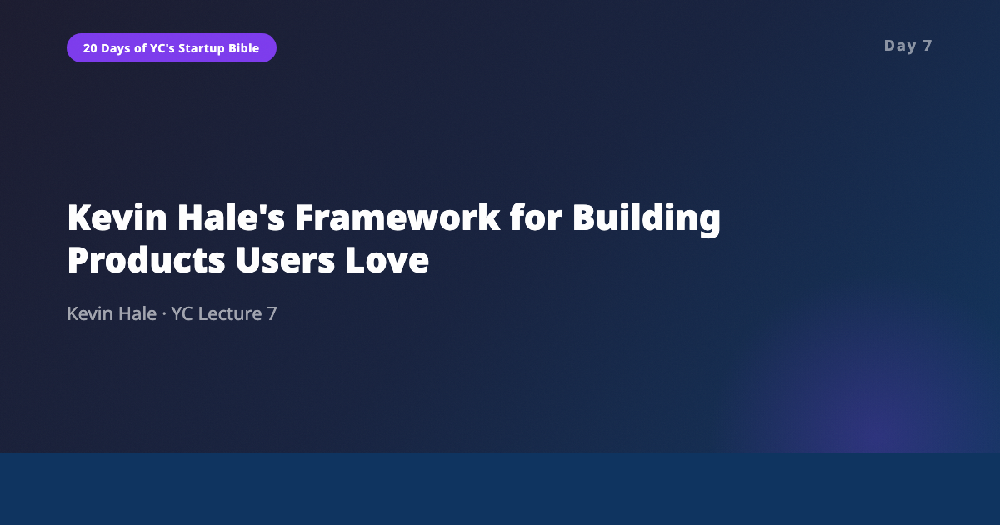
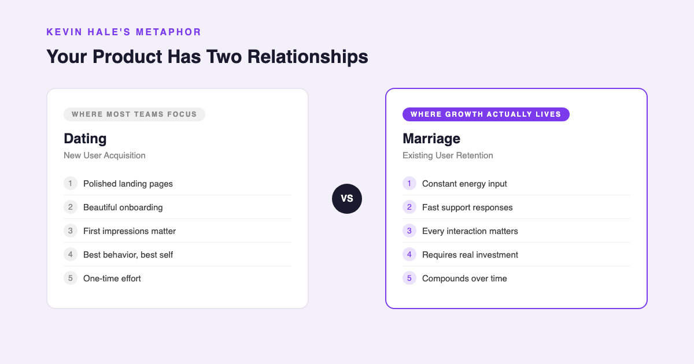
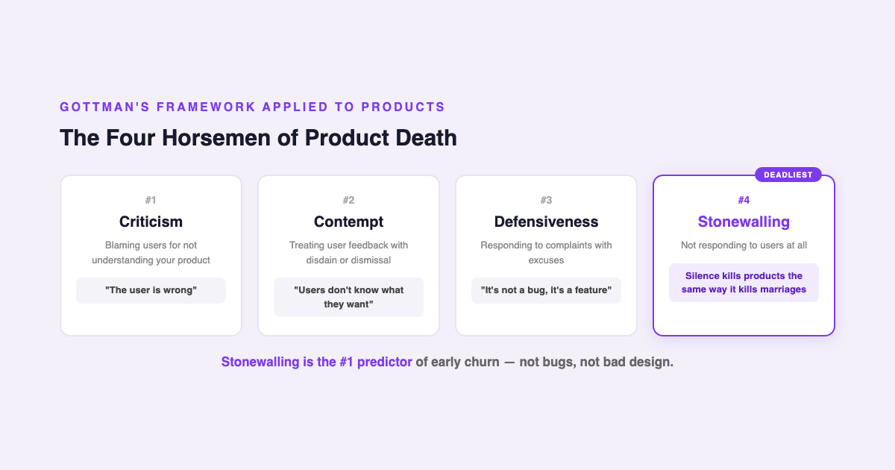
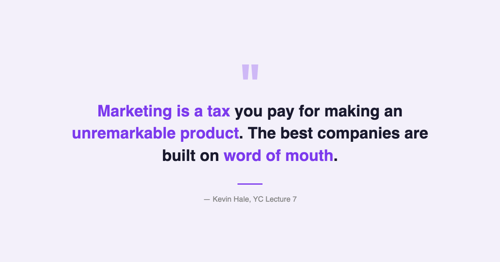

# YC's Startup Lesson #7: Kevin Hale's Framework for Building Products Users Love

## Wufoo's co-founder on why your relationship with users is a marriage, not a first date — and why silence is the deadliest product sin

---

This is Day 7 of my 20-day series breaking down YC's legendary startup lecture series. Today's speaker is Kevin Hale, co-founder of Wufoo and YC Partner, and his lecture on how to build products users love is one of the most emotionally resonant in the entire series.

After ten years building data and AI products, I've seen plenty of teams obsess over acquisition metrics while treating existing users as an afterthought. Hale's lecture explains exactly why that instinct is backwards — and offers a surprisingly human framework for thinking about product development. His core argument: building products users love isn't about features. It's about relationships.

---

## Growth Is a Relationship Problem, Not a Conversion Problem

Hale opens with a formula that reframes everything: **Growth = Conversion Rate - Churn.**

This looks simple. But the insight is in the asymmetry. Reducing churn by 1% has the same mathematical effect as increasing conversion by 1%. Yet reducing churn is dramatically cheaper. Despite this, most companies assign their A-team to acquisition and their B-team to retention. The marketing budget dwarfs the support budget. The sexiest engineers work on new features, not on fixing the experiences that make existing users leave.

Hale frames this with a metaphor that stuck with me more than any framework diagram could: **new user acquisition is dating. Existing user retention is marriage.**

When you're dating, you put effort into first impressions. You're charming. You present the best version of yourself. And companies do this too — polished landing pages, seamless onboarding flows, beautiful marketing materials. But once the user signs up, the experience often degrades. The landing page promised magic. The actual product delivers confusion.

Marriage, Hale argues, is the better mental model for product development. A good marriage requires constant energy input. It's the second law of thermodynamics applied to relationships — without continuous effort, things naturally decay toward disorder. The same is true for your relationship with existing users. If you're not actively investing in that relationship, it's deteriorating.

This connected deeply with something I've observed building data platforms. The teams that treated their existing users like partners — checking in, responding quickly, investing in the long-term experience — those were the products that survived. The ones that spent all their energy on flashy demos and acquisition campaigns often had a revolving door of users who tried the product once and never came back.

---

## The Four Horsemen of Product Death

Hale draws on John Gottman's research on marriage to identify the patterns that kill user relationships. Gottman studied thousands of couples and identified four behaviors — the "Four Horsemen of the Apocalypse" — that predict relationship failure with startling accuracy. Hale maps these directly onto product teams:

1. **Criticism** — Blaming users for not understanding your product. "The user is wrong" is criticism. If users are confused, that's your failure, not theirs.

2. **Contempt** — Treating user feedback with disdain. Building for yourself instead of for the people who actually use your product. When a team dismisses feature requests or support tickets as noise, that's contempt.

3. **Defensiveness** — Responding to complaints with excuses. "That's not a bug, it's a feature" is defensiveness. So is pointing users to documentation instead of fixing the underlying problem.

4. **Stonewalling** — The deadliest of all. Not responding at all. Ignoring support tickets. Letting emails sit unanswered. Going silent when users report problems. Gottman found that stonewalling is the single strongest predictor of relationship failure. Hale argues it's the same for products — and I believe he's right.

In my experience building data products, the companies that lost users fastest weren't the ones with the buggiest software. They were the ones that went silent. When a user reports a problem and gets no response, they don't just feel frustrated — they feel invisible. And invisible users leave.

---

## Japanese Quality and Support Driven Development

Hale introduces two Japanese concepts for thinking about product quality: **atarimae hinshitsu** (functional quality — it works as expected) and **miryokuteki hinshitsu** (enchanting quality — it delights). The key insight: you must nail functional quality before attempting enchanting quality. A beautifully designed product that doesn't work reliably is worse than an ugly product that does.

This maps to Hale's approach at Wufoo, which he calls **Support Driven Development (SDD)**. At Wufoo, every single person — including engineers — did customer support. Ten people served 500,000 users with an average response time of 7-12 minutes.

The results were extraordinary. With just $118,000 in total funding, Wufoo was acquired by SurveyMonkey for a return of 29,561%. The Kayak story Hale tells illustrates the same principle: the CEO installed a red phone that rang every time a customer called support, forcing the entire company to hear — and feel — user pain in real time.

Hale's team took this even further. They added an emotional state dropdown to their support form, asking users how they were feeling before describing their issue. The fill rate was 75.8% — nearly identical to the 78.1% fill rate for browser type, a required technical field. Users WANTED to share how they felt. And once they did, their support interactions became noticeably calmer and more constructive. Giving users an emotional outlet before they describe their problem doesn't just generate empathy data — it changes the interaction dynamics.

They also sent handwritten thank-you cards to users every week. Not automated emails. Not in-app notifications. Physical cards, written by hand, by the people who built the product. This is the kind of thing that sounds impractical, but it creates the word of mouth that no marketing budget can buy.

---

## The AI/Data Angle

Hale's lecture is from 2014, and the biggest question it raises for 2026 is this: how do small teams handle support at scale without losing the human touch that makes Support Driven Development work?

The answer, I believe, is AI-augmented support combined with obsessive documentation.

When I was building data products, one of the most impactful investments we made was spending 30% of engineering time on help tools, inline documentation, and self-service diagnostics. Hale mentions that Wufoo redesigned a single help document and reduced support tickets for that feature by 30%. That kind of leverage is now amplified by AI. An AI that's trained on your product documentation can handle the 80% of tickets that are variations of the same five questions — freeing your human team to handle the 20% that require empathy, judgment, and creativity.

But the trap is obvious: if you use AI as a replacement for human support rather than an augmentation, you're just automating stonewalling with better grammar. The user who gets a perfectly polished AI response that doesn't actually solve their problem feels even more invisible than the one who gets no response at all — because now they know the company invested in appearing responsive without actually being responsive.

The companies that will win are the ones that use AI to handle routine questions instantly while routing complex, emotional, or ambiguous issues to humans who have the context and authority to actually help. The knowledge gap theory Hale discusses — making products intuitive by reducing the knowledge needed to use them, not by adding features — is perfectly suited for AI implementation. Context-aware help systems, intelligent onboarding that adapts to user behavior, documentation that surfaces exactly what you need when you need it. These are all problems AI solves well, as long as the human fallback is real and fast.

---

## What Surprised Me Most

Hale's closing argument: **marketing is a tax you pay for not making your product remarkable.**

Word of mouth, he says, is the only growth engine that compounds without increasing spend. And the way to generate word of mouth isn't through clever marketing — it's through building something so good that people can't help but talk about it. Wufoo's handwritten cards, their 7-minute response times, their emotional state dropdown — none of these were scalable in the traditional sense. But they created stories that users told their friends, which created growth that no marketing budget could match.

The number that captures this best: 10 people, $118,000 in funding, 29,561% return. That's what happens when you treat the user relationship like a marriage instead of a series of first dates.

---

## Key Takeaways

- **Growth = Conversion - Churn.** Reducing churn is cheaper and has the same mathematical impact as increasing conversion. Put your A-team on retention.
- **New users = dating. Existing users = marriage.** Stop putting all your energy into first impressions and start investing in the long-term relationship.
- **Stonewalling kills products.** Not responding to users is the single strongest predictor of churn. Silence is worse than a bad answer.
- **Support Driven Development works.** Everyone does support. Wufoo: 10 people, 500K users, 7-12 min response time, 29,561% return.
- **Atarimae before miryokuteki.** Get the product working right before trying to make it enchanting. Functional quality is the foundation.
- **Give users an emotional outlet.** Wufoo's emotional state dropdown had a 75.8% fill rate and made interactions calmer. Design for emotion, not just function.
- **Marketing is a tax for unremarkable products.** Word of mouth is the only growth engine that compounds without increasing spend.
- **AI can augment SDD, not replace it.** Use AI for routine tickets. Route complex issues to humans. Never automate stonewalling.

---

## What's Next

**Day 8:** Walker Williams, Justin Kan, and Stanley Tang on doing things that don't scale and startup PR — the tactical playbook for early-stage growth when you have zero resources and need to create momentum from nothing.

If you're following along with this series, [subscribe to my newsletter](https://substack.com/@jiazhenzhu) where I go deeper, with angles I don't publish on Medium.

---

## Resources

- **Video:** [YC Lecture 7 — Kevin Hale: How to Build Products Users Love](https://www.youtube.com/watch?v=sz_LgBAGYyo&list=PL5q_lef6zVkaTY_cT1k7qFNF2TidHCe-1&index=7)
- **Transcript:** [Kevin Hale Lecture 7 (Annotated) — Genius](https://genius.com/Kevin-hale-lecture-7-how-to-build-products-users-love-part-i-annotated)
