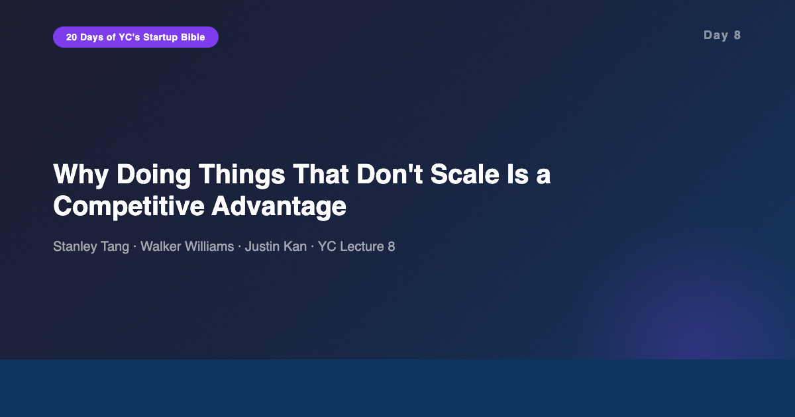
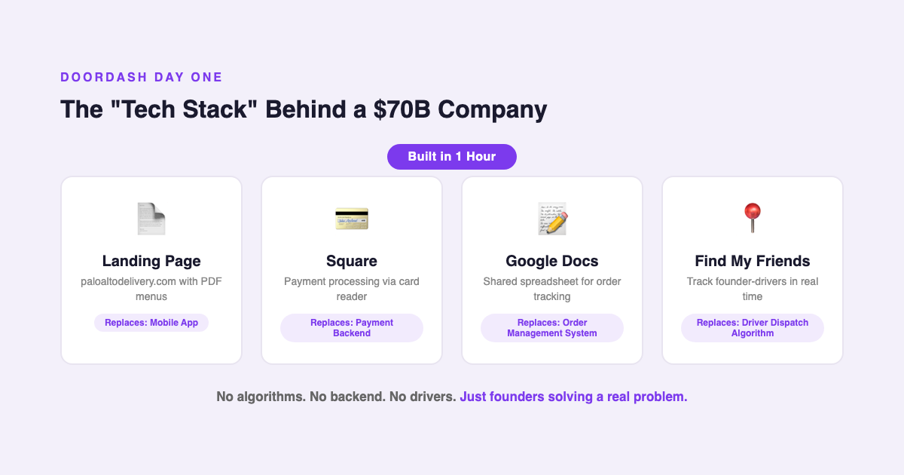
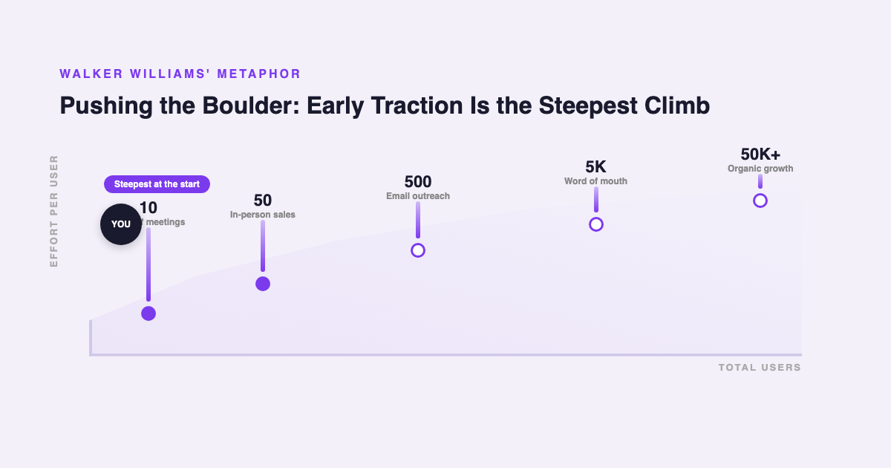
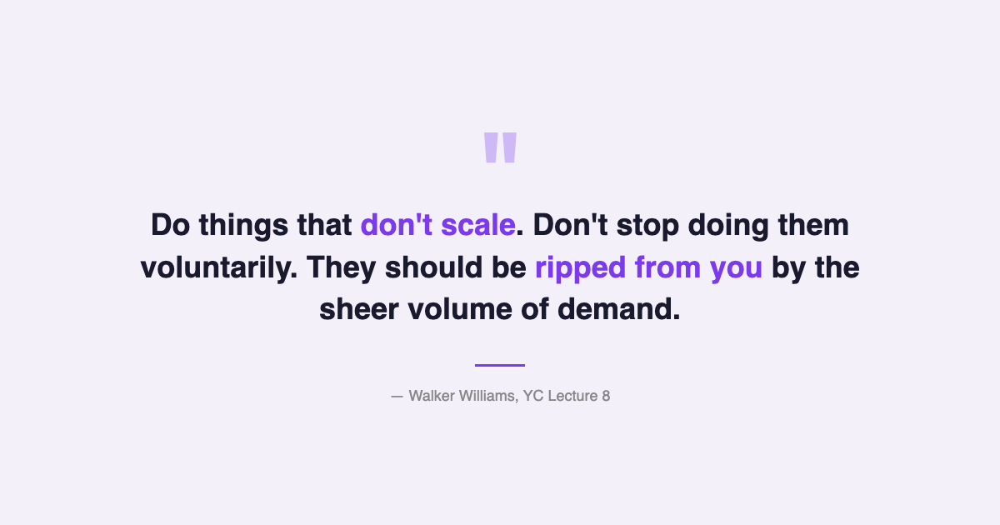

# YC's Startup Lesson #8: Why Doing Things That Don't Scale Is a Competitive Advantage

## Stanley Tang, Walker Williams, and Justin Kan on the DoorDash landing page, the boulder of early traction, and why PR won't save you

---

This is Day 8 of my 20-day series breaking down YC's legendary startup lecture series. Today features three speakers: Stanley Tang (DoorDash co-founder), Walker Williams (Teespring co-founder), and Justin Kan (Twitch/Justin.tv co-founder). Their combined message is one of the most tactical in the entire series — a practical playbook for getting from zero to traction when you have no resources, no brand, and no users.

After ten years building data and AI products, I've watched teams repeatedly make the same mistake: spending months engineering scalable infrastructure before proving that anyone actually wants the product. These three speakers make the case that not only is that backwards — doing things that don't scale is often the ONLY way to figure out what you should be building.

---

## The One-Hour Hypothesis Test

Stanley Tang's DoorDash origin story is one of the most cited examples in startup lore, and for good reason. It strips entrepreneurship down to its most essential act: testing whether a problem is real.

Tang and his co-founders were Stanford students who noticed that local restaurants in Palo Alto didn't offer delivery. Rather than building an app, hiring drivers, or raising money, they did something radical in its simplicity. They built a landing page called paloaltodelivery.com. It took one hour. They uploaded PDF menus from local restaurants, listed a phone number, and waited.

The phone rang. Orders came in. And then the founders did something that no $70 billion company would ever do at scale: they delivered the food themselves. They took customer support calls during Stanford lectures. They processed payments with Square. They tracked each other's locations with Find My Friends. They managed orders in a shared Google Doc.

This is the part that resonates most deeply with my own experience. In data and AI, I've seen teams spend six months building a machine learning pipeline before confirming that the underlying data problem matters to anyone. Tang spent an hour. The gap between those two approaches isn't just about speed — it's about what you learn. When you deliver the food yourself, you understand the delivery process at a level that no amount of user research or data analysis can provide. You feel the friction. You see the edge cases. You become the domain expert.

This connects to something I've noticed in consulting as well. The most effective consultants are the ones who've personally done the work in the domain they advise on. You can't fake that embodied knowledge. Tang's insight is the same: doing the unscalable work yourself isn't just a scrappy shortcut. It's research that makes everything you build afterward better.

---

## The Boulder and the Hill

Walker Williams from Teespring provides the complementary perspective: what the first users actually feel like when you're in the trenches getting them.

His metaphor is visceral. Getting early traction is like pushing a boulder up a hill. The hill is steepest at the very beginning. His first users at Teespring required days of in-person meetings to close. Days — to sell 50 shirts for $1,000. The effort-to-revenue ratio was absurd. But Williams argues this is exactly how it's supposed to feel.

This hit close to home. When I started creating content on social media, the early days felt identical. Posting carefully crafted insights to an audience of almost nobody. Single-digit likes. Minimal engagement. Every piece of content felt like pushing that boulder. But the people who did engage early became the most loyal followers — the ones who share, comment, and come back consistently.

Williams makes a critical distinction about these early users: they're not just customers. They're potential champions. And the relationship is asymmetric. One detractor can cancel out the positive impact of ten champions. So you have to make it right with every single user, especially the frustrated ones. His counterintuitive finding: the most frustrated early users, once you resolve their issues, often become your longest-term users. They've seen you at your worst and watched you fix it. That builds trust no marketing campaign can replicate.

---

## Speed Over Code Quality

One of the most provocative claims in this lecture comes from Williams on engineering priorities. Teespring's CTO, at one point, duplicated the entire codebase rather than refactoring it. The result: a process that would have taken a month was completed in three to four days.

This sounds like engineering malpractice. But Williams frames it with a principle that I've come to respect after years in tech: only worry about the next order of magnitude. If you have 100 users, build systems that work for 1,000. Don't build for 100,000. You'll know different things by the time you reach 1,000 that will change what you build for 100,000 anyway.

In data engineering, this principle is particularly relevant. I've seen teams build elaborate distributed data pipelines before they had enough data to justify anything beyond a single database. The premature optimization wasn't just wasteful — it actively slowed them down because every change required navigating infrastructure that was designed for a scale they hadn't reached.

---

## PR Is a Vanity Metric

Justin Kan's section on PR provides an important counterweight to the "do things that don't scale" message. PR, he argues, is one of those unscalable activities that people overvalue. Being featured in TechCrunch or the New York Times feels like a milestone. It isn't.

Kan is blunt: press coverage is useful for getting your first few hundred users and for impressing your parents. Beyond that, it's not a sustainable growth channel. The attention spike is temporary. The users who come from press coverage often have lower retention than users who found you through word of mouth or direct need.

That said, Kan offers tactical advice for when PR does make sense. Know your goal (what do you want from the coverage?). Know your audience (which reporter covers your space?). Get warm introductions through other founders who've been covered. Give reporters a one-week lead time. And aim for face-to-face meetings — the conversion rate is dramatically higher than email pitches.

The most important PR insight: never give your product away for free to get press coverage or early users. Paid users and free users behave completely differently. Free users create a false sense of product-market fit. They'll say they love your product because it cost them nothing. Paid users will tell you what's actually wrong because they have skin in the game.

---

## The AI/Data Angle

This lecture is from 2014, and the "do things that don't scale" philosophy has an interesting tension with the AI era. AI tools today make it possible to automate things that previously required hands-on founder involvement. You can use AI to handle customer support, generate personalized emails, process orders, and analyze user behavior — all the things Tang did manually at DoorDash.

But I'd argue the core principle still holds, maybe even more strongly. In an era where everyone has access to the same AI tools, the founders who still do unscalable things — who still personally talk to users, who still deliver the product themselves, who still write individual emails — have an even greater competitive advantage. When AI makes efficiency cheap, human attention becomes the scarce resource.

From my experience building AI products, the teams that shipped fastest were the ones that used AI to augment their unscalable activities, not replace them. Use AI to draft the personalized email, but review and send it yourself. Use AI to analyze support tickets for patterns, but respond to the critical ones personally. Use AI to build a prototype in an hour (just like Tang built his landing page in an hour), but be the one who talks to every early user.

The trap is using AI as an excuse to skip the unscalable phase entirely. If you never deliver the food yourself, you never develop the domain expertise that makes your product decisions better than your competitors'. The one-hour landing page test is more relevant than ever — AI just means the landing page is even easier to build.

---

## What Surprised Me Most

The part of this lecture I keep returning to is Williams's insistence that you should do unscalable things for as LONG as possible. Not as a temporary phase. Not as a necessary evil. As a deliberate strategy. He says: don't stop doing these things voluntarily. They should be ripped from you — by the sheer volume of demand making them physically impossible.

This reframes "things that don't scale" from a startup hack into a philosophy. The founders who maintain direct user relationships the longest are the ones who build the deepest moats. They understand their users at a level that no analytics dashboard can provide. And in the AI era, when everyone's analytics dashboards look the same, that embodied understanding is the real competitive advantage.

---

## Key Takeaways

- **Test hypotheses with the simplest possible method.** DoorDash started with a one-hour landing page and PDF menus. Don't build infrastructure before you've confirmed the problem is real.
- **Doing the work yourself makes you the domain expert.** Delivering food, taking support calls, writing personalized emails — this isn't grunt work. It's research.
- **First users are the hardest — and the most valuable.** Pushing the boulder is steepest at the start. Those early users become your champions if you treat them right.
- **One detractor cancels ten champions.** Always make it right. The most frustrated users, once resolved, become the most loyal.
- **Speed beats code quality at early stage.** Only build for the next order of magnitude. You'll know different things by then.
- **PR is a vanity metric.** Good for first few hundred users. Not a growth strategy. Never give product away free to get coverage.
- **Don't stop unscalable work voluntarily.** Hold onto it as long as possible. Let demand rip it from you.
- **In the AI era, human attention is the scarce resource.** Use AI to augment unscalable activities, not replace them.

---

## What's Next

**Day 9:** Marc Andreessen, Ron Conway, and Parker Conrad on how to raise money — the investor perspective on what makes a startup fundable and the tactical playbook for actually closing a round.

If you're following along with this series, [subscribe to my newsletter](https://substack.com/@jiazhenzhu) where I go deeper, with angles I don't publish on Medium.

---

## Resources

- **Video:** [YC Lecture 8 — Doing Things That Don't Scale, PR, and How to Get Started](https://www.youtube.com/watch?v=oQOC-qy-GDY)
- **Transcript:** [Walker Williams Lecture 8 (Annotated) — Genius](https://genius.com/Walker-williams-lecture-8-doing-things-that-dont-scale-pr-and-how-to-get-started-annotated)
