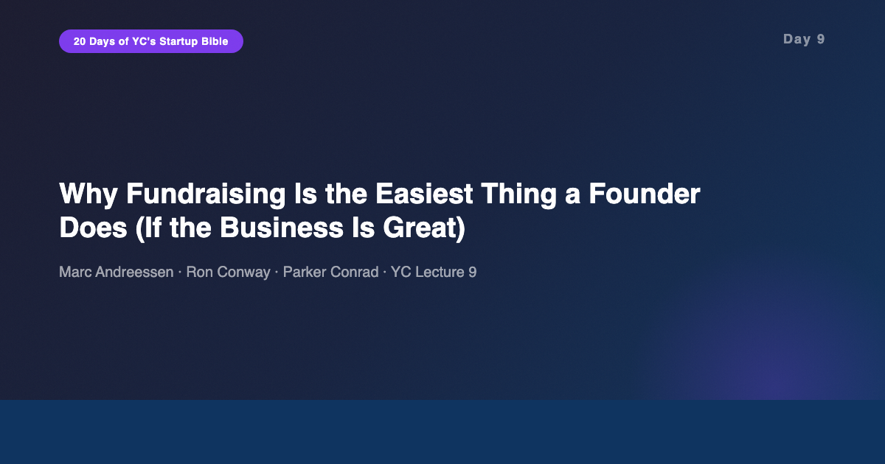
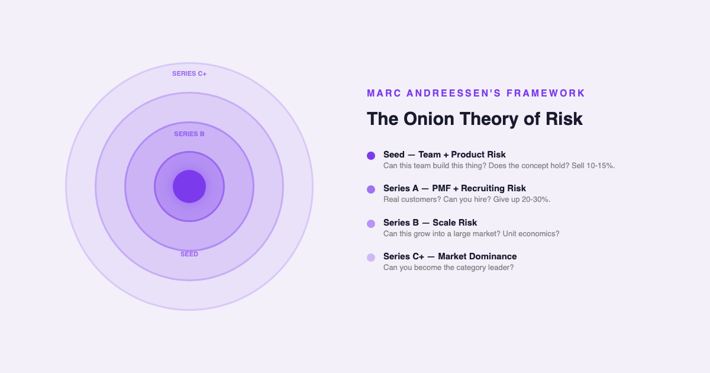
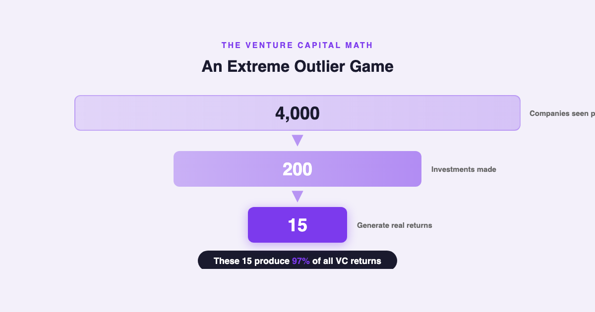
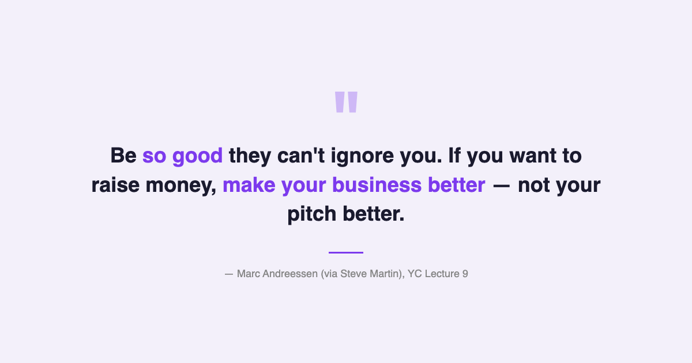

# YC's Startup Lesson #9: Why Fundraising Is the Easiest Thing a Founder Does (If the Business Is Great)

## Marc Andreessen, Ron Conway, and Parker Conrad on the Steve Martin principle, the onion theory of risk, and why choosing an investor is like choosing a spouse

---

This is Day 9 of my 20-day series breaking down YC's legendary startup lecture series. Today features a panel that reads like a Silicon Valley Mount Rushmore: Marc Andreessen (co-founder of a16z and Netscape), Ron Conway (founder of SV Angel, often called the godfather of Silicon Valley angel investing), and Parker Conrad (founder of Zenefits). Their combined perspective covers both sides of the fundraising table — what investors actually look for, and what founders actually experience.

After ten years building data and AI products, I've been on the fundraising side of the table at various stages. I've watched pitches succeed that shouldn't have and fail that shouldn't have. This lecture crystallized something I've felt but couldn't articulate: the best fundraising strategy isn't about fundraising at all.

---

## "Be So Good They Can't Ignore You"

Andreessen opens with a Steve Martin quote that reframes the entire fundraising conversation: "Be so good they can't ignore you."

His argument is counterintuitive for anyone who's spent time preparing pitch decks. Fundraising, he claims, is actually the EASIEST thing a startup founder will do — if the underlying business is genuinely compelling. The problem isn't that fundraising is hard. The problem is that most founders are trying to raise money for businesses that aren't good enough yet.

This is the Steve Martin principle applied to startups. When someone asked Steve Martin for advice on breaking into comedy, he said: "Nobody ever takes note of my answer because it's not the answer they want to hear. What they want to hear is 'Here's how you get an agent, here's how you write a script' — but what I always say is: be so good they can't ignore you."

The same applies to fundraising. Founders obsess over pitch mechanics — the deck layout, the demo script, the storytelling arc. Andreessen's point is that all of that optimization is second-order. If the business is obviously great, the money follows. If it's not, no amount of pitch polish will save it.

This resonates deeply with what I've seen in data and AI. The best products I've worked on didn't need elaborate sales pitches. When you build something that solves a real, painful problem, users pull it out of your hands. The same dynamic applies to investors — they're looking for businesses that are so clearly working that saying no would be the risky move.

---

## The Onion Theory of Risk

One of the most useful frameworks in this lecture is Andreessen's "onion theory of risk." Every startup is a bundle of layered risks, like the layers of an onion. Each fundraising round should peel away a specific layer.

At the seed stage, you're eliminating founding team risk and product risk. Can this team build this thing? Does the initial concept hold together? At the Series A, you're eliminating product-market fit risk and early hiring risk. Can you get real customers? Can you recruit the team to serve them? At the Series B, you're eliminating scaling risk. Can this grow?

The critical insight is about calibration. The amount of money you raise at each round should precisely match the risks you're eliminating at that stage. Raise too little, and you can't peel away enough risk to justify the next round. Raise too much, and you've taken unnecessary dilution for risk layers you're not ready to address yet.

This framework has practical implications for how you structure your ask. When you walk into a seed round, you shouldn't be talking about your go-to-market strategy for enterprise customers. That's a Series A risk. At seed, you need to convince investors that your team can build the product and that the initial hypothesis is worth testing. Each round has its own thesis, and mixing them signals confusion.

From my experience in data product development, I see a parallel. When building data platforms, you de-risk in stages too. First: can we access and clean the data? Then: can we generate useful insights? Then: can we scale the pipeline? Teams that try to solve all three simultaneously usually fail at all three. The onion theory isn't just for fundraising — it's a general framework for navigating uncertainty.

---

## The Extreme Outlier Game

Andreessen shares a statistic that should change how every founder thinks about venture capital. Of the roughly 4,000 companies that VCs see in a given year, they invest in about 200. Of those 200, approximately 15 generate 97% of all returns.

This has a profound implication for what investors are actually looking for. They're not looking for solid, well-rounded companies with no obvious weaknesses. They're looking for companies with the potential to be one of those 15. And the companies that become those 15 almost always have serious, obvious flaws — alongside one or two extreme, exceptional strengths.

Andreessen calls this "investing in strength versus lack of weakness." Checkbox investing — where you evaluate every dimension and only invest if nothing looks bad — systematically misses the biggest winners. The biggest winners are weird. They have glaring problems. But they have something so compelling that it doesn't matter.

He gives a personal example: a16z passed on Airbnb in the first round. The concerns were obvious. Strangers sleeping in strangers' homes? Legal issues in every city? A market that seemed tiny? All valid weaknesses. But the strength — the sheer intensity of user love, the growth rate, the repeat usage — was off the charts. That single missed deal shaped how a16z thinks about investing to this day.

This principle extends far beyond venture capital. In my career building AI products, the most successful features were rarely the well-rounded ones. They were the ones that did ONE thing extraordinarily well, even if they had rough edges everywhere else. Users will forgive a lot of jank if you solve their core problem in a way nobody else can.

And this applies to personal career strategy too. The professionals I've seen have the most impact aren't the ones with balanced, weakness-free resumes. They're the ones with one or two extreme spikes — a depth of expertise or a unique combination of skills that makes them impossible to ignore. The Steve Martin principle works for careers the same way it works for startups.

---

## Choosing an Investor Is Choosing a Spouse

Parker Conrad provides the most memorable metaphor of the lecture. Choosing an investor, he argues, is like choosing a spouse. A VC sits on your board for 10 to 20 years. That's longer than the average US marriage in America. You're not picking someone for a transaction. You're picking a partner for the hardest decade of your professional life.

Conrad offers a practical test: after meeting a potential investor, ask yourself — even if they didn't have a checkbook, was that hour worthwhile? Did you learn something? Did they challenge your thinking? Did they connect you to someone useful? If the answer is no, they're probably not the right partner, regardless of their fund size.

This echoes something Kevin Hale said in Day 7 about building products users love — he also used the marriage metaphor. It's a recurring thread in this series. The human relationships at the core of startups — co-founders, investors, early users — all follow the same pattern. You're looking for genuine alignment, not just a transaction. And the cost of getting it wrong compounds over years.

In my MBA classes at Stern, we study investor relations as a financial optimization problem. What's the right valuation? What are the optimal terms? But the YC perspective adds a layer that finance classes often miss: the relational dimension. The best investor isn't the one who offers the highest valuation. It's the one who adds the most value when things inevitably go wrong.

---

## The AI/Data Angle

This lecture is from 2014, and the fundraising landscape has shifted dramatically — partly because of AI. In 2024-2026, AI startups are raising at unprecedented valuations, often at the idea stage. The onion theory of risk still applies, but the layers look different.

For AI startups specifically, the risk layers have shifted. The core technology risk (can we build the model?) has decreased as foundation models become commoditized. But new risks have emerged: data moat risk (can we build a proprietary dataset?), regulatory risk (will this be legal in two years?), and integration risk (can enterprises actually deploy this?).

From my experience building data products, I'd argue the most underrated risk layer for AI startups is the "last mile" problem — the gap between a working demo and a reliable production system. I've seen dozens of AI features that worked brilliantly in demos but failed in production because real-world data is messier, more variable, and more adversarial than training data. Investors who understand this gap are significantly more valuable than those who just want to fund the next model.

The Steve Martin principle is especially relevant in the current AI hype cycle. When every pitch deck mentions "AI" and "LLM," the founders who stand out aren't the ones with the slickest demos. They're the ones with genuine domain expertise, real user traction, and products so good that the AI label is secondary to the problem being solved. Be so good they can't ignore you — even in a market where everyone is waving the AI flag.

---

## What Surprised Me Most

The statistic that stuck with me most is the cap table warning. Andreessen says that if outsiders already own 80% of a company before the Series A, a16z walks away. Not because the company is bad, but because the incentive structure is broken. The founders don't own enough of their own company to stay motivated through the inevitable hard years.

The recommended guidelines are striking in their specificity. Sell 10-15% at seed. Give up 20-30% at Series A. These numbers aren't arbitrary — they're calibrated to ensure that founders still own enough of the company to be fully committed through the scaling phase. A destroyed cap table, Andreessen argues, is a destroyed company.

This is something I've seen play out in practice. Teams where the founders own very little of the equity move differently. There's less urgency, less willingness to do the painful unscalable work from Day 8, less of the obsessive product focus that creates those 15 outlier companies. Equity alignment isn't a legal detail. It's an operational reality.

---

## Key Takeaways

- **Make your business better, not your pitch better.** If the business is genuinely great, fundraising is the easy part. If it's not, no pitch will save it.
- **Peel the onion one layer at a time.** Each round eliminates specific risks. Raise the amount that matches the risks you're addressing — no more, no less.
- **VC is an extreme outlier game.** 15 out of 4,000 companies generate 97% of returns. Investors are looking for extreme strength, not lack of weakness.
- **Big winners have big flaws.** Checkbox investing misses the outliers. a16z passed on Airbnb because they focused on weaknesses instead of the extraordinary strength.
- **Choose investors like you'd choose a spouse.** 10-20 year relationship. Even without a checkbook, was that meeting worth your time?
- **Protect your cap table.** Seed: 10-15%. Series A: 20-30%. If outsiders own 80%, the company is structurally broken.
- **First sentence clarity.** VCs see 30 companies for every 1 they invest in. If they can't understand what you do immediately, you're filtered out.
- **Bootstrap as long as possible.** Don't treat fundraising as an achievement. It's a tool, not a milestone.

---

## What's Next

**Day 10:** Alfred Lin and Brian Chesky on Company Culture Part I — how Airbnb built a culture so strong that it became their primary competitive advantage, and why culture is simply the decisions you make when nobody's watching.

If you're following along with this series, [subscribe to my newsletter](https://substack.com/@jiazhenzhu) where I go deeper, with angles I don't publish on Medium.

---

## Resources

- **Video:** [YC Lecture 9 — How to Raise Money](https://www.youtube.com/watch?v=uFX95HahaUs)
- **Transcript:** [Marc Andreessen Lecture 9 (Annotated) — Genius](https://genius.com/Marc-andreessen-lecture-9-how-to-raise-money-annotated)