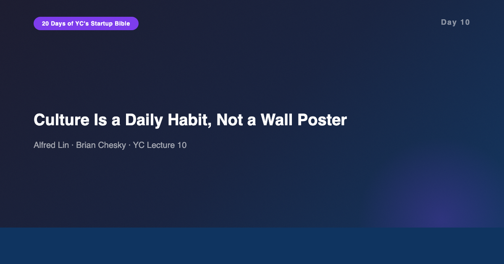
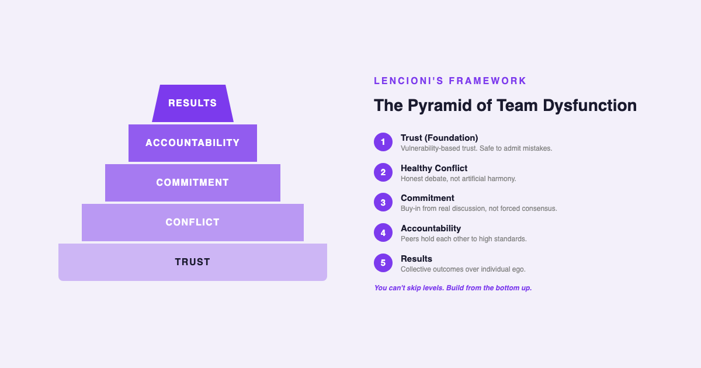
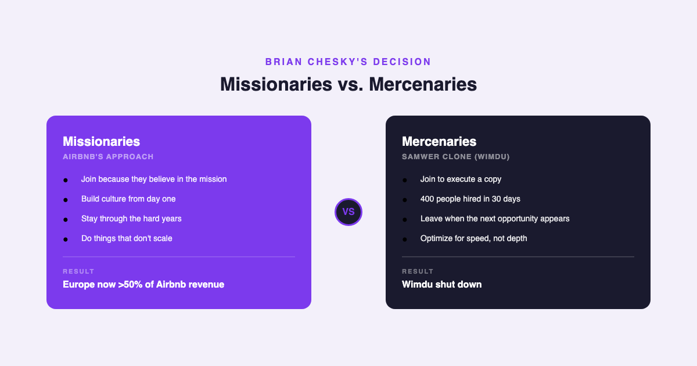
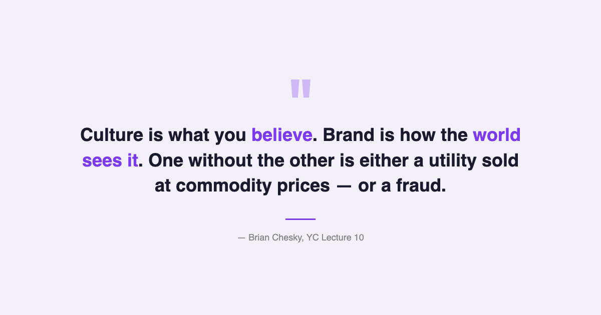

# YC's Startup Lesson #10: Culture Is a Daily Habit, Not a Wall Poster

## Alfred Lin and Brian Chesky on why your first hire implants a DNA chip, why missionaries beat mercenaries, and why the best companies treat culture like fitness

---

This is Day 10 of my 20-day series breaking down YC's legendary startup lecture series. Today features Alfred Lin — partner at Sequoia Capital and former COO of Zappos — alongside Brian Chesky, co-founder and CEO of Airbnb. Between them, they've built two of the most culture-obsessed companies in modern business. Lin brings the analytical framework; Chesky brings the war stories.

After ten years building data and AI products and managing engineering teams, I've seen culture go wrong in every conceivable way. Teams that recited values they didn't practice. Leaders who treated culture as a recruiting brochure. Companies that confused perks with purpose. This lecture cuts through all of that with a definition so simple it's almost uncomfortable: culture is your core values plus your actions in pursuit of your mission. If those two things don't match, you don't have culture — you have marketing.

---

## Culture as Fitness, Not a Crash Diet

Alfred Lin opens with an analogy that reframes how most people think about company culture. Culture, he argues, is like physical fitness. You can't crash-diet your way to being healthy. You have to make it a daily practice — repeated actions, every day, compounding over time.

This isn't just philosophy. Lin cites data: companies that consistently appear on Fortune's "Best Places to Work" list returned 11.8% annually to shareholders, compared to roughly 6% for the S&P 500. Over a 25-year period, that gap is enormous. Culture isn't a soft, fuzzy concept. It's a measurable competitive advantage that compounds over decades.

Lin's definition is precise: culture equals core values plus actions taken every day in pursuit of your mission. The key word is "actions." Values written on a wall mean nothing if they don't translate into daily decisions. Who gets promoted? Who gets fired? How do you handle disagreements? How do you make trade-offs when two good options conflict? Those decisions ARE your culture, whether you've articulated it or not.

From my experience building and scaling data teams, this resonates deeply. I've worked in organizations where the stated values included "data-driven decision making," but leadership routinely overrode data with gut feelings. The engineers noticed. They always notice. The gap between stated values and lived behavior is the single fastest way to destroy trust in a technical organization.

---

## The DNA Chip: Why Your First Hire Matters More Than Your Series A

Brian Chesky shares a detail that sounds almost absurd until you think about it: he spent four to five months finding Airbnb's first engineer. Not because nobody was qualified. Because he believed the first employee implants a "DNA chip" into the company — a behavioral template that every subsequent hire unconsciously copies.

Chesky took this further. He personally interviewed Airbnb's first 300 employees. His screening question was deliberately extreme: "If you had ten years left to live, would you still take this job?" He wasn't looking for a yes. He was looking for how people processed the question — whether they could articulate why this specific mission mattered to them beyond a paycheck.

Lin complements this with Patrick Lencioni's pyramid of team dysfunction, which provides the structural framework for WHY culture-first hiring matters. The pyramid builds from bottom to top: Trust, then Healthy Conflict, then Commitment, then Accountability, and finally Results. You can't skip levels. A team without trust can't have honest conflict. Without honest conflict, you get artificial harmony instead of real commitment. And without real commitment, nobody holds each other accountable.

This framework explains something I've observed repeatedly in my career. In data and AI teams, the most common failure mode isn't technical — it's interpersonal. An engineer who doesn't trust their product manager won't flag problems early. A data scientist who avoids conflict with stakeholders will build what was asked for rather than what's needed. The technical debt isn't in the code. It's in the team dynamics. Lencioni's pyramid isn't just management theory — it's a diagnostic tool for why good teams ship great products and dysfunctional teams ship mediocre ones.

Airbnb also ran separate culture-fit interviews — distinct from technical interviews. This is a practice I've seen work in my own experience managing hiring pipelines. When culture evaluation is embedded in the technical interview, it gets deprioritized. Making it a standalone gate sends a signal: we care about this as much as your coding ability.

---

## Missionaries vs. Mercenaries: The Samwer Clone Story

The most vivid illustration of culture as competitive advantage comes from Chesky's story about the Samwer brothers. The Samwers — famous in the startup world for cloning successful American companies and launching them in international markets — cloned Airbnb and built a 400-person operation across Europe in just 30 days.

They approached Chesky with an acquisition offer. The pressure to buy was enormous. Acquiring the clone would have instantly given Airbnb a European footprint with hundreds of employees already in place. Many advisors recommended taking the deal.

Chesky refused. His reasoning was pure culture logic: you can't bolt on 400 mercenaries to a missionary organization. The Samwer employees were there to execute a copy. They hadn't spent months internalizing why Airbnb existed. They hadn't agonized over the mission. They were efficient operators executing someone else's playbook.

The result? Airbnb built out Europe organically, with people who believed in the mission. Europe now generates over 50% of Airbnb's total revenue. The mercenary clone, Wimdu, eventually shut down.

This distinction — missionaries versus mercenaries — maps directly to something I see in the AI industry today. When the generative AI wave hit, every company scrambled to hire "AI talent." Many of them staffed up with engineers who were chasing the hype, not the problem. Those teams are now struggling with retention, alignment, and shipping anything coherent. The teams that are winning are the ones where people joined because they cared about the specific problem being solved, not because "AI" was on the job title.

---

## Core Values Must Be Unique (Or They're Useless)

One of Lin's most practical points is about what core values should NOT be. Values like "honesty," "integrity," and "teamwork" are table stakes. Every company claims them. If your competitor could put the same values on their wall, they're not values — they're defaults.

Airbnb's core values are deliberately unique. "Be a cereal entrepreneur" is a reference to the early days when Chesky and Gebbia sold novelty cereal boxes (Obama O's and Cap'n McCains) to fund the company. It means: be resourceful, be scrappy, find creative solutions to impossible problems. That value is specific to Airbnb's origin story. No other company could authentically claim it.

"Champion the mission" meant something concrete at Airbnb — it was the filter through which the Samwer decision was made. "Every frame matters" came from Chesky's design background and reflected a commitment to craftsmanship that permeated the product.

In my MBA classes at Stern, we study organizational behavior frameworks that treat values as interchangeable components of corporate strategy. The YC perspective is fundamentally different: values must be EARNED through lived experience, not designed in a boardroom. The best values are the ones that make outsiders say "that's weird" and insiders say "that's exactly who we are."

---

## The AI/Data Angle

This lecture surfaces a recurring YC theme that I've now heard in multiple lectures across this series: "do things that don't scale." Day 8 covered it explicitly. Day 4 touched on it. And here in Day 10, Chesky is doing it again — personally interviewing 300 employees, spending 5 months on one hire, refusing a shortcut acquisition.

This theme keeps appearing because it's the meta-pattern beneath everything YC teaches. Great products come from unscalable user conversations (Day 4). Great growth comes from unscalable early tactics (Day 8). And great culture comes from unscalable personal investment in every early team member (Day 10). Scalability is the goal, but the path to scalability runs through doing things that would make an operations consultant wince.

For AI teams specifically, this has a direct application. The temptation in AI product development is to automate everything from day one — after all, that's what the technology does. But the best AI products I've built started with manual processes. Manual data labeling before training classifiers. Manual user interviews before building recommendation systems. Manual quality audits before trusting automated pipelines. The "things that don't scale" principle isn't just about hustle. It's about building the deep understanding that makes scaling possible later.

Culture in AI teams has an additional dimension that Lin and Chesky don't address (this was 2014, after all): the values around AI ethics, data privacy, and model transparency. These can't be generic statements like "we use AI responsibly." They need to be as specific and earned as "be a cereal entrepreneur." What does responsible AI mean for YOUR specific product, YOUR specific users, YOUR specific failure modes? If you can't answer that concretely, you don't have an AI ethics culture — you have a press release.

---

## What Surprised Me Most

The detail that stuck with me most is Chesky's claim that brand and culture are two sides of the same coin. Culture is what you believe internally. Brand is how the outside world perceives those beliefs. A company with strong culture but no brand is a utility sold at commodity prices. A company with strong brand but no culture is a fraud waiting to be exposed.

This framing has implications for how AI companies think about positioning. Many AI startups have strong technical culture but weak brand narratives. They can tell you about their model architecture but not about why they exist. The result is that they compete on benchmarks — commodity pricing in technical clothing. The ones that break out are the ones where the internal culture (what they believe about how AI should work) becomes the external brand (what customers trust them to deliver).

---

## Key Takeaways

- **Culture = core values + daily actions in pursuit of mission.** If the values on the wall don't match the decisions in the room, you don't have culture — you have decoration.
- **Culture is like fitness — daily habits, not crash diets.** Best-companies-to-work-for returned 11.8% vs ~6% for S&P 500 over 25 years.
- **Your first hire implants a DNA chip.** Chesky spent 4-5 months finding Airbnb's first engineer. He interviewed the first 300 employees personally.
- **Core values must be unique.** "Honesty" and "integrity" are defaults, not values. "Be a cereal entrepreneur" is a real value because no other company could claim it.
- **Build trust before anything else.** Lencioni's pyramid: Trust, Conflict, Commitment, Accountability, Results. You can't skip levels.
- **Missionaries beat mercenaries every time.** Airbnb refused to acquire the Samwer clone (400 people in 30 days). Europe now generates >50% of revenue.
- **"Do things that don't scale" is the meta-pattern.** It appears in product (Day 4), growth (Day 8), and culture (Day 10). The path to scalability runs through unscalable personal investment.
- **Brand and culture are two sides of the same coin.** Culture without brand = utility at commodity prices. Brand without culture = fraud waiting to be exposed.

---

## What's Next

**Day 11:** Patrick Collison, John Collison (Stripe), and Ben Silbermann (Pinterest) on Company Culture Part II — how different founders build different cultures, and what happens when culture scales past the first 100 employees.

If you're following along with this series, [subscribe to my newsletter](https://substack.com/@jiazhenzhu) where I go deeper, with angles I don't publish on Medium.

---

## Resources

- **Video:** [YC Lecture 10 — Company Culture and Building a Team, Part I](https://www.youtube.com/watch?v=RfWgVWGEuGE)
- **Transcript:** [Alfred Lin Lecture 10 (Annotated) — Genius](https://genius.com/Alfred-lin-lecture-10-company-culture-and-building-a-team-part-i-annotated)