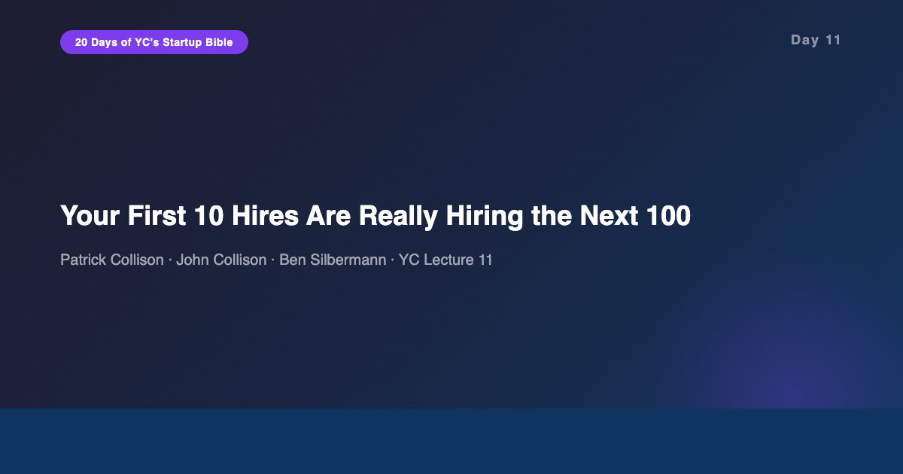
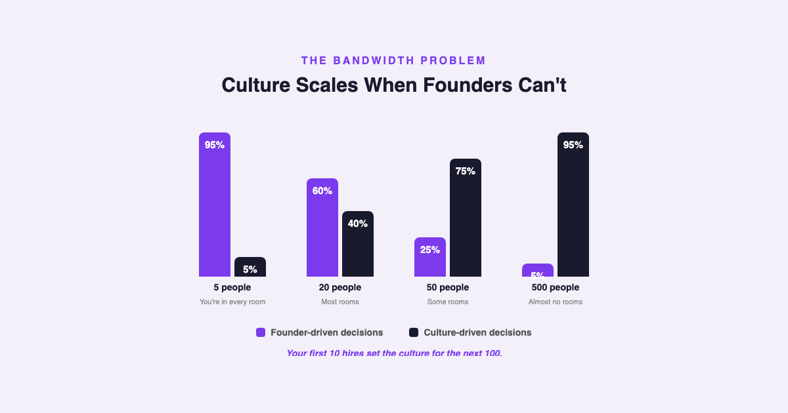
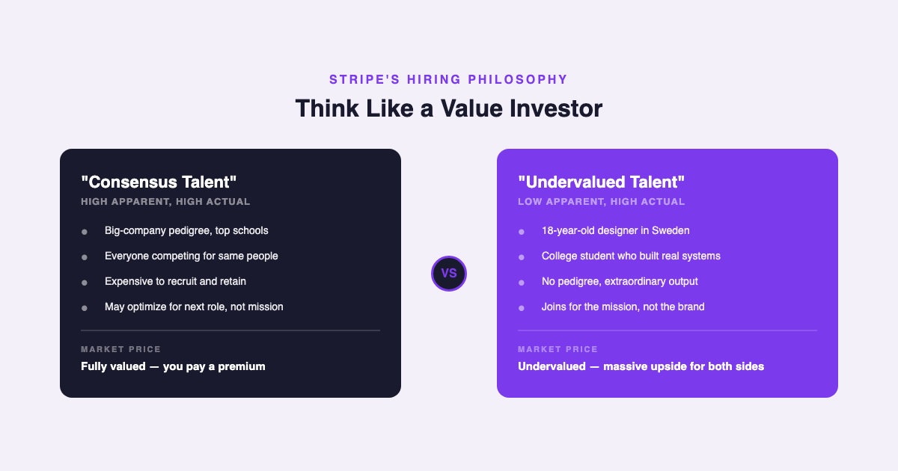
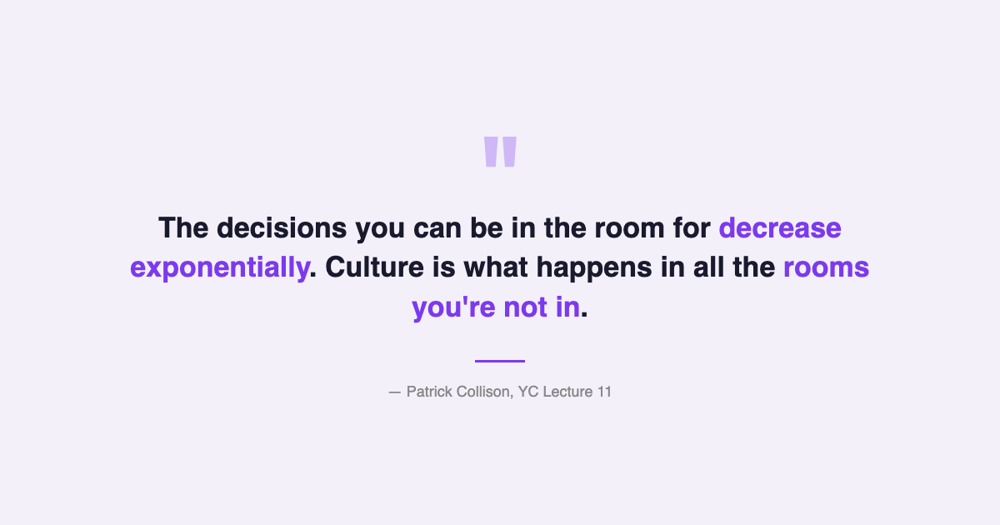

# YC's Startup Lesson #11: Your First 10 Hires Are Really Hiring the Next 100

## Patrick Collison, John Collison, and Ben Silbermann on thinking like a value investor, radical transparency, and why culture is the only thing that scales when you can't be in every room

---

This is Day 11 of my 20-day series breaking down YC's legendary startup lecture series. Today features two sets of founders who built very different companies with very different cultures: Patrick and John Collison, co-founders of Stripe, and Ben Silbermann, founder of Pinterest. Where Day 10 gave us the theory of culture (Alfred Lin's frameworks, Chesky's DNA metaphor), Day 11 is the practitioner's manual — specific tactics for hiring, transparency, and scaling culture past the point where you can personally touch every decision.

After ten years building data and AI products, I've hired hundreds of people and been part of dozens of hiring committees. The conventional wisdom in tech hiring is broken in ways I couldn't articulate until I heard the Collisons describe their approach. They don't think like recruiters. They think like value investors. And that reframing changes everything about where you look, who you hire, and how you evaluate talent.

---

## Culture as Bandwidth Solution

Patrick Collison opens with a framing that turns culture from an abstract concept into an engineering problem. As a founder, the number of decisions you can personally be involved in decreases exponentially as the company grows. At 5 people, you're in every conversation. At 50, you're in maybe a quarter. At 500, you're in almost none.

Culture is what fills the gap. It's the set of assumptions, values, and decision-making frameworks that operate when you're NOT in the room. Collison frames it as the "invariant" — the thing that stays constant across an ever-expanding decision space. This is why your first 10 hires matter so disproportionately. Those 10 people don't just do their own work. They set the behavioral template that the next 100 hires unconsciously absorb.

This maps directly to something I've experienced scaling data teams. When my first data engineer was someone who obsessively documented every pipeline decision, that practice became the team norm. When I later joined a team where the first engineer had a "move fast, document later" philosophy, that was equally persistent — and "later" never came. The first hire's habits become the team's habits, whether you plan for it or not.

Ben Silbermann adds his own filter for the first 10: hard-working, high integrity, low ego, and a quirky intellectual curiosity. The "quirky" part matters because it signals someone who's genuinely interested in understanding things, not just executing tasks. In my experience, the best data scientists share this trait — they're the ones who notice anomalies in data not because they're told to look, but because they can't help it.

---

## Think Like a Value Investor: Finding Undervalued Talent

The most actionable framework in this lecture is the Collisons' approach to hiring as value investing. In public markets, value investors look for stocks whose intrinsic value exceeds their market price. The Collisons apply the same logic to talent: find people whose ACTUAL ability far exceeds their APPARENT talent.

Their examples are striking. Stripe's first designer was an 18-year-old living in Sweden. Their first CTO was still in college. These weren't "safe" hires by any conventional measure. No big-company pedigree. No impressive LinkedIn profiles. But the Collisons had done the work to evaluate actual ability, not resume signals.

The key distinction Collison makes is between relaxing standards on "apparent talent" versus "actual talent." You never lower the bar on quality. You lower the bar on the SIGNALS you use to judge quality. Traditional hiring over-indexes on credentials, brand-name employers, and years of experience — proxies that correlate with talent but are not talent itself.

This connects directly to something I discussed in Day 9 about Marc Andreessen's "invest in strength" principle. Andreessen argued that great investors back founders with one exceptional strength rather than well-rounded mediocrity. The Collisons take this further: great hiring means backing people with exceptional ability who haven't yet accumulated the social proof that would make them expensive and obvious.

In my own career building data and AI teams, the best hires I've made followed this pattern. A junior analyst who'd taught herself SQL by building a database of every recipe she'd ever cooked. A recent bootcamp grad who had rebuilt a complex ETL pipeline in his spare time just to understand how it worked. Neither had impressive resumes. Both became the strongest contributors on their teams within six months. The signal wasn't on the resume — it was in how they talked about problems.

---

## Radical Transparency and Its Trade-offs

Stripe's approach to transparency deserves its own section because it's both the most compelling and most cautionary part of the lecture. The Collisons implemented what they call radical transparency: all internal emails were bcc'd to an "everyone" list so any employee could read any conversation. All internal documentation lived in public Hackpad documents. Nothing was hidden.

The benefits were real. New employees could self-onboard by reading the entire history of decisions. Context wasn't hoarded by senior people. Information asymmetry — the quiet killer of alignment in growing companies — was eliminated by default.

But Collison is honest about the costs. When everyone can read everything, people start performing rather than communicating. A phenomenon they called "drive-by criticism" emerged: people who weren't involved in a decision would drop one-line critiques without context, causing "stage fright" in the original participants. The email transparency literally broke Gmail at 170 people because of the sheer volume.

From my experience managing data teams, this tension is familiar. I've worked in organizations that tried radical transparency with dashboards — making every team's metrics visible to everyone. The theory was accountability. The reality was that teams gamed the metrics because they knew everyone was watching. Transparency without trust creates surveillance. Transparency WITH trust creates alignment. This is why Lencioni's pyramid from Day 10 matters: trust has to come first.

---

## Practical Hiring Tactics

Several tactical insights from this lecture are immediately actionable:

**Quantitative reference checks.** Instead of asking "is this person good?" — a question that produces uniformly positive answers — the Collisons ask: "Where does this person rank? Top 1%, top 5%, or top 10% of people you've worked with?" This creates artificial scarcity in the evaluation and forces honest differentiation. A reference who pauses before answering "top 5%" is telling you something very different from one who immediately says "top 1%."

**The mission test.** If a candidate lists 7 unrelated companies they'd love to work at, that's a red flag. They want "experience" — the resume line, the brand name, the learning opportunity. They don't want YOUR mission. This doesn't make them bad people. It makes them a bad culture fit for an early-stage company where missionary commitment is the difference between surviving and folding.

**Learn "world class" before hiring.** Before hiring for a role you've never held yourself — say, a VP of Sales or a Head of Design — talk to 5-10 people who are universally acknowledged as world-class in that function. Build a mental model of what excellence looks like BEFORE you start evaluating candidates. Otherwise, you'll anchor on the first impressive-sounding person you meet.

**Time horizons scale proportionally.** In month one, think one month ahead when hiring. In year four, think four years ahead. Early hires should deliver immediate output. Later hires can be "investment hires" — people who won't peak for two years but will be transformative when they do.

---

## The AI/Data Angle

The "value investor" hiring framework has a specific and urgent application in AI right now. The AI talent market is experiencing one of the most extreme disconnects between apparent talent and actual talent in recent tech history.

On one side, you have candidates with "AI" prominently on their resume — they've fine-tuned a model, they list PyTorch and TensorFlow, they've completed the standard courses. Their apparent talent is high. On the other side, you have people who've been quietly building data infrastructure, writing production code, and shipping features for years — and who picked up modern AI tools in six months because they had the engineering fundamentals to absorb them quickly. Their apparent talent in "AI" is lower, but their actual ability to build AI products is often higher.

The companies winning the AI hiring war right now are the ones thinking like value investors. They're not competing for the same pool of "AI engineers" that every FAANG company is bidding on. They're finding strong engineers with deep domain knowledge and helping them become AI engineers. The talent is undervalued because the market is pricing on keywords, not capability.

Pinterest's model of autonomous teams — small units with a designer, engineer, and writer, anchored to specific projects — also maps well to how effective AI teams should be structured. The worst AI team structure I've seen is the centralized "AI center of excellence" that serves every business unit. The best is small, cross-functional pods embedded in specific problem domains, exactly as Silbermann describes.

---

## What Surprised Me Most

The detail that stuck with me most is Collison's casual admission that startup hours are exaggerated. He estimates it's about two hours more per day than a normal job — "the startup version of fishing stories." This is refreshingly honest and directly contradicts the hustle-porn narrative that dominates startup culture content.

It also reframes the culture question. If it's NOT about working 100-hour weeks, then what IS the cultural advantage of a startup? It's not hours — it's intensity of focus. Two extra hours of deeply focused work on one problem beats ten extra hours of scattered effort across many. Culture isn't about how much you work. It's about how aligned that work is.

---

## Key Takeaways

- **Culture solves the bandwidth problem.** The decisions you can be in the room for decrease exponentially. Culture is the invariant — what happens when you're not there.
- **Your first 10 hires are hiring the next 100.** Behavioral templates set by early employees become the unconscious norms for everyone who follows.
- **Think like a value investor.** Find people whose actual talent exceeds their apparent talent. Relax credential requirements, never quality requirements.
- **Radical transparency has real trade-offs.** Information access drives alignment, but without trust it creates surveillance and stage fright.
- **Use quantitative reference checks.** "Top 1%, 5%, or 10%?" forces honest differentiation. "Is this person good?" does not.
- **The 7-company red flag.** Candidates who'd happily work at 7 unrelated companies want experience, not your mission.
- **Learn what "world class" looks like before you hire.** Talk to acknowledged top performers in any unfamiliar role before evaluating candidates.
- **Startup hours are exaggerated.** About 2 hours more per day. The advantage is focus intensity, not raw hours.

---

## What's Next

**Day 12:** Aaron Levie (Box) on Building for the Enterprise — why enterprise software is having its moment and how startups can compete with incumbents.

If you're following along with this series, [subscribe to my newsletter](https://substack.com/@jiazhenzhu) where I go deeper, with angles I don't publish on Medium.

---

## Resources

- **Video:** [YC Lecture 11 — Company Culture and Building a Team, Part II](https://www.youtube.com/watch?v=H8Dl8rZ6qwE)
- **Transcript:** [Patrick Collison Lecture 11 (Annotated) — Genius](https://genius.com/Patrick-collison-lecture-11-company-culture-and-building-a-team-part-ii-annotated)