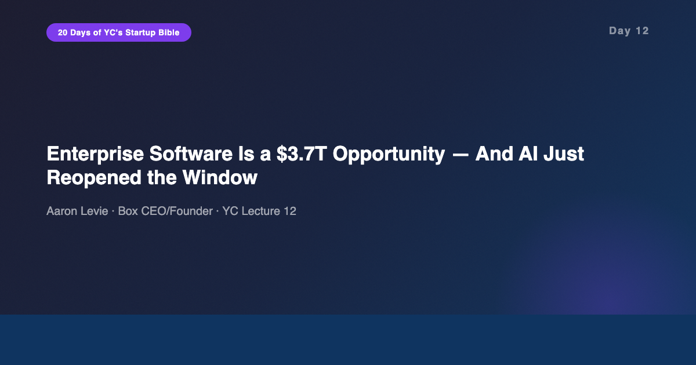
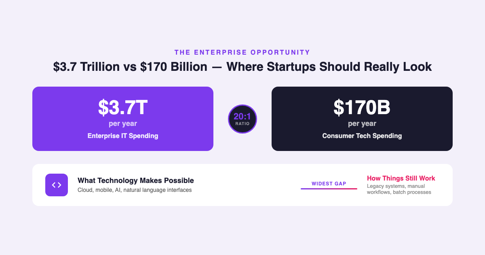
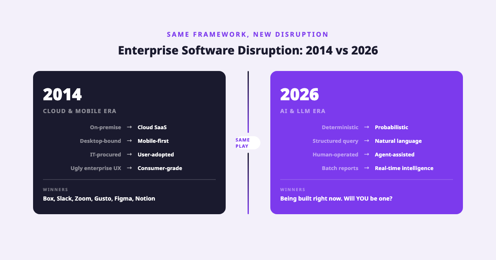
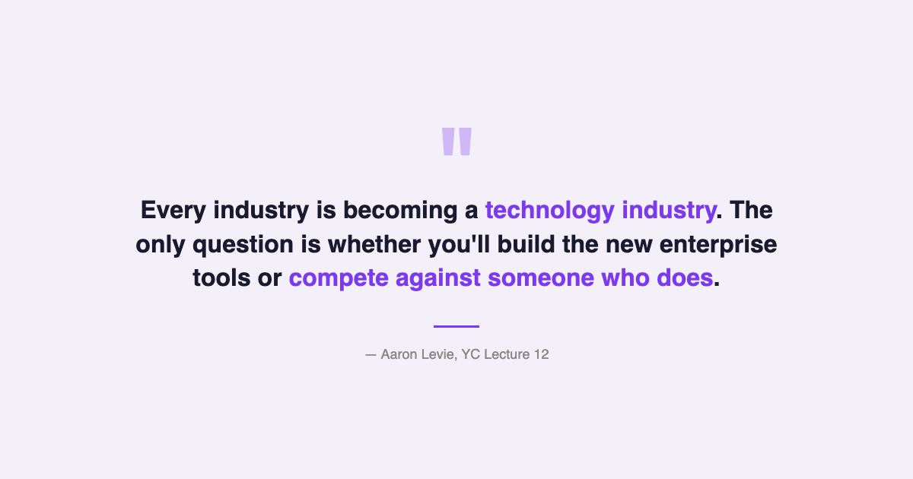

# YC's Startup Lesson #12: Enterprise Software Is a $3.7T Opportunity — And AI Just Reopened the Window

## Aaron Levie on spotting technology disruptions, starting intentionally small, and why the widest gap between what's possible and what exists is always the startup's best friend

---

This is Day 12 of my 20-day series breaking down YC's legendary startup lecture series. Today features Aaron Levie, co-founder and CEO of Box, on building for the enterprise. This one is personal. I've spent 10+ years building data and AI products for enterprises — from chat-to-data interfaces to full data platforms. Enterprise software is my home turf. So when Levie lays out his framework for why enterprise startups win, I'm not learning it for the first time. I'm pressure-testing it against a decade of lived experience.

And what strikes me most is that Levie gave this lecture in 2014, declaring it "the best time in the history of the world to build an enterprise software company." Twelve years later, I'd argue the window hasn't closed — it's blown wide open again. The technology disruption has simply shifted from cloud and mobile to AI and large language models. The playbook Levie describes is more relevant now than when he wrote it.

---

## The $3.7 Trillion Market That Founders Ignore

Levie opens with a number that should reframe every aspiring founder's thinking: enterprise IT spending is $3.7 trillion per year. Consumer tech, the space that gets all the press and all the Y Combinator mythology? $170 billion.

That's a 20:1 ratio. And yet the popular startup narrative is dominated by consumer products — social networks, messaging apps, consumer AI tools. The reason is simple: consumer products are visible. You use them every day. Enterprise software is invisible. Nobody tweets about their new ERP system.

But enterprise customers have a fundamentally different relationship with software than consumers do. They pay for VALUE CREATION, not just cost savings. If your product helps a company generate $1 million in new revenue or avoid $1 million in losses, they'll gladly pay $100,000 for it. The ROI math is explicit, measurable, and repeatable. Try charging a consumer $100,000 for anything.

This maps directly to Peter Thiel's monopoly framework from Day 5. Enterprise software is one of the clearest paths to building a monopoly because switching costs are high, integration depth creates lock-in, and the relationship compounds over time. A consumer can switch social networks in five minutes. An enterprise migration takes months or years.

From my own experience, the most successful data products I've built were ones where we could point to a specific dollar figure — "this dashboard prevented $2M in inventory waste last quarter" — and tie the product directly to that outcome. The ones that failed were the ones where the value was diffuse and hard to quantify. Enterprise software lives and dies on measurable ROI.

---

## Spotting the Technology Disruption Gap

The core framework of Levie's lecture is elegantly simple: find the widest gap between what technology makes possible and how things actually work today. That gap is your startup opportunity.

In 2014, the gaps were:

- **Cloud vs. on-premise:** Software could be delivered as a service, but most enterprise tools still required local installation and IT departments to manage them.
- **Mobile vs. desktop-bound:** Workers had smartphones but their enterprise tools were chained to desktop browsers.
- **Consumer-grade UX vs. enterprise ugliness:** People used beautiful consumer apps at home, then came to work and suffered through interfaces designed in 2003.
- **User-led IT vs. CIO-gatekept IT:** Workers were adopting tools themselves (Dropbox, Slack) rather than waiting for IT to procure them.

Levie used these gaps to build Box. The technology made cloud file storage possible. But enterprises were still running on-premise SharePoint servers, managing VPNs, and emailing attachments. The gap was massive, and Box filled it.

Now here's what I find fascinating — and what I think Levie would say if he gave this lecture again today. In 2026, the gaps have shifted but the FRAMEWORK is identical:

- **AI-native workflows vs. manual processes:** LLMs can read, summarize, draft, analyze, and route information. But most enterprise workflows still require humans to manually move data between systems, write reports, and make routing decisions that a model could handle.
- **Natural language interfaces vs. structured-query tools:** Users can talk to AI in plain language. But most enterprise data tools still require SQL, BI dashboard configuration, or custom report requests.
- **Real-time intelligence vs. batch reporting:** AI can monitor and respond in real time. Most enterprises still run batch processes overnight and review reports the next morning.
- **AI agents vs. ticket-based workflows:** Autonomous AI can handle tier-1 support, data validation, and routine decision-making. Most enterprises still route everything through human queues.

I've been building in this exact gap for the past three years — chat-to-data interfaces that let business users query enterprise data in plain English instead of waiting for an analyst to write SQL. The technology disruption gap is real, it's wide, and it's exactly where Levie's framework says startups should aim.

---

## The Art of Starting Intentionally Small

Levie's second key insight is counterintuitive: the best enterprise startups start with a deliberately narrow wedge. Not because they lack ambition, but because incumbents won't bother defending small markets.

His examples are precise:

- **ZenPayroll (now Gusto):** Started with payroll for small businesses. ADP and Paychex ignored them because the small business segment was low-margin and fragmented. By the time incumbents noticed, Gusto had the product, the brand, and the customer love to expand.
- **PlanGrid:** Put construction blueprints on iPad. A tiny use case that no enterprise software company would build a product around. But once contractors had blueprints on iPad, they wanted document management, then project tracking, then the full construction workflow. PlanGrid sold to Autodesk for $875 million.

The pattern: enter through a gap too small for incumbents to care about, then expand from a position of strength.

This is what I call the "asymmetry play," and Levie explicitly names it. Find something you can do that incumbents CAN'T or WON'T. Zenefits flipped the business model entirely — instead of charging companies for HR software, they gave the software away free and monetized through insurance brokerage commissions. The incumbent HR software companies literally couldn't copy this because it would cannibalize their existing revenue.

In the AI era, the asymmetry opportunities are everywhere. Incumbents have massive installed bases running on deterministic logic. They can't easily introduce probabilistic AI outputs into workflows where their customers expect consistency. A startup with no legacy can build AI-native from day one. This is exactly the cloud transition playbook, replayed with AI.

---

## Bleeding-Edge Customers and the Platform Mistake

Two tactical insights from Levie deserve special attention.

First: find "bleeding-edge" customers. These are people living in the future — already using whatever cutting-edge tools exist, already frustrated by the gaps. They tell you what's missing before the mainstream market even knows it needs it. In enterprise AI right now, bleeding-edge customers are the ones who've already deployed LLMs internally and discovered the limitations — hallucination rates in domain-specific contexts, integration complexity with existing data pipelines, governance and audit requirements that no AI vendor has solved cleanly. These customers are gold. They know exactly what they need and they'll co-develop the solution with you.

Second: listen to customer PROBLEMS, not their SOLUTIONS. When enterprise customers tell you what to build, they're usually describing a feature that solves their specific workflow. If you build exactly what they ask for, you end up with a customized product that works for one client and nobody else. Instead, listen to the underlying problem and build a modular, platformizable solution. Think API-first. Think configuration over customization.

Levie warns against building a "platform" too early. Your product should sell itself through obvious, immediate value. Then you add platform capabilities as the product matures. This connects to Adora Cheung's advice from Day 4: do things that don't scale first, then systematize what works.

In my experience building data products, the biggest trap is premature platformization. I've watched teams spend eighteen months building a "universal data platform" that does everything for everyone — and therefore does nothing well for anyone. The winners build a sharp, narrow tool that solves one painful problem brilliantly, then extend.

---

## The AI/Data Angle

This section deserves extra space because Levie's 2014 lecture is essentially a time capsule — and comparing it to 2026 reveals the cyclical nature of enterprise technology disruption.

Levie's thesis in 2014: cloud, mobile, and consumerized UX created a once-in-a-generation opportunity to rebuild enterprise software. He was right. That wave produced Box, Slack, Zoom, Gusto, Figma, Notion, and dozens of other companies that are now the incumbents.

The 2026 thesis: AI, large language models, and autonomous agents are creating another once-in-a-generation opportunity to rebuild enterprise software AGAIN. Many of the companies born from the 2014 wave are now the incumbents that can't easily adapt. They've built products on deterministic logic, structured workflows, and human-in-the-loop processes. AI-native startups can build from scratch with probabilistic reasoning, natural language interfaces, and agent-driven automation.

The parallels are striking:

| 2014 Disruption (Cloud/Mobile) | 2026 Disruption (AI/LLM) |
|---|---|
| On-prem to cloud | Deterministic to probabilistic |
| Desktop to mobile | Structured query to natural language |
| IT-procured to user-adopted | Human-operated to agent-assisted |
| Ugly enterprise UX to consumer-grade | Form-driven to conversational |
| Batch processing to real-time SaaS | Scheduled reports to real-time intelligence |

Every row in that table represents a company-building opportunity. And Levie's framework — find the widest gap, start with a narrow wedge, build asymmetric advantages, find bleeding-edge customers — applies to each one.

But there's a critical difference between 2014 and 2026 that Levie couldn't have anticipated: the speed of the disruption cycle is accelerating. The cloud transition took roughly 10-15 years to play out. The AI transition is happening in 2-3 years. This means the window for AI-native enterprise startups is both more lucrative and more compressed. If you're building in this space, the clock is ticking faster than it did for Levie's generation.

One more thing Levie says that resonates deeply: "every industry is becoming a technology industry." Retail, healthcare, construction, agriculture, media — all of them need new enterprise software. In 2026, I'd add: every industry is becoming an AI industry, whether they planned for it or not. The enterprises that don't adopt AI-native tools will be disrupted by competitors who do. That's not a prediction — it's already happening.

---

## What Surprised Me Most

What surprised me most is how well Levie's 2014 framework holds up. Usually, decade-old startup advice feels dated — the examples are irrelevant, the market assumptions are wrong, the technology landscape has changed beyond recognition. But Levie wasn't giving technology advice. He was giving PATTERN advice. And the pattern — spot disruption gaps, start small, build asymmetries, find future-living customers — is timeless.

The detail that stuck with me: Levie points out that enterprise customers PAY for value creation, not just cost saving. Most enterprise AI pitches I see today are framed as "save 20% on labor costs." The better pitch — and the one Levie would endorse — is "unlock $5 million in revenue you couldn't access before." The companies that frame AI as a growth engine rather than a cost cutter will build much larger businesses.

---

## Key Takeaways

- **Enterprise IT is $3.7T/year — 20x larger than consumer tech.** Stop chasing consumer app ideas when enterprises will pay premium prices for measurable value.
- **Find the widest technology disruption gap.** In 2014 it was cloud/mobile. In 2026 it's AI/LLM. The framework is the same: what's now possible vs. how things still work.
- **Start intentionally small.** Enter through a narrow wedge that incumbents dismiss. ZenPayroll, PlanGrid, and Box all started with use cases too small for incumbents to bother defending.
- **Build asymmetric advantages.** Do what incumbents can't or won't. AI-native startups can build with probabilistic reasoning and natural language — things legacy vendors can't retrofit.
- **Find bleeding-edge customers.** People already living in the future tell you what products are missing. In enterprise AI, these are teams that have already deployed LLMs and discovered the gaps.
- **Listen to problems, not solutions.** Build modular, API-first products. Customer-requested features lead to customization traps.
- **Product should sell itself — but you still need sales.** Consumer UX gets adoption. Domain-specific sales closes deals. Don't let sales compensate for a bad product.
- **Every industry is becoming an AI industry.** The enterprise software rebuild is happening across retail, healthcare, construction, agriculture, and every other vertical.

---

## What's Next

**Day 13:** Reid Hoffman (LinkedIn) on How to Be a Great Founder — what separates good founders from great ones, and when to be stubborn vs. flexible.

If you're following along with this series, [subscribe to my newsletter](https://substack.com/@jiazhenzhu) where I go deeper, with angles I don't publish on Medium.

---

## Resources

- **Video:** [YC Lecture 12 — Building for the Enterprise](https://www.youtube.com/watch?v=tFVDjrvQJdw)
- **Transcript:** [Aaron Levie Lecture 12 (Annotated) — Genius](https://genius.com/Aaron-levie-lecture-12-sales-and-marketing-annotated)