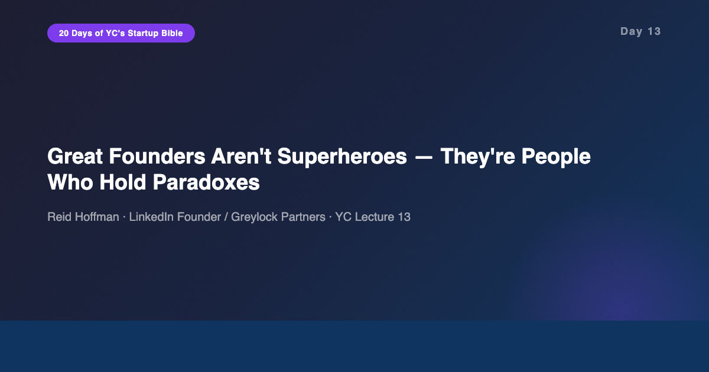
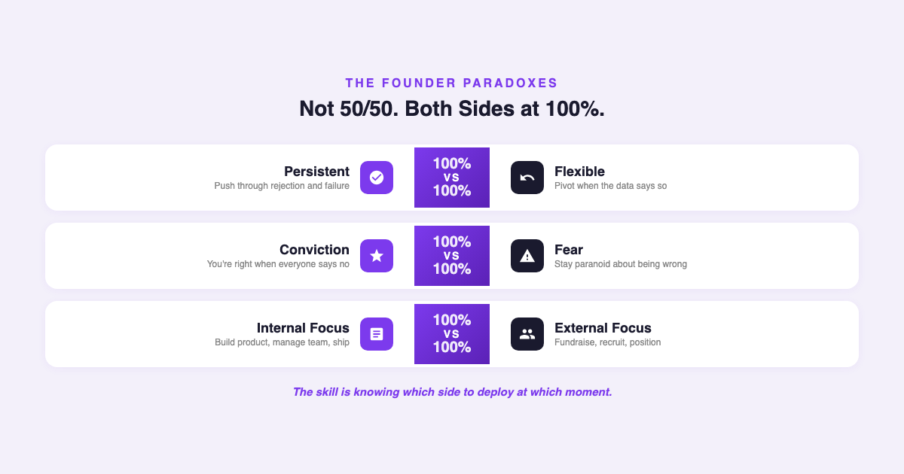
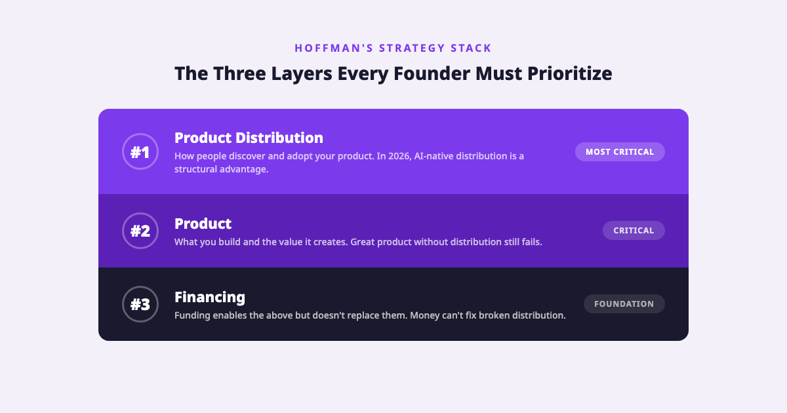
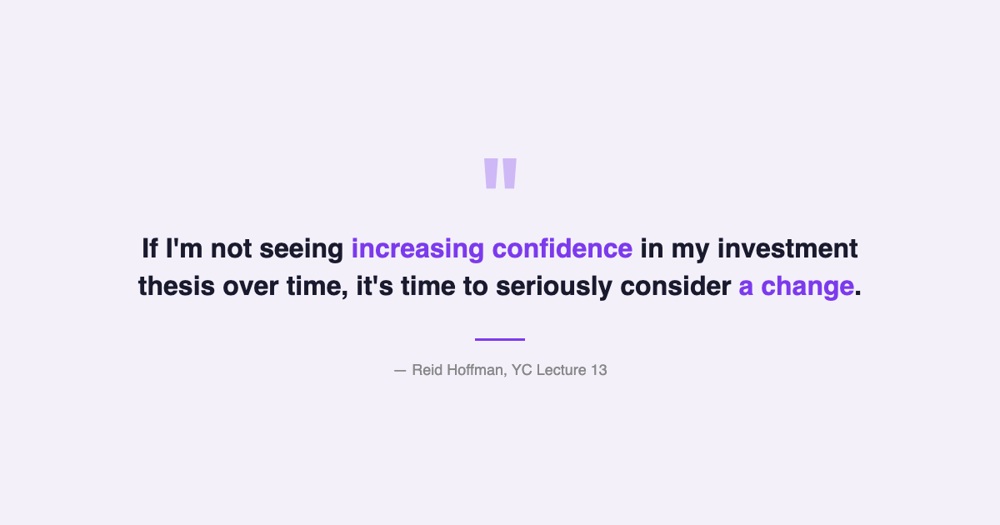

# YC's Startup Lesson #13: Great Founders Aren't Superheroes — They're People Who Hold Paradoxes

## Reid Hoffman on navigating contradictions, the co-founder equation, and why "all in" gets harder the older you get

---

This is Day 13 of my 20-day series breaking down YC's legendary startup lecture series. Today features Reid Hoffman — founder of LinkedIn, partner at Greylock, early investor in Facebook, Airbnb, and PayPal mafia member — on how to be a great founder. I've spent 10+ years building data and AI products, and I'm currently finishing my MBA at NYU Stern while guest lecturing in CS. I came into this lecture expecting a motivational talk about grit and vision. What I got instead was a framework built on contradictions — and one of the most honest assessments of the founder journey I've encountered in this entire series.

Hoffman doesn't describe great founders as people with a single dominant trait. He describes them as people who hold OPPOSING traits at maximum intensity, simultaneously. And that reframing changes everything about how you evaluate yourself — or anyone else — as a potential founder.

---

## The Paradox Framework: Both Sides at 100%

The central thesis of Hoffman's lecture is that great founders live in paradoxes. Not compromises. Not balance. Paradoxes — where you hold two contradictory positions at full intensity.

Here are the core ones:

**Persistent vs. Flexible.** You need absolute conviction that your idea will work — enough to push through rejection, skepticism, and failure. But you also need the flexibility to recognize when your current approach isn't working and pivot. Not 60% persistent and 40% flexible. Both at 100%. The skill is knowing which one to deploy at which moment.

**Conviction vs. Fear.** You need the belief that you're right when smart people tell you you're wrong — that's what makes you contrarian. But you also need the fear that you might be wrong — that's what keeps you listening to data. Hoffman invested in companies where the founder had both: unshakeable confidence in their vision and genuine anxiety about their execution.

**Internal vs. External.** You need to focus internally — building the product, managing the team, shipping features. But you also need to focus externally — fundraising, partnerships, market positioning, recruiting. Most people are naturally better at one. Great founders force themselves to operate at high levels in both domains.

This framework resonated with me because I've seen it play out in every successful product leader I've worked with over the past decade. The best ones weren't the most confident or the most analytical. They were the ones who could hold both simultaneously — championing a product vision in the morning and killing a feature based on data in the afternoon. It's not a personality type. It's a skill you develop under pressure.

---

## The Co-Founder Equation — And Whether AI Has Changed It

Hoffman is emphatic: 2-3 co-founders is almost always better than going solo. His reasoning is practical — co-founders complement each other's weaknesses, provide emotional resilience during the inevitable crises, and create accountability. He points out that the co-founder relationship is the most important decision a founder makes, more important than the idea itself, because a bad co-founder match will destroy even a great idea.

He also emphasizes that the co-founder relationship must be built on HIGH TRUST, ideally forged through prior working experience. Not someone you met at a co-founder matching event. Someone who's been through hard things with you.

This is where I want to push back — or at least update the framework for 2026.

When Hoffman gave this lecture in 2014, a solo technical founder couldn't build, design, market, and scale a product alone. You needed a technical co-founder AND a business co-founder at minimum. The tooling simply didn't exist for one person to cover all the bases.

In 2026, the equation looks different. AI coding assistants can generate production-quality code. AI design tools can create interfaces. AI writing tools can produce marketing copy, blog posts, and documentation. A single technical founder with the right AI stack can now ship what used to require a team of three to five people.

Does this mean co-founders are obsolete? No. Hoffman's point about emotional resilience still holds — startups are psychologically brutal, and having a co-founder to share the burden matters. But the THRESHOLD for what a solo founder can accomplish has risen dramatically. The question is no longer "can you build this alone?" but "should you, given that you now can?"

From my own experience spending $450/month on AI tools and watching what they can do to my personal productivity — the answer is increasingly: if you can't find the RIGHT co-founder (high trust, complementary skills, shared vision), going solo with AI leverage is a legitimate path. A mediocre co-founder is worse than no co-founder with great AI tools.

---

## References Are Everything — A Meta-Pattern

One of Hoffman's most tactical insights: references are everything. When he evaluated potential investments, he didn't rely on the pitch. He relied on what people who'd worked with the founder said about them. He famously invested in Airbnb within two minutes of the meeting — not because the pitch was great, but because he'd already gathered references on Brian Chesky before the meeting started.

This is a meta-pattern I've noticed across this entire YC series. References appeared in Marc Andreessen's fundraising lecture on Day 9 — investors call references before writing checks. They appeared in the culture lectures on Days 10 and 11 — hiring should be reference-driven, not resume-driven. And now Hoffman confirms it from the founder evaluation side: the best signal about a founder is what people who've worked with them say when the founder isn't in the room.

The consistency is striking. In an industry that talks constantly about disruption and innovation, the most reliable evaluation mechanism is the oldest one: ask someone who knows.

For anyone building a startup right now, the implication is clear. Your reputation IS your fundraising deck. Your network IS your hiring pipeline. Every interaction, every project, every collaboration is building (or eroding) the reference base that will determine whether investors take your meeting, whether great engineers join your team, and whether customers trust your product.

---

## No Balance — And Why That Gets Harder With Age

Here's the line from Hoffman that hit me the hardest: "If I hear a founder talk about having a balanced life, they're not committed to winning."

It's a brutal statement. It's also, from everything I've observed, largely true.

Building a startup requires an intensity that is fundamentally incompatible with balance. Not for a sprint — for years. The founders who succeed are the ones who go all in. And that's much easier to do when you're 22 with no mortgage, no kids, no aging parents, and no career to protect.

This is something I think about personally. As someone in my 30s with a decade of career behind me, the calculus of "all in" is completely different than it would have been at 22. I have more skills, more network, more pattern recognition. But I also have more to lose. There are people depending on me. There are financial obligations. The risk tolerance equation shifts.

And I think this is why so many breakout startups are founded by young people — not because they're smarter or more creative, but because they have less to lose. When the downside of failure is "move back to your parents' house," going all in is a free option. When the downside is "can't pay the mortgage," it's a calculated bet with real stakes.

Hoffman doesn't address this tension directly, but it's implicit in his framework. The paradox of age and entrepreneurship: you have more capability but less freedom. More insight but more constraints. The founders who succeed later in life are the ones who find creative ways to go all in WITHOUT burning everything down — leveraging their network, their savings, their expertise to compress the risk timeline.

---

## The AI/Data Angle

Hoffman's lecture is fundamentally about what makes a great HUMAN founder. But in 2026, the definition of "founder" is expanding.

The most significant shift: AI has changed the minimum viable team. Hoffman's insistence on 2-3 co-founders was based on a world where building a product required multiple specialized humans. In 2026, a solo founder with AI tools can handle:

- **Product development:** AI coding assistants write, test, and debug code
- **Design:** AI generates UI/UX from descriptions
- **Content and marketing:** AI produces copy, social media, documentation
- **Data analysis:** AI processes and interprets data sets
- **Customer support:** AI agents handle tier-1 support from day one

This doesn't eliminate the need for human co-founders entirely — strategic thinking, relationship building, fundraising, and the emotional resilience Hoffman describes still require humans. But it dramatically changes the THRESHOLD. What used to require three co-founders now requires one founder plus an AI stack.

Hoffman's three-layer strategy stack — product distribution over product over financing — also gets an AI upgrade. In 2026, AI-native distribution is a real advantage. Products that use AI to find, onboard, and retain users have a structural edge. Think about how ChatGPT's conversational interface IS the distribution — people share conversations, which drives new users, which improves the model. The product IS the distribution channel.

For data professionals considering the founder path, Hoffman's investment thesis framework is particularly useful. He recommends writing your thesis as bullets and constantly asking: "Is my confidence increasing or decreasing?" This is essentially A/B testing applied to strategic conviction. For anyone who's spent years making data-driven decisions, this feels natural — but the discipline of WRITING it down and REVIEWING it regularly is what separates thinking about a startup from actually building one.

One more point on contrarianism. Hoffman says real contrarian thinking isn't just disagreeing with the crowd — it's having smart people disagree with you while you know something they don't. When he pitched LinkedIn, two-thirds of his network thought he was crazy. But he knew something they didn't about professional identity moving online. In the AI space right now, there are plenty of "contrarian" ideas that are actually just unpopular. The real contrarian opportunities are the ones where domain experts say "that won't work" but you have data or experience that suggests otherwise. That's where the moat is built.

---

## What Surprised Me Most

What surprised me most was how personal Hoffman's framework felt. Most lectures in this series have been tactical — here's how to raise money, here's how to build culture, here's how to sell to enterprises. Hoffman's lecture is philosophical. He's not telling you WHAT to do. He's telling you WHO you need to be. And the answer — someone who can hold paradoxes, go all in, build through references, and know when to pivot — is both more honest and more daunting than any tactical playbook.

The pivot advice also stuck with me. Hoffman says you should pivot when your confidence in your investment thesis has been DECREASING for an extended period — not after you've crashed into a wall. It's a subtle but critical distinction. Most founders wait too long because they conflate persistence with stubbornness. The investment thesis framework — write it down, review it, track your confidence — gives you an early warning system.

And LinkedIn itself is the proof. Hoffman notes that LinkedIn never had a rocketship growth moment. It compounded year by year, slowly. No viral explosion. Just steady, unglamorous growth. In a world that celebrates hockey-stick curves, that's a genuinely contrarian path — and a reassuring one for founders building in spaces where compound growth matters more than viral moments.

---

## Key Takeaways

- **Great founders hold paradoxes, not balance.** Persistent AND flexible. Conviction AND fear. Internal AND external. Both at 100%, deployed situationally.
- **2-3 co-founders still matters — but AI is shifting the math.** The emotional resilience argument holds; the "you need humans for everything" argument is weakening. A solo founder with AI leverage is more viable than ever.
- **Write your investment thesis as bullets.** Constantly ask: is my confidence increasing or decreasing? Pivot when confidence has been declining for an extended period, not after crashing.
- **Real contrarian = smart people disagree with you, but you know something they don't.** Not just being different for the sake of it.
- **References are the universal signal.** Investing, hiring, founder evaluation — across every YC lecture, the people who know you are your most important asset.
- **Location is a network choice.** Be where the ecosystem for your specific business lives. Not every startup belongs in Silicon Valley.
- **Product distribution > product > financing.** The three-layer strategy stack. Distribution wins even over great products.
- **All in gets harder with age — and that's honest.** The founders who succeed later in life find creative ways to compress risk, not ignore it.
- **Compounding beats rocketships.** LinkedIn grew slowly, year by year. Not every great company has a viral moment.

---

## What's Next

**Day 14:** Keith Rabois (Square, Khosla Ventures) on How to Operate — the nuts and bolts of running a startup after you've found product-market fit.

If you're following along with this series, [subscribe to my newsletter](https://substack.com/@jiazhenzhu) where I go deeper, with angles I don't publish on Medium.

---

## Resources

- **Video:** [YC Lecture 13 — How to Be a Great Founder](https://www.youtube.com/watch?v=dQ7ZvO5DpIw)
- **Transcript:** [Reid Hoffman Lecture 13 (Annotated) — Genius](https://genius.com/Reid-hoffman-lecture-13-how-to-be-a-great-founder-annotated)