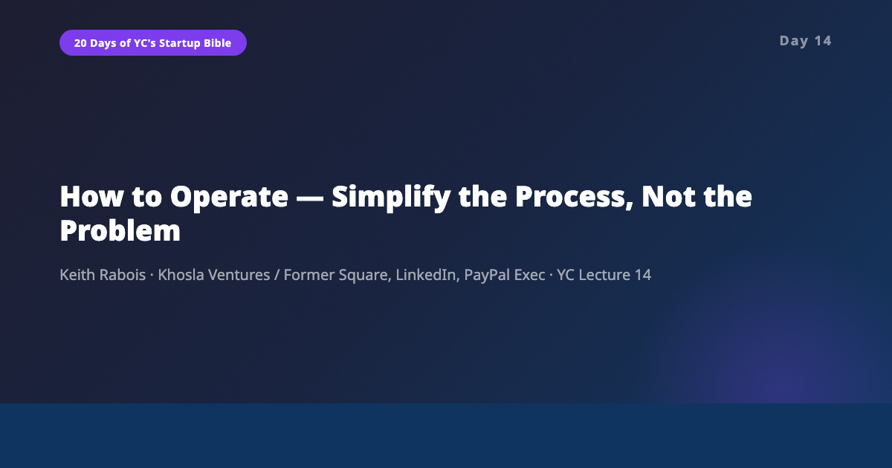
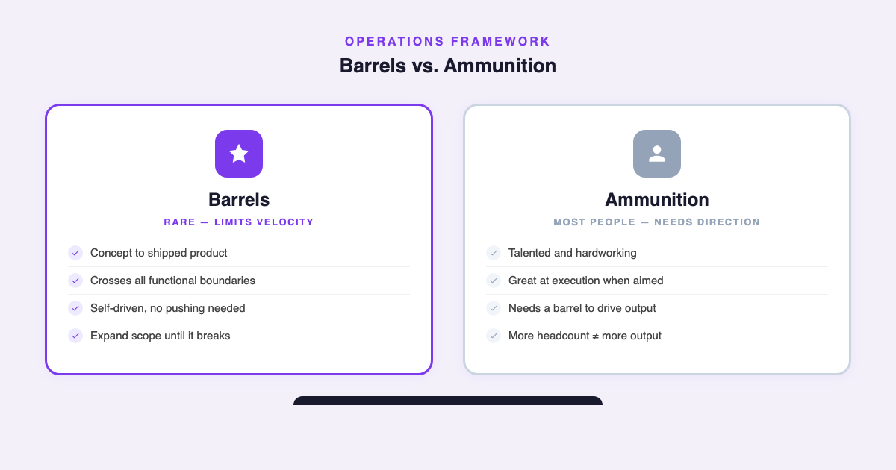
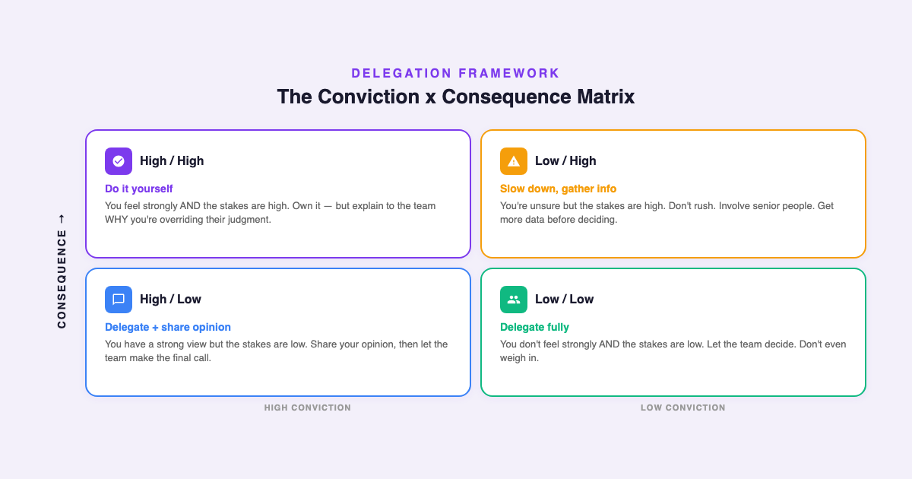

# YC's Startup Lesson #14: How to Operate — Simplify the Process, Not the Problem

## Keith Rabois on editing, barrels vs ammunition, and the delegation matrix every operator needs

---

This is Day 14 of my 20-day series breaking down YC's legendary startup lecture series. Today features Keith Rabois — managing director at Khosla Ventures and former COO/executive at Square, LinkedIn, PayPal, and Slide — on how to operate a startup. I've spent 10+ years building data and AI products and I'm finishing my MBA at NYU Stern while guest lecturing in CS. Operations has always been the part of startups that gets the least attention in glamorous founder narratives. Everyone wants to talk about product vision and fundraising. Nobody wants to talk about how to actually run the machine. Rabois changes that.

This lecture is the most tactical, immediately applicable talk in the entire YC series. It's not about philosophy. It's about mechanics — specific frameworks for delegation, people management, metrics, and the daily work of making a company function. If yesterday's lecture on great founders was about who you need to be, today's is about what you need to DO.

---

## CEO as Editor, Not Writer

Rabois opens with a metaphor that reframes the entire CEO role: you're an editor, not a writer. Your team writes the content. Your job is to simplify it, clarify it, ask probing questions, allocate resources to the right sections, and ensure a consistent voice across the organization.

The editing metaphor has four specific components:

**Simplify.** Rabois cites Andy Grove: every step you can remove from a process yields a 30-50% improvement in performance. Not a marginal gain — a 30-50% gain. The implication is that complexity is not just inefficient, it's actively destructive. Your job as an operator is to wage war on unnecessary steps.

**Clarify.** Ask questions until things are crystal clear. If you can't explain a decision in simple language, you don't understand it. If your team can't explain their work simply, they don't understand it either.

**Allocate resources.** Decide which sections of the newspaper get front-page placement. Not everything your company does deserves equal investment. The editor decides what matters most and directs resources accordingly.

**Ensure consistent voice.** Everyone in the company should be able to articulate the mission, the strategy, and the current priorities in similar language. If different teams tell different stories, you have an editing problem.

The goal, Rabois says, is to see LESS RED INK every day. When you first start editing your team's output, you'll be rewriting everything. Over time, the team internalizes your standards. The amount of correction you need to make decreases. If it doesn't decrease, you have the wrong people.

This framework resonated deeply with my own experience. In every data platform I've built, the biggest performance gains never came from better algorithms or faster hardware. They came from removing steps. Eliminating unnecessary data transformations. Cutting approval workflows. Simplifying the pipeline. Every step removed was exactly the kind of 30-50% improvement Rabois describes.

---

## Barrels vs. Ammunition

This is the most memorable framework in the entire lecture — and possibly in the entire YC series.

Rabois divides people in a company into two categories: **barrels** and **ammunition**. Ammunition is most people — talented, hardworking, capable of doing great work when pointed in the right direction. Barrels are the rare individuals who can take an idea from concept all the way to shipped product, crossing every functional boundary, solving every blocker, and driving the project to completion without anyone else pushing them.

His key insight: **your company's output is limited by the number of barrels you have, not the total headcount.** Adding more ammunition to a company with no barrels doesn't increase output — it just creates more things that never ship.

How do you identify barrels? Rabois suggests the "smoothie test." Imagine you sent a company-wide email saying "we're going to start making smoothies in the office every afternoon." Within 24 hours, only 1-2 people in the entire company will have figured out the blender, the ingredients, the schedule, and actually made it happen. Those are your barrels.

Once you find a barrel, the management strategy is simple: **expand their scope until it breaks.** Keep giving them more responsibility — new teams, new products, new functions — until they hit a point where the quality of their output degrades. Then pull back slightly. That's their optimal scope.

This concept maps directly to something I've observed in every data and AI team I've managed. The difference between a team that ships and a team that doesn't is almost never about talent distribution. It's about whether someone on the team can own the full journey from messy data problem to deployed solution. The best data scientists I've worked with weren't the ones with the most impressive algorithms — they were the ones who could navigate from a vague business question through data exploration, modeling, engineering, deployment, and stakeholder communication. They were barrels.

---

## The Delegation Matrix

Rabois introduces a 2x2 matrix for deciding what to delegate and what to handle yourself, based on two axes: **your conviction level** (how strongly you believe in the right answer) and **the consequence level** (how much damage a wrong decision would cause).

- **Low conviction, low consequence:** Delegate completely. Let the team decide. Don't even weigh in.
- **High conviction, low consequence:** Delegate but share your opinion. Let them make the final call.
- **Low conviction, high consequence:** This is where you need to slow down, gather more information, and involve senior people. Don't rush these decisions.
- **High conviction, high consequence:** Do it yourself. Or at minimum, be deeply involved. BUT — and this is critical — explain to the team WHY you're overriding their judgment. If you just override without explaining, you train your team to stop thinking.

This framework is deceptively simple but incredibly practical. Looking back at my career, most of my management mistakes fell into two categories: spending too much energy on low-conviction, low-consequence decisions (micromanaging things that didn't matter), and not spending enough on high-conviction, high-consequence ones (trusting delegation when I should have been hands-on). The matrix makes the right behavior obvious in advance rather than obvious in hindsight.

---

## Task Relevant Maturity and the Art of Management Style

Rabois borrows Andy Grove's concept of **Task Relevant Maturity** to explain why you should manage different people differently. If someone has done the exact task before and succeeded, give them more autonomy. If they're doing something new, provide more structure and check-ins.

This means your management style should vary person by person AND task by task. The same engineer might need full autonomy on backend architecture (their area of deep expertise) but heavy guidance on cross-functional coordination (something they've never done before). Managing everyone the same way — either all hands-off or all hands-on — is a failure of management, not a style choice.

This is something I've applied in my CS guest lectures as well. Students who have programming experience need a different level of scaffolding than those writing their first line of code. It's not about being "nice" or "tough" — it's about matching your management intensity to the person's experience with that specific task.

---

## The AI/Data Angle

Rabois's operating frameworks were designed for a world where humans did all the work. In 2026, several of his frameworks get an interesting update.

**Barrels in the AI era.** The barrel concept becomes even more important when AI amplifies individual productivity. A barrel with AI tools can now do what used to require a barrel plus a team of five. But it also means the SHORTAGE of barrels is the binding constraint more than ever. AI makes ammunition more productive, but it doesn't turn ammunition into barrels. The ability to own a project end-to-end, make judgment calls at every step, and drive to completion — that's still fundamentally human.

**Simplification as AI strategy.** Rabois says every step removed yields 30-50% improvement. In AI/ML pipelines, this principle applies with even more force. Every unnecessary preprocessing step, every redundant feature transformation, every manual approval gate — these don't just slow things down, they introduce failure points in already complex systems. The best AI teams I've worked with are ruthlessly simple in their processes, even when the underlying models are complex. Simplify the process, not the problem.

**Dashboards and anomaly detection.** Rabois advocates for founder-built dashboards that the entire company uses daily. In 2026, AI takes this further. Instead of humans scanning dashboards for anomalies, AI agents can continuously monitor metrics, detect unusual patterns, and surface insights proactively. The PayPal story Rabois tells — finding 54 eBay sellers organically writing "pay me with PayPal" — that kind of anomaly detection is exactly what AI excels at. What took a human analyst days to discover, an AI agent can flag in real-time.

**Pairing indicators with AI.** Rabois's concept of paired indicators — measuring fraud rate alongside false positive rate to prevent optimization bias — is essential for any AI system. Every AI metric needs a counter-metric. Accuracy needs a fairness measure. Speed needs a quality check. Revenue needs customer satisfaction. This is one of the most important operational principles for anyone building AI products, and it's remarkable that Rabois articulated it in 2014 before the AI ethics conversation even started.

---

## What Surprised Me Most

What surprised me most was the emphasis on DETAILS. Rabois tells two stories that stuck with me.

First, Bill Walsh (the legendary 49ers coach) included instructions for how the receptionist should answer the phone in his organizational playbook. Not because phone etiquette matters to football strategy. Because the standard you set for the smallest details signals the standard you expect for everything else.

Second, Steve Jobs insisted that the circuit boards inside the original Macintosh be aesthetically beautiful — even though no customer would ever see them. The engineers pushed back: nobody will know. Jobs's response: WE will know.

The lesson: details are not a distraction from strategy. Details ARE strategy. The quality of your smallest decisions signals the quality standard for your biggest ones. In my experience, this is especially true in data work. The team that's sloppy about documentation will eventually be sloppy about data quality. The team that cuts corners on testing will eventually ship a model that breaks in production. Standards are fractal — they repeat at every scale.

Peter Thiel's "one thing" principle also surprised me. He'd assign every person at PayPal exactly ONE priority and refuse to discuss anything else with them. It sounds extreme, but the reasoning is sharp: people naturally gravitate toward problems they can make B+ progress on while avoiding the A+ problems that actually matter. Forcing focus on a single thing eliminates that escape route. You either solve the hard problem or you have nothing to report.

---

## Key Takeaways

- **CEO = editor, not writer.** Simplify, clarify, allocate, and ensure consistency. Measure success by how much less red ink you need each day.
- **Simplify the process, not the problem.** Every step removed = 30-50% performance gain. Complexity is not a sign of sophistication — it's a sign of insufficient editing.
- **Barrels determine velocity.** Your company's output equals the number of people who can take an idea from concept to shipped product. Hire for this. Test for this. Expand barrel scope until it breaks.
- **Use the delegation 2x2.** Map decisions by conviction and consequence. Stop micromanaging the low/low quadrant and start owning the high/high one.
- **Task Relevant Maturity.** Different management styles for different people on different tasks. This is a feature, not a bug.
- **Force focus with "one thing."** People solve B+ problems to avoid A+ problems. Assign one priority and refuse to discuss anything else.
- **Pair every metric.** Single metrics create optimization bias. Measure the thing AND its counter-metric.
- **Hunt for anomalies.** The best insights come from data points that don't fit the pattern. Build systems to surface them.
- **Details are strategy.** The standard you set for the smallest things signals the standard for everything else.

---

## What's Next

**Day 15:** Ben Horowitz on How to Manage — the counterpart to today's operations talk, focused on the human side of running a company.

If you're following along with this series, [subscribe to my newsletter](https://substack.com/@jiazhenzhu) where I go deeper, with angles I don't publish on Medium.

---

## Resources

- **Video:** [YC Lecture 14 — How to Operate](https://www.youtube.com/watch?v=6fQHLK1aIBs)
- **Transcript:** [Keith Rabois Lecture 14 (Annotated) — Genius](https://genius.com/keith-rabois-lecture-14-how-to-operate-annotated)