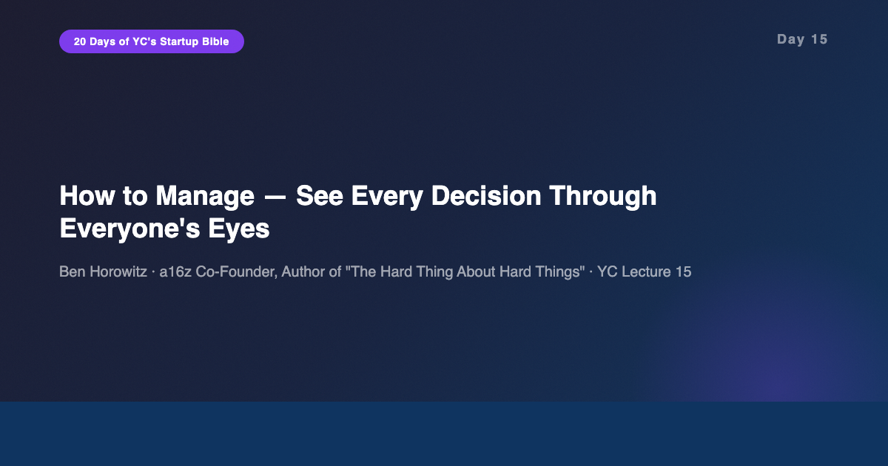
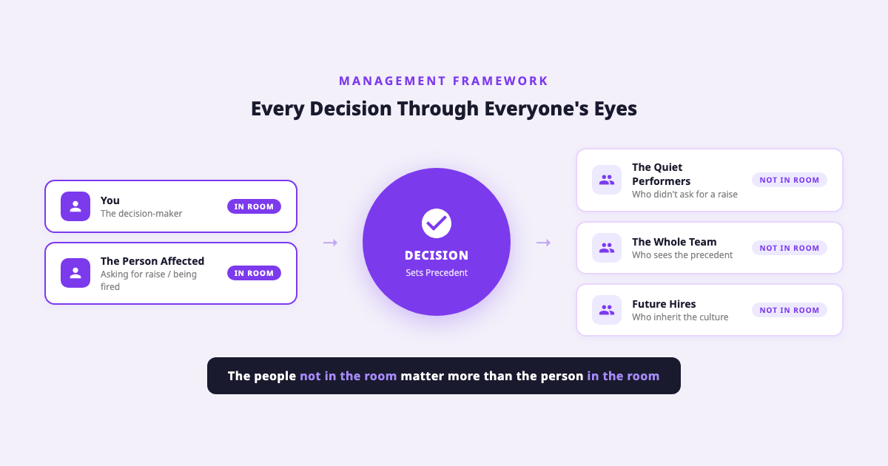
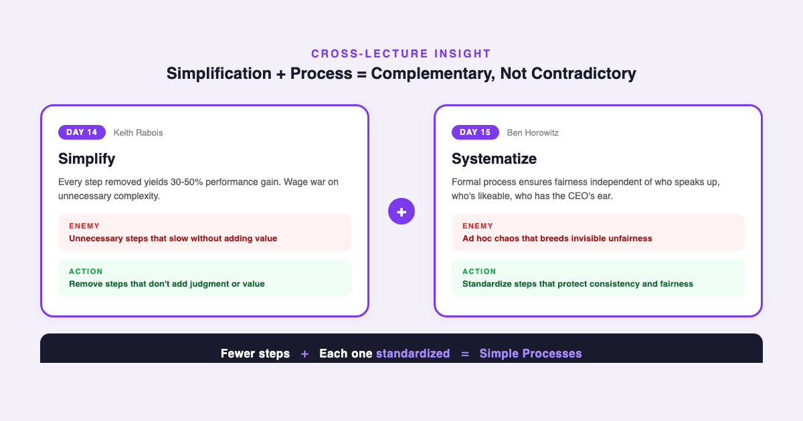

# YC's Startup Lesson #15: How to Manage — See Every Decision Through Everyone's Eyes

## Ben Horowitz on the demotion trap, the Shmoney Dance, and why process protects culture

---

This is Day 15 of my 20-day series breaking down YC's legendary startup lecture series. Today features Ben Horowitz — co-founder of Andreessen Horowitz, author of *The Hard Thing About Hard Things*, and one of the most respected voices on startup management. I've spent 10+ years building data and AI products, I'm finishing my MBA at NYU Stern, and I guest lecture in CS. Management is one of those topics where most advice sounds right in theory and falls apart on contact with reality. Horowitz's lecture is different because every framework comes from a decision he actually had to make — often one where every option was bad.

Yesterday Keith Rabois told us to simplify. Today Horowitz tells us to build process. These sound contradictory. They're not. And understanding why they're complementary is one of the most important management insights in this entire series.

---

## The Core Principle: Everyone's Eyes, Not Just Yours

Horowitz opens with a deceptively simple framework: when you make any management decision, you must see it through the eyes of EVERYONE affected — not just the person in the room, but every person NOT in the room.

This sounds obvious. It's not. Most managers instinctively optimize for the person sitting across from them. Someone asks for a raise? You think about whether they deserve it. Someone is underperforming? You think about the kindest way to handle it.

Horowitz says this instinct is a trap. Every decision you make sets a precedent. Every precedent shapes your culture. And culture is not what you say — it's what you do when you think nobody's watching, multiplied across every person who hears about what you did.

He illustrates this with three scenarios that build on each other.

**The Demotion Trap.** An executive is underperforming. Firing feels harsh. Demotion feels kind — you're giving them a second chance. But look at it through everyone else's eyes. That executive still holds 1.5% equity they were granted for a role they're no longer performing. Their direct reports now have a boss who was publicly judged as not good enough. Other executives learn that underperformance gets softened, not addressed. The "kind" choice creates resentment, ambiguity, and a signal that effort matters more than results.

**The Raise Request.** A strong engineer walks into your office and makes a compelling case for a raise. They've shipped great work. The market data supports it. Your instinct is to say yes — they deserve it. But Horowitz asks: what about the equally strong engineer who DIDN'T walk in? The one who's quietly shipping excellent work without lobbying? If you give raises to people who ask, you're systematically rewarding self-advocacy and punishing heads-down execution. He calls this the Shmoney Dance — the people willing to perform for money get it, while the people just doing the work don't.

**Process as the Solution.** Both problems have the same fix: formal evaluation processes. Regular review cycles. Compensation bands. Promotion criteria. Not because bureaucracy is good, but because process ensures fairness independent of who speaks up, who's likeable, and who has the CEO's ear.

---

## Simplify AND Systematize: The Day 14 + Day 15 Connection

This is where these two back-to-back lectures create something neither says alone.

Yesterday, Keith Rabois said every step you remove from a process yields a 30-50% improvement. His entire framework is about editing — cutting, simplifying, eliminating. Today, Horowitz says you need formal evaluation processes, structured decision frameworks, and standardized approaches to management.

Are they contradicting each other? No. They're describing two different enemies.

**Rabois's enemy is unnecessary complexity.** Steps that exist because "we've always done it this way." Approval chains that slow things down without adding judgment. Meetings that could be emails. Processes that serve the process, not the outcome.

**Horowitz's enemy is ad hoc chaos.** Decisions made inconsistently because there's no framework. Compensation determined by who asks loudest. Promotions driven by proximity to power. Performance addressed only when it becomes a crisis.

Simplification removes steps that don't add value. Process standardizes steps that do. The real complexity in management doesn't come from having a review cycle — it comes from NOT having one, where every raise request becomes a novel negotiation, every performance issue becomes a unique crisis, and every promotion becomes a political campaign.

In my experience building data platforms, I've seen this exact pattern. The teams with the simplest, most standardized deployment processes ship the fastest. Not because the process is minimal — sometimes it has several mandatory steps — but because everyone knows exactly what to do. The absence of process doesn't create simplicity. It creates chaos that looks simple from the outside and feels impossible from the inside.

---

## Toussaint L'Ouverture: Management as Culture Upgrade

Horowitz tells one of the most unexpected stories in the entire YC series: the story of Toussaint L'Ouverture, who led the only successful slave revolution in history in Haiti.

What makes Toussaint a management case study isn't the revolution itself — it's what he did after winning. He faced a choice every victorious leader faces: reward your loyalists and punish your enemies, or build something bigger.

Toussaint chose the bigger thing. He took the enemy's best military leaders and made them his generals — not to be magnanimous, but because they were the best at their jobs, and he needed the best. He let slave owners keep their land but required them to pay workers and lowered their taxes. He chose cultural upgrade over revenge.

The management principle: when you take over a team, inherit a mess, or win a political battle at your company, the instinct is to reward friends and punish enemies. But if you optimize for loyalty over competence, you build a weaker organization. The hardest management skill is making decisions that are right for the system, not just satisfying for you.

---

## The Kimchi Problem

Horowitz introduces a principle I've started calling "organizational entropy": the Kimchi Problem. Kimchi is made by burying vegetables underground — the deeper and longer you bury them, the more intense and pungent they become.

Management problems work the same way. The issue you avoid discussing today doesn't stay the same size. It ferments. It intensifies. It develops new dimensions you didn't anticipate. By the time you finally address it, it's exponentially harder to resolve than it would have been on day one.

This connects to his point about firing with dignity. Bill Campbell — coach to Steve Jobs, Larry Page, and Eric Schmidt — taught Horowitz: "You can take someone's job but you cannot take their dignity." When you fire someone, your public words about them become their professional reputation. If you trash them, you're not just being unkind — you're signaling to every remaining employee what they can expect when it's their turn.

The best managers fire quickly and speak generously. The worst managers delay firing (burying the kimchi) and then speak poorly about the person (adding heat to the fermentation).

---

## The AI/Data Angle

Horowitz's management frameworks predate the AI era, but they map onto AI-age challenges with striking precision.

**Process as algorithmic fairness.** Horowitz's argument for formal evaluation processes is essentially an argument for removing bias from human decision-making. In AI, we call this algorithmic fairness — building systems that produce consistent outputs independent of who's making the request. The Shmoney Dance problem (rewarding those who ask) is a bias problem. Formal process is the human equivalent of a debiasing algorithm. From my experience building data products, I've learned that the systems people trust most aren't the ones with the best accuracy — they're the ones with the most consistent and explainable decision-making.

**"Everyone's eyes" as multi-stakeholder optimization.** In data science, we call this multi-objective optimization — you can't optimize for one metric without understanding the impact on all other metrics. Horowitz is making the same argument for management. Optimizing for the person in the room (local optimization) without considering everyone else (global optimization) creates the organizational equivalent of overfitting. Your model performs beautifully on the training data (the person you're talking to) and terribly on the test data (everyone else who hears about your decision).

**The Kimchi Problem as technical debt.** Every data engineer knows this pattern. The pipeline bug you ignore today compounds. The data quality issue you work around instead of fixing becomes embedded in downstream models. The schema change you postpone gets harder with every day of new data flowing through the old schema. Horowitz's principle — surface it now, before it ferments — is the management version of "fix it in the codebase, not in the workaround."

**Simplify + systematize in AI operations.** The Day 14 + Day 15 synthesis has a direct analog in ML operations. The best MLOps teams simplify their pipelines (remove unnecessary steps, eliminate redundant transformations) AND systematize their processes (standardized model evaluation, automated monitoring, formal deployment checklists). Simplicity without process leads to fragile, unrepeatable results. Process without simplicity leads to slow, bureaucratic systems. The optimal point is simple processes — few steps, each one standardized.

---

## What Surprised Me Most

What surprised me most was the stock option exercise story. Horowitz explains that the standard 90-day exercise window for stock options — the one that forces departing employees to exercise within 90 days or lose their vested options — exists because of an old accounting rule called APB 25. Not because of fairness. Not because of incentive alignment. Because of an accounting regulation that has since been replaced.

His company was one of the first to offer 10-year exercise windows, giving departing employees a decade to decide whether to exercise. It sounds clearly fairer. But Horowitz is honest about the tradeoff: it's fairer to leavers but potentially unfair to stayers, who are diluted by options held by people no longer contributing. There's no universal right answer.

This intellectual honesty — presenting a problem without pretending there's a clean solution — is what makes Horowitz's management advice trustworthy. Most management advice claims everything has a right answer if you're smart enough. Horowitz admits some decisions are genuinely hard, with legitimate downsides on every path. The manager's job isn't to find the perfect answer. It's to make the best choice while acknowledging the tradeoffs honestly.

---

## Key Takeaways

- **See through everyone's eyes.** Every management decision must account for the people NOT in the room. The precedent you set matters more than the individual case.
- **Demotion is not kindness.** It preserves the person's feelings at the cost of equity fairness, team authority, and cultural signal.
- **Rewarding those who ask punishes those who don't.** Build formal evaluation processes to ensure fairness independent of self-advocacy.
- **Simplify AND systematize.** Simplification (Day 14) removes unnecessary steps. Process (Day 15) standardizes necessary ones. They're complementary, not contradictory.
- **Culture upgrade > revenge.** When you win, optimize for system strength, not personal satisfaction. Hire the best, even former adversaries.
- **The Kimchi Problem.** The issue you bury today ferments into something far worse. Surface problems early.
- **Fire with dignity.** "You can take someone's job but not their dignity." Your public words become their reputation.
- **No clean answers.** The best managers make decisions honestly, acknowledging real tradeoffs instead of pretending there's a perfect option.

---

## What's Next

**Day 16:** Emmett Shear on How to Run a User Interview — shifting from management philosophy to the tactical skill of extracting real insight from users.

If you're working through these management ideas for your own startup, happy to chat — I've been pressure-testing these frameworks against a decade of building data and AI teams.

And if you're following along with this series, [subscribe to my newsletter](https://substack.com/@jiazhenzhu) where I go deeper, with angles I don't publish on Medium.

---

## Resources

- **Video:** [YC Lecture 15 — How to Manage](https://www.youtube.com/watch?v=uVhTvQXfibU)
- **Transcript:** [Ben Horowitz Lecture 15 (Annotated) — Genius](https://genius.com/b-horowitz-lecture-15-how-to-manage-annotated)