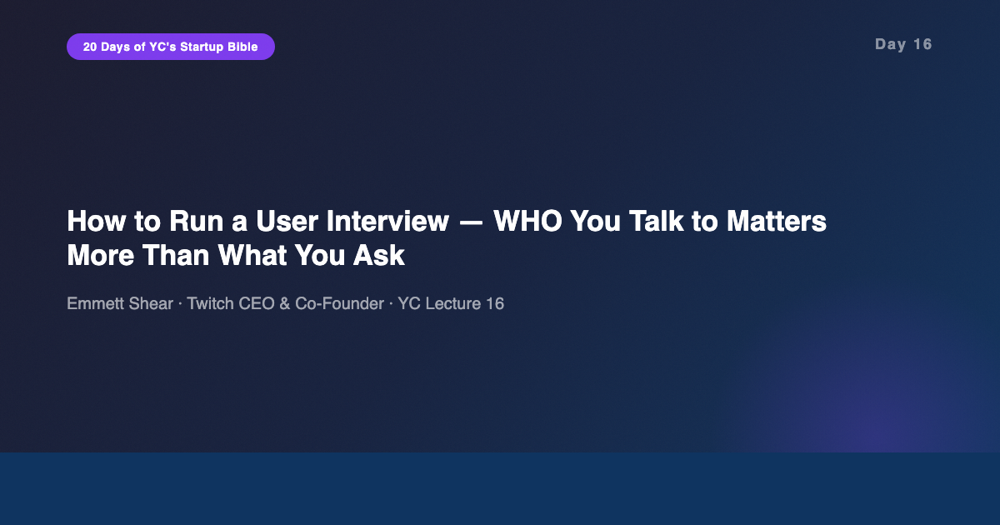
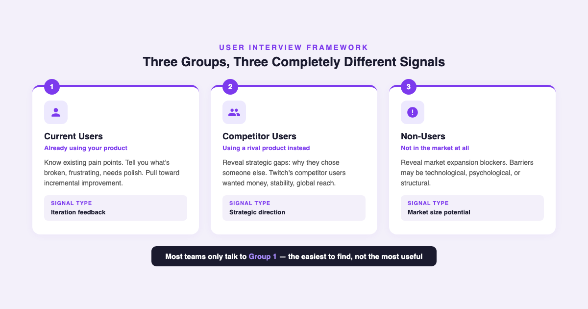
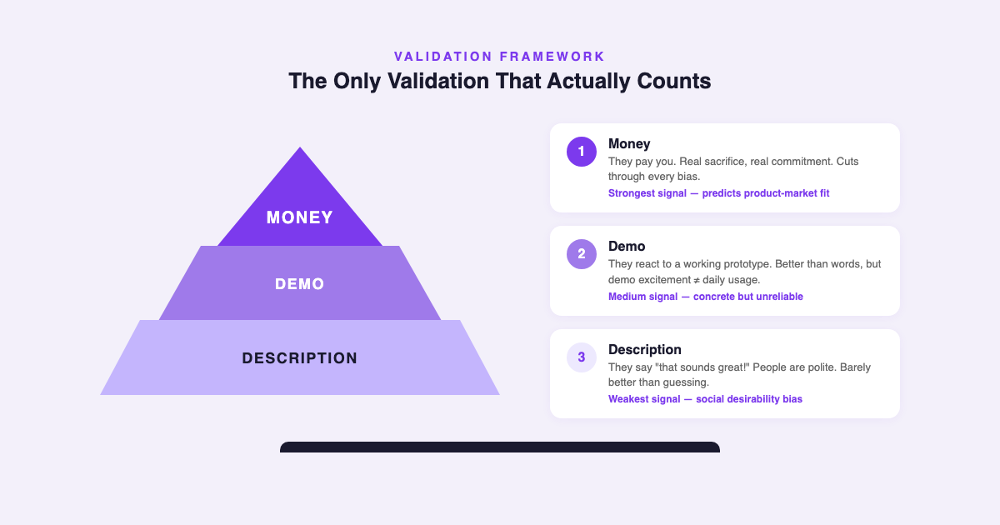

# YC's Startup Lesson #16: How to Run a User Interview — WHO You Talk to Matters More Than What You Ask

## Emmett Shear on the three user groups, why showing your product pollutes data, and the only validation that actually counts

---

This is Day 16 of my 20-day series breaking down YC's legendary startup lecture series. Today features Emmett Shear — CEO and co-founder of Twitch, the live-streaming platform that redefined how millions consume content. I've spent 10+ years building data and AI products, I'm finishing my MBA at NYU Stern, and I guest lecture in CS. User research is something every product team claims to do well and almost nobody actually does well. Shear's lecture strips away the theater of user interviews and reveals what actually produces useful signal.

Yesterday Ben Horowitz told us to see every management decision through everyone's eyes. Today Shear applies a similar principle to product: see every user interview through the lens of who you're talking to, because the same question produces completely different answers from different user segments.

---

## The Most Important Decision: WHO You Interview

Shear opens with the insight that most product teams get wrong from the start: the selection of who you talk to matters far more than the questions you prepare.

Twitch learned this the hard way. Early on, they spent time talking to viewers — the people watching streams. Viewers had opinions about UI, video quality, and features. But viewers weren't the constraint on Twitch's growth. Broadcasters were. The people creating content were the ones who determined whether the platform had anything worth watching. When Twitch shifted its user research focus to broadcasters, everything changed.

Shear divides potential interview subjects into three groups, and understanding which group you're talking to is essential because they give you fundamentally different information:

**Current users** know your product's existing pain points. They'll tell you what's broken, what's frustrating, what needs polish. This feedback is valuable for iteration but dangerous for strategy — it pulls you toward incremental improvements and away from transformative changes. Twitch's existing broadcasters wanted small quality-of-life features. Important, but not what would win the market.

**Competitor users** tell you why they chose someone else. At Twitch, these were broadcasters using competing platforms. Their feedback was completely different: they wanted money (better monetization), stability (reliable infrastructure), and global reach. These were strategic gaps, not feature requests. And this is where Twitch ultimately allocated its resources.

**Non-users** reveal what's blocking market expansion entirely. These are people who might stream but don't — on any platform. Their barriers might be technological ("I don't know how to set up streaming"), psychological ("nobody would watch me"), or structural ("I can't afford the equipment"). This group tells you about the market you haven't reached yet.

Most teams default to talking to current users because they're the easiest to find. They're already in your product, already engaged, already willing to give feedback. But convenience is the enemy of insight. The people easiest to reach are often the least useful to interview for strategic decisions.

---

## Don't Show Your Product: The Archaeological Dig

This principle hit me hardest, and it connects directly to earlier lectures in this series.

Shear is adamant: do NOT show your product during user interviews. The moment you put your product in front of someone, you've contaminated the data. You've shifted from learning what's already in their heads to testing whether they'll validate what's already in yours.

A proper user interview is an archaeological dig. You're uncovering what already exists — their current behavior, their existing pain points, their workarounds, their mental models. You're asking "How do you do X today?" not "Would you use a tool that does Y?"

This connects directly to Adora Cheung's lecture on Day 4 about being the janitor — getting so close to the problem that you understand it at the ground level before designing any solution. And it connects to Walker Williams' Day 8 lecture on doing things that don't scale — the hands-on, manual work of understanding users before building systems for them.

The distinction matters because of a cognitive bias that's well-documented in my field: confirmation bias. The moment you show someone your product, you activate their desire to be polite, their tendency to react to what's in front of them rather than what's in their head, and your own tendency to interpret ambiguous responses as validation. The interview becomes a Rorschach test where everyone sees what they want to see.

Features are YOUR job, not the user's. Users can tell you about their problems. They can describe their current behavior. They can show you their workarounds. But they cannot design your product for you. If you ask "what features do you want?" you're outsourcing product thinking to people who don't have the context, constraints, or vision you have.

---

## The Validation Hierarchy: Money Talks, Everything Else Walks

Shear presents a validation hierarchy that should be tattooed on every product manager's forehead:

**Level 1 — Description.** You describe your product to someone and ask if they'd use it. This is the weakest signal. People are polite. People like ideas in theory. "That sounds great!" is essentially meaningless as product validation. In my MBA classes at Stern, we studied case after case where market research surveys showed overwhelming demand for products that flopped on launch. Description-level validation is barely better than guessing.

**Level 2 — Demo.** You show a working prototype or demo and gauge reaction. Better than description, because people are reacting to something concrete. But still unreliable. Demo excitement is a lot like movie-trailer excitement — the actual experience of using the product daily, paying for it monthly, and integrating it into workflows is completely different from watching a polished walkthrough.

**Level 3 — Money.** Someone pays you. This is the ultimate validation and the only signal that reliably predicts product-market fit. Payment requires someone to make a real sacrifice — money they could spend elsewhere — in exchange for your product. It cuts through every social desirability bias, every polite encouragement, every "that sounds cool."

This resonated deeply with my experience building data products in enterprise (ToB) environments. I've sat in countless meetings where stakeholders said "yes, we need this, build it." I've watched demos receive standing ovations. And I've watched those same stakeholders fail to allocate budget, fail to assign integration resources, fail to show up for onboarding. The only reliable signal was always the same: will they sign the contract? Will they cut the check?

Shear's hierarchy maps perfectly to a principle from Day 8 — Walker Williams saying that doing things that don't scale is how you find product-market fit. Getting someone to pay you before you've built the scalable version is the hardest and most valuable form of validation.

---

## Tactical Advice: 6-8 People, Record Everything

Shear offers several tactical insights that are worth capturing:

**Sample size: 6-8 people is enough.** You don't need hundreds of interviews. After 6-8 conversations with people from the right segment, patterns emerge clearly. Diversity of perspective within those 6-8 matters more than quantity. This is consistent with what qualitative researchers have known for decades — thematic saturation typically occurs within 6-12 interviews.

**Record, don't take notes.** Notes are filtered through the note-taker's biases. Recordings are raw data. More importantly, playing back a recording of a real user describing their pain is more persuasive to your team than any PowerPoint summary. The emotional impact of hearing a user struggle is something no bullet point can replicate.

**The most common mistakes:** (1) Showing your product instead of learning their behavior. (2) Asking about pet features you've already decided to build. (3) Talking to whoever is convenient instead of who you strategically need. All three are forms of the same error — prioritizing your comfort over the quality of the signal.

---

## The AI/Data Angle

Shear's 2014 user interview framework maps onto the AI product landscape with uncomfortable precision.

**The "show your product" trap is worse in AI.** AI demos are inherently impressive. Show someone a large language model generating text, a computer vision model identifying objects, or a recommendation engine surfacing content, and the reaction is almost always "wow." But "wow" is not product validation. The gap between an impressive AI demo and a product people will pay for monthly is enormous. I've seen this firsthand — the same stakeholders who were dazzled by our AI demos hesitated when it came time to integrate the output into their actual workflows. Demo validation for AI products is especially dangerous because the technology itself is so visually impressive that it masks the question of whether the use case is real.

**WHO to interview for AI features matters even more.** In traditional software, the user and the buyer are often the same person or at least in the same organization. In enterprise AI, they're frequently different people with different incentives. The data scientist who would use your tool isn't the VP who controls the budget. The end user who benefits from the AI feature isn't the compliance officer who needs to approve it. Shear's three-group framework becomes even more complex when you add these organizational layers.

**Money as AI validation is non-negotiable.** The AI industry is drowning in free pilots, proof-of-concepts, and "partnerships" that never convert to revenue. Every one of these is description-level or demo-level validation masquerading as product-market fit. The companies that are actually winning in AI are the ones forcing the money question early: will you pay for this? Not "do you think AI could help" — will you sign this contract? From my decade building data products, the single biggest predictor of whether an AI feature ships is whether someone with budget authority says yes before you write the first line of model code.

**Recording user interviews as training data.** Shear's advice to record everything has an interesting twist in the AI age. Those recordings aren't just persuasion tools for your team — they're potential training data for understanding user intent, building better onboarding flows, and training support systems. The raw signal from user interviews is one of the most underutilized data assets in product development.

---

## What Surprised Me Most

What surprised me most was how directly Shear's framework explains Twitch's resource allocation decisions. Existing broadcasters — current users — wanted small features. Competitor broadcasters wanted monetization, stability, and global reach. Twitch chose to invest heavily in what competitor users wanted, not what existing users asked for.

This is counterintuitive. Most product advice says "listen to your users." Shear is saying: yes, listen — but listen to the RIGHT users. And sometimes the right users are the ones who AREN'T using your product yet. The existing users will keep you alive with incremental feedback. The competitor users will tell you how to win. The non-users will tell you how big the market can be.

It takes real discipline to allocate engineering resources based on feedback from people who don't currently use your product, especially when your current users are vocal and visible. But that discipline is what separates companies that iterate from companies that transform.

---

## Key Takeaways

- **WHO > WHAT.** The selection of interview subjects matters more than the questions you ask. Don't default to whoever is convenient.
- **Three groups, three signals.** Current users reveal pain points. Competitor users reveal strategic gaps. Non-users reveal market expansion blockers. You need all three.
- **Don't show your product.** User interviews are archaeological digs, not demos. Learn what's already in their heads before polluting it with your solution.
- **Ask about behavior, not features.** "How do you do X today?" is the most powerful interview question. Feature design is your job, not the user's.
- **Money is the only real validation.** Payment > demo reaction > verbal endorsement. Everything below payment is noise that feels like signal.
- **6-8 people, diverse perspectives.** Quantity doesn't beat quality. Thematic saturation occurs faster than you think.
- **Record everything.** Raw recordings are more persuasive than any summary and more honest than any set of notes.

---

## What's Next

**Day 17:** Hosain Rahman on How to Design Hardware Products — shifting from software user research to the unique constraints of building physical products.

And if you're following along with this series, [subscribe to my newsletter](https://substack.com/@jiazhenzhu) where I go deeper, with angles I don't publish on Medium.

---

## Resources

- **Video:** [YC Lecture 16 — How to Run a User Interview](https://www.youtube.com/watch?v=qAws7eXItMk)
- **Transcript:** [Emmett Shear Lecture 16 (Annotated) — Genius](https://genius.com/emmett-shear-lecture-16-how-to-run-a-user-interview-annotated)