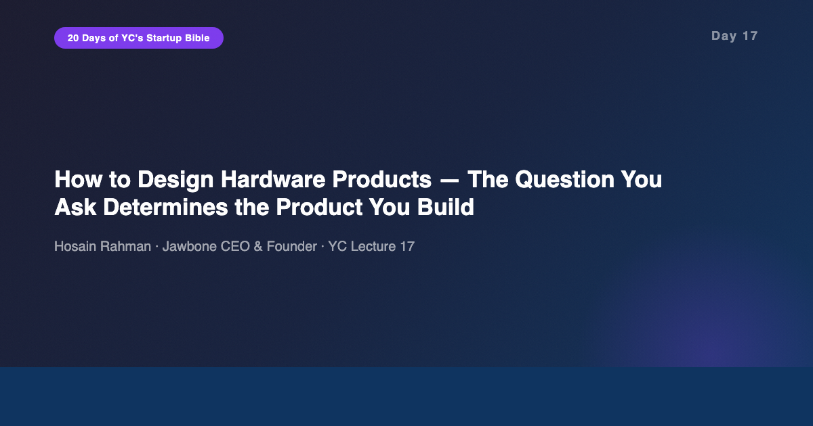
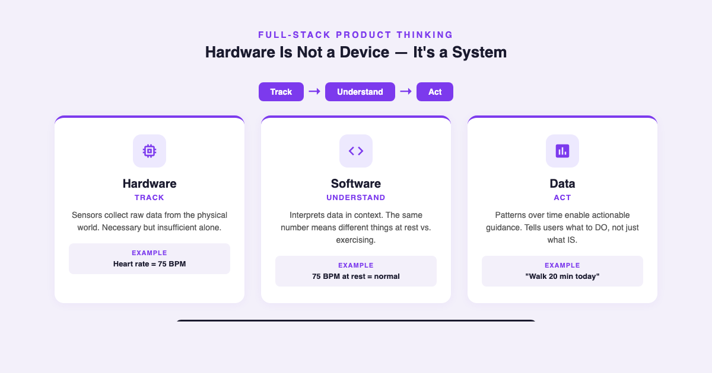
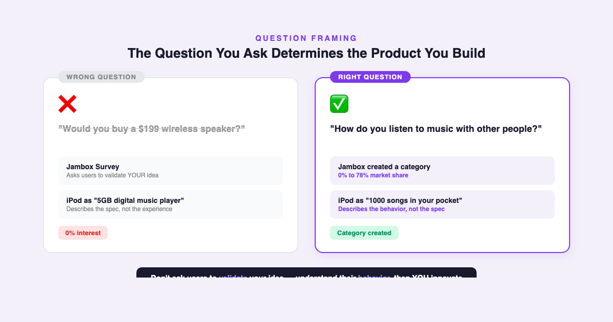

# YC's Startup Lesson #17: How to Design Hardware Products — The Question You Ask Determines the Product You Build

## Hosain Rahman on full-stack thinking, the WHYS framework, and why data without context is useless

---

This is Day 17 of my 20-day series breaking down YC's legendary startup lecture series. Today features Hosain Rahman — CEO and founder of Jawbone, the company behind the Jambox wireless speaker and the UP fitness tracker. I've spent 10+ years building data and AI products, I'm finishing my MBA at NYU Stern, and I guest lecture in CS. While I'm not a hardware engineer, Rahman's lecture contains principles that apply to every product discipline — especially the relationship between hardware, software, and data that defines modern product design.

Yesterday Emmett Shear told us WHO you interview matters more than what you ask. Today Rahman takes that a step further: HOW you frame the question determines the entire product you build. The same principle, applied at a different altitude.

---

## Hardware Is Not a Device — It's a System

Rahman opens with a statement that reframes the entire lecture: Jawbone is not a hardware company. It's an "experiences company."

This isn't marketing speak. It reflects a fundamental truth about modern product design: the device is the smallest part of the system. Hardware collects data. Software interprets it. And the combination delivers an experience that neither component could achieve alone.

Rahman uses the UP fitness tracker to illustrate: the band tracks your heart rate, sleep, and activity. That's hardware. But a heart rate of 75 — is that good or bad? It depends on whether you just woke up, finished a run, or are sitting in a meeting. The software adds context. The data layer understands patterns over time. And only the complete system — Track, Understand, Act — can tell you something useful.

This is the framework that stuck with me:

**Track** — Collect raw data from sensors. Heart rate, steps, sleep patterns. This is the hardware layer, and it's necessary but insufficient.

**Understand** — Interpret the data in context. 75 BPM at rest is normal. 75 BPM during exercise means you're barely working. The same number means completely different things depending on context. This is where software and machine learning live.

**Act** — Tell the user what to DO. Not just "here's your data," but "you should walk for 20 minutes" or "you should go to bed earlier tonight." This is where value is created, and most products never get here.

From my experience building data products, this resonates deeply. I've seen countless dashboards that track metrics beautifully but never tell anyone what to do about them. Data without context is trivia. Context without action is academic. The full stack — track, understand, act — is what separates a feature from a product.

---

## Reframe the Question, Reframe the Product

This is the insight that connects Day 17 to Day 16 and to the entire series.

Jawbone asked potential customers: "Would you buy a $199 wireless speaker?" The answer was essentially 0% interest. A perfectly reasonable survey question that produced perfectly useless data.

Then they reframed: "How do you listen to music with other people?" That question uncovered behavior — people wanted to share music socially, wanted portability, wanted something that sounded good without cables and complexity. From that behavioral understanding, they designed the Jambox. It created a category. Wireless speakers went from 0% to 78% market share.

The parallel to Apple is instructive. Steve Jobs didn't pitch the iPod as a "5GB digital music player." He pitched it as "1000 songs in your pocket." The technical specification describes the product. The behavioral framing describes the experience. The experience is what people buy.

This connects directly to what Emmett Shear taught yesterday about user interviews. Shear said: don't show your product during interviews — you'll pollute the data. Rahman goes further: don't even describe the product category. Ask about behavior. Ask about life. Ask "how do you do X?" not "would you use Y?"

In my MBA classes at Stern, we studied case after case of products that tested well in concept surveys and failed at launch. The reason is almost always the same: the survey asked people to evaluate a solution instead of revealing their behavior. The question frames the answer. Frame the question around your product, and you get validation theater. Frame it around their life, and you get insight.

---

## Constraints as Innovation Catalyst

Rahman makes a counterintuitive argument about constraints: they don't limit innovation — they drive it.

Hardware has brutal constraints. You can't ship a software update to fix a physical defect. Manufacturing timelines are measured in months. Every gram, every millimeter, every component adds cost. These constraints force a discipline that software teams rarely experience.

Jawbone's five-phase creation process reflects this discipline:

1. **Explore** — Wide-open ideation. What problems exist? What behaviors can we observe?
2. **Validate** — Is this a real problem for real people? (Using behavioral questions, not validation surveys.)
3. **Concept** — What could a solution look like? Multiple concepts, not a single idea.
4. **Program** — Define the full system: hardware specs, software requirements, data architecture.
5. **Develop** — Build, test, iterate within the constraints of physical manufacturing.

The key insight is that hardware slows software down, and software speeds hardware up. The hardware team forces the software team to be disciplined — you can't ship a half-baked feature when it has to work with a physical sensor. The software team forces the hardware team to think beyond the device — the experience extends far beyond what the physical product can do alone. This mutual tension produces better products than either discipline alone.

In my work building data platforms, I've seen a version of this dynamic between data infrastructure and product features. Infrastructure teams move slowly and demand rigor. Product teams move fast and demand flexibility. The tension is productive when both sides understand they're building a system, not just their component.

---

## The AI/Data Angle

Rahman's 2014 lecture is more relevant now than when he gave it, because the Track-Understand-Act framework is essentially the architecture of every modern AI product.

**Track = Data Collection.** Every AI system starts with data capture. Whether it's a fitness tracker collecting biometric signals or a language model processing text, the input layer matters. In my experience, 80% of AI product failures trace back to poor data collection — garbage in, garbage out is still the most reliable law in our field.

**Understand = Model + Context.** Rahman's point about heart rate context maps perfectly to what we now call contextual AI. A raw metric means nothing. A recommendation engine that doesn't account for user context is just a popularity contest. The models that win are the ones that understand context — time, location, history, intent. This is where the AI industry is moving, from raw capability to contextual intelligence.

**Act = Actionable Output.** This is where most AI products fail today. They show you data. They show you predictions. They show you probabilities. But they don't tell you what to DO. The jump from "here's what we predict" to "here's what you should do about it" is the gap between an AI feature and an AI product. From building chat-to-data systems, I know this firsthand — users don't want to see a chart, they want to know what the chart means for their next decision.

Rahman's insight about constraints also applies directly to AI product development. Model limitations — hallucination rates, latency, cost per query — are constraints that force product teams to be creative. The best AI products aren't the ones with the most powerful models. They're the ones that design experiences that work beautifully within model constraints, the same way Jawbone designed hardware that worked beautifully within physical constraints.

---

## What Surprised Me Most

What surprised me most was the continuity between yesterday's lecture and today's. Emmett Shear (software/platform) and Hosain Rahman (hardware/devices) arrived at the same fundamental principle from completely different directions: don't ask users to validate your idea. Understand their behavior, then innovate on their behalf.

The framing is different — Shear calls it "don't show your product," Rahman calls it "ask behavior, not validation" — but the principle is identical. Features are YOUR job. Understanding the user's life is where research should focus.

This is the insight the user community often misses about user research. It's not about asking people what they want. It's about understanding how they live, work, and struggle — then designing solutions they couldn't have articulated. Henry Ford's apocryphal quote about faster horses captures the spirit, but Rahman and Shear provide the actual methodology.

---

## Key Takeaways

- **Hardware is a system, not a device.** Hardware + software + data. The device is the smallest part of the value chain.
- **Track, Understand, Act.** Data alone is useless. Context makes it meaningful. Actionable guidance makes it valuable.
- **Reframe the question.** "Would you buy a $199 speaker?" gets 0% interest. "How do you listen to music with others?" creates a category.
- **Behavior, not validation.** Don't ask users to evaluate your product. Ask how they live. "1000 songs in your pocket" > "5GB digital music player."
- **Constraints drive innovation.** Physical limitations force simplification and refinement. Embrace them, don't fight them.
- **Hardware slows software, software speeds hardware.** The tension between disciplines produces better systems than either alone.
- **Five phases: Explore, Validate, Concept, Program, Develop.** A disciplined creation process that applies beyond hardware.

---

## What's Next

**Day 18:** Kirsty Nathoo and Carolynn Levy on Legal and Accounting Basics — the operational foundations that most founders ignore until it's too late.

And if you're following along with this series, [subscribe to my newsletter](https://substack.com/@jiazhenzhu) where I go deeper, with angles I don't publish on Medium.

---

## Resources

- **Video:** [YC Lecture 17 — How to Design Hardware Products](https://www.youtube.com/watch?v=F4K_qVlYQkg)
- **Transcript:** [Hosain Rahman Lecture 17 (Annotated) — Genius](https://genius.com/Hosain-rahman-lecture-17-how-to-build-products-users-love-part-ii-annotated)