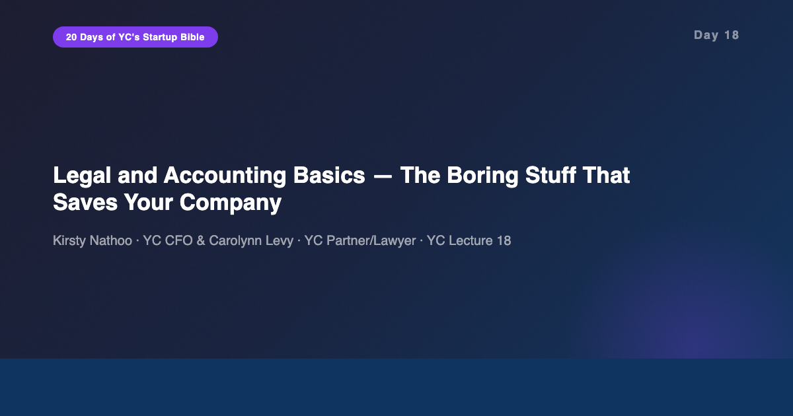
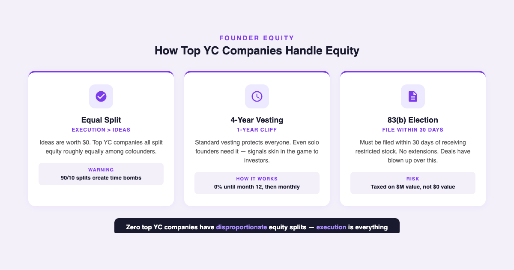
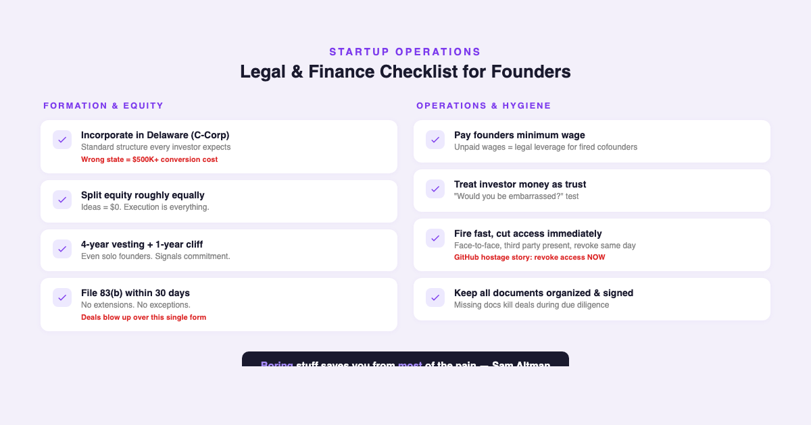

# YC's Startup Lesson #18: Legal and Accounting Basics — The Boring Stuff That Saves Your Company

## Kirsty Nathoo and Carolynn Levy on incorporation, equity splits, vesting, 83(b) elections, and why process protects the company

---

This is Day 18 of my 20-day series breaking down YC's legendary startup lecture series. Today features Kirsty Nathoo — YC's CFO — and Carolynn Levy — YC Partner and lawyer who created the SAFE note. I've spent 10+ years building data and AI products, I'm finishing my MBA at NYU Stern, and I guest lecture in CS. At Stern, we had entire courses on corporate finance and business law — and this single YC lecture covers the practical startup essentials more effectively than most of those syllabi.

Sam Altman introduces this lecture with a line that captures it perfectly: "This is the boring stuff that saves you from most of the pain." On Day 15, Ben Horowitz told us that process protects culture. Today, Nathoo and Levy show that legal and financial process protects the company itself.

---

## Incorporate in Delaware. Standard.

Nathoo opens with the simplest and most expensive mistake founders make: incorporating in the wrong state.

Delaware C-Corp. That's it. Not an LLC. Not your home state. Not a foreign entity. Delaware, because every investor, every acquirer, and every law firm understands Delaware corporate law. The legal infrastructure is mature. The case law is extensive. The process is predictable.

One YC company incorporated as an LLC in a different state and had to convert to a Delaware C-Corp before raising. The conversion cost them $500,000 in unexpected tax liability. Half a million dollars — not for building product, not for hiring, but for fixing a formation mistake.

The broader principle matters more than the specific advice: standardize wherever possible. Use standard documents (YC's SAFE, standard equity agreements). Use standard structures (Delaware C-Corp). Every deviation from standard creates friction during fundraising and due diligence. Investors have seen thousands of Delaware C-Corps. They haven't seen your creative LLC structure from Wyoming, and they don't want to pay their lawyers to figure it out.

From my MBA coursework at Stern, the corporate law classes spent weeks on the nuances of different entity types. In practice, for venture-backed startups, the answer is almost always the same: Delaware C-Corp, standard docs, don't get creative with legal structure.

---

## Equity, Vesting, and the 83(b) Trap

This section of the lecture is where real money gets lost — or saved.

**Equity splits: execution over ideas.** Levy makes the point bluntly: ideas are worth zero dollars. Among the top YC companies, not a single one has a disproportionate equity split. The founders who contributed the "idea" don't get more. Equity reflects the commitment to execute over the next 5-10 years, not who had the shower thought.

This resonates with what we heard on Day 1. Sam Altman said the idea is the starting point, not the value. Moskovitz showed that great execution on a mediocre idea beats mediocre execution on a great idea. Nathoo and Levy add the financial teeth: if you split equity 90/10 because "it was your idea," you've created a cofounder who has no real skin in the game and every incentive to leave.

**Standard vesting: 4 years, 1-year cliff.** This protects everyone. If a cofounder leaves after 6 months, they don't walk away with 25% of the company. They walk away with nothing (because the cliff hasn't hit). After the cliff, equity vests monthly. This is standard for a reason — it aligns incentives over the long haul.

Levy adds a counterintuitive point: solo founders need vesting too. Not because there's a cofounder to protect against, but because it signals skin in the game to investors and sets the cultural standard for every employee who follows.

**The 83(b) election — file it or lose it.** This is the single most important administrative task in early-stage startup life. When you receive restricted stock, the IRS lets you elect to be taxed on the current value (which is essentially zero for a new company) rather than the value when shares vest. But you MUST file within 30 days of receiving the stock. No extensions. No exceptions.

Levy has seen deals blow up because a founder didn't file their 83(b). An acquirer or investor discovers it during due diligence, and suddenly the tax liability is enormous — because the shares are now worth millions, and the founder is being taxed at vesting on millions rather than at grant on pennies.

---

## Money, Firing, and Document Hygiene

The second half of the lecture covers the operational realities that most founders learn the hard way.

**Pay yourselves.** Nathoo is emphatic: founders must pay themselves at least minimum wage. Not because you need the money (you probably do), but because unpaid wages become legal leverage. If you fire a cofounder who hasn't been paid, those unpaid wages become a claim against the company. Minimum wage removes that leverage entirely.

**Investor money is not your money.** Nathoo tells a story about a founder who took investor money to Vegas. The test she proposes is simple: "Would you be embarrassed if your investors saw this expense?" If yes, don't do it. Investor money is a loan of trust. Every dollar should move the company forward.

**Fire quickly and professionally.** This connects directly to Day 15. Horowitz said the most common CEO failure is not firing fast enough. Nathoo and Levy add the operational playbook: do it face-to-face, have a third party present, and cut access immediately. One YC company didn't revoke a fired engineer's GitHub access. The engineer held the codebase hostage. The legal and operational cleanup cost more than paying them severance would have.

**Keep documents organized and signed.** This sounds trivial until you're in the middle of fundraising or an acquisition. Due diligence requires every document — incorporation papers, equity agreements, IP assignments, employment contracts. Missing documents don't just slow the process; they can kill deals. The time to organize is now, when it's boring and easy — not later, when it's stressful and expensive.

---

## The AI/Data Angle

This 2014 lecture focuses on process and paperwork. In 2026, much of this is automated — and that's the opportunity.

**Formation and compliance tools have matured.** Clerky (built by a YC company, incidentally) automates Delaware incorporation, equity issuance, and 83(b) election filing. Gusto handles payroll and minimum-wage compliance. Carta manages cap tables and vesting schedules. The tools that didn't exist in 2014 now handle most of what Nathoo and Levy describe as manual, error-prone processes.

**AI is entering legal compliance.** In my experience building data platforms, I've seen how automation transforms operational processes. The next wave is AI-powered compliance tracking — systems that monitor filing deadlines, flag missing documents, and catch cap table discrepancies before they become due diligence failures. Tools like Harvey and CoCounsel are already applying LLMs to legal document review. For startups, the practical application is simpler: AI that reminds you to file your 83(b) within 30 days, alerts you when an employee contract is unsigned, or flags unusual expenses against your board-approved budget.

**The "boring stuff" scales differently with AI.** Nathoo's point about document hygiene — keep everything organized and signed — is fundamentally a data management problem. And data management is what AI does well. The startups that will have the cleanest due diligence processes in 2026 are the ones using AI to maintain their document trail from day one, not the ones scrambling to organize files the week before a Series A.

The meta-lesson connects to Day 15: process protects culture, and now technology protects process. The stack is culture > process > tools. Automate the bottom layer so founders can focus on the top.

---

## What Surprised Me Most

What surprised me most was how many catastrophic outcomes trace back to a single missed step. A $500K tax hit from wrong incorporation. A blown acquisition from an unfiled 83(b). A codebase held hostage from unrevoked access. A fired founder's unpaid wages becoming legal leverage.

None of these are product failures. None are market failures. They're administrative failures — the kind that feel too boring to prioritize when you're racing to build and ship. But the asymmetry is striking: the effort to do it right is minimal (file a form, revoke access, sign a document), while the cost of getting it wrong can be existential.

In my years building data products, I've seen the same pattern. The unglamorous work — data validation, access controls, audit trails — prevents the catastrophic failures. The teams that skip it because "we're moving fast" are the same teams that lose a week to a data breach or a compliance audit. Speed without hygiene is just technical debt with legal consequences.

---

## Key Takeaways

- **Incorporate in Delaware as a C-Corp.** Standard structure, standard docs, standard expectations. Every deviation costs money and time during fundraising.
- **Split equity roughly equally.** Ideas are worth $0. Execution is everything. No top YC company has a disproportionate split.
- **4-year vesting, 1-year cliff.** Protects everyone. Solo founders need it too — signals skin in the game.
- **File your 83(b) election within 30 days.** No extensions. Deals have blown up over this single form.
- **Know what you're signing.** Board seats, pro-rata rights, and information rights all matter. Read the documents.
- **Pay yourselves minimum wage.** Removes legal leverage from fired cofounders.
- **Investor money is not your money.** Apply the embarrassment test to every expense.
- **Fire quickly, cut access immediately.** Face-to-face, third party present, revoke everything same day.
- **Keep all documents organized and signed.** The time to organize is now, not during due diligence.

---

## What's Next

**Day 19:** Tyler Bosmeny, Michael Seibel, Dalton Caldwell, and Qasar Younis on Sales, Marketing, and How to Pitch — the outward-facing skills that complement today's inward-facing operational foundations.

And if you're following along with this series, [subscribe to my newsletter](https://substack.com/@jiazhenzhu) where I go deeper, with angles I don't publish on Medium.

---

## Resources

- **Video:** [YC Lecture 18 — Legal and Accounting Basics](https://www.youtube.com/watch?v=EHzvmyMJEK4)
- **Transcript:** [Kirsty Nathoo Lecture 18 (Annotated) — Genius](https://genius.com/Kirsty-nathoo-lecture-18-mechanics-legal-finance-hr-etc-annotated)