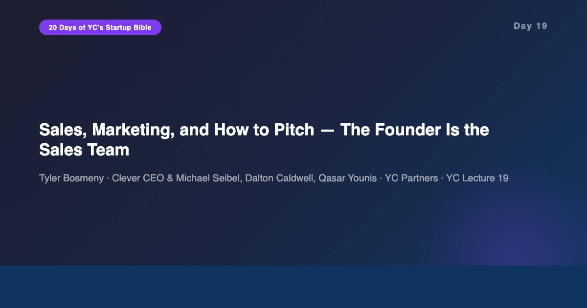
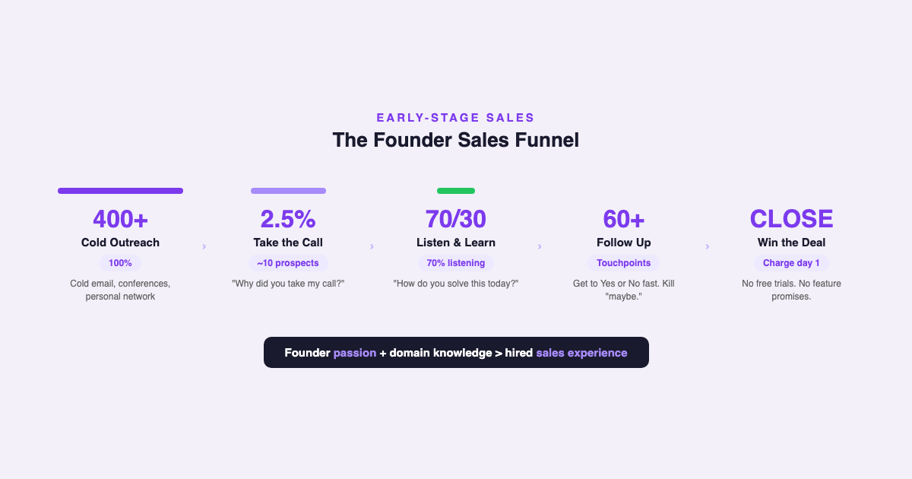
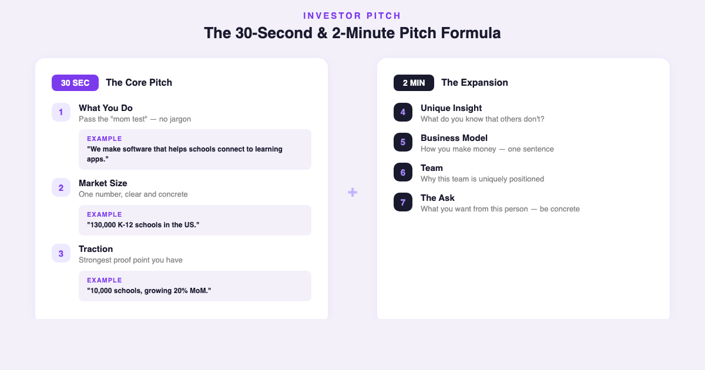

# YC's Startup Lesson #19: Sales, Marketing, and How to Pitch — The Founder Is the Sales Team

## Tyler Bosmeny, Michael Seibel, Dalton Caldwell, and Qasar Younis on why founders sell best, the numbers game of early sales, and a pitch formula that works in 30 seconds

---

This is Day 19 of my 20-day series breaking down YC's legendary startup lecture series. Today features Tyler Bosmeny — CEO of Clever, which became the dominant platform connecting schools to learning apps — alongside YC partners Michael Seibel, Dalton Caldwell, and Qasar Younis. I've spent 10+ years building data and AI products, I'm finishing my MBA at NYU Stern, and I guest lecture in CS. Stern's marketing and sales strategy courses teach frameworks and theory. This YC lecture teaches what actually happens when you pick up the phone with zero brand recognition and try to get strangers to buy something.

On Day 18, Nathoo and Levy showed us the internal operational hygiene that protects a company. Today, Bosmeny and the YC partners cover the outward-facing skill that keeps a company alive: selling. And the central thesis is deceptively simple — the founder is the best salesperson the company will ever have.

---

## The Founder IS Sales

Bosmeny opens with a point that most technical founders resist: you cannot outsource sales in the early days. The founder sells better than any hire because the founder has two things no salesperson can replicate — genuine passion for the problem and deep domain knowledge.

This isn't motivational advice. It's structural. When a founder walks into a room and explains the problem, prospects can feel the difference between someone who built the product because they care and someone reading from a script. Early customers aren't buying the product — they're buying the founder's conviction.

In my own experience building data products, the deals that closed fastest were always the ones where I could speak the customer's language. When I was building chat-to-data products, the demo wasn't about features. It was about showing a data analyst that I understood exactly which SQL query they were sick of writing every Monday morning. That's domain knowledge, and no sales hire can fake it in month one.

The practical reality is even more pointed: only 2.5% of cold outreach converts to a conversation. Bosmeny contacted over 400 school districts in his first two months at Clever. That's the Rogers diffusion curve in action — you're looking for the innovators, the 2.5% who are willing to try something new from someone they've never heard of. Your job is to make the numbers work: cold emails, conferences, personal network, warm intros. Volume matters.

---

## Shut Up and Listen — The 70/30 Rule

The most counterintuitive sales lesson in this lecture: top salespeople talk only 30% of the time. The other 70% is listening.

Bosmeny's framework for sales calls is almost comically simple:

1. **"Why did you take my call?"** — This tells you what pain they're already feeling. If they took the call, something is broken in their current process.
2. **"How do you solve this problem today?"** — This tells you what you're replacing and what the switching cost looks like.

That's it. Two questions. Then you listen.

From my MBA classes at Stern, the marketing professors teach frameworks like SPIN Selling and Challenger Sale. Those frameworks are useful at scale. But at the earliest stage, the framework is simpler: ask the right question, then close your mouth. The prospect will tell you exactly what they need, what they'll pay for, and what objections you'll face — if you let them talk.

This connects directly to Day 4. Adora Cheung told us that talking to users is the most important thing a founder does. Bosmeny is saying the same thing, but in the sales context: the sales call IS a user interview. Every call is data. The founders who treat sales as "pitching" miss the insight. The founders who treat sales as "listening" close the deal AND improve the product.

---

## Follow-Up Is Not Harassment — It's Confidence

Here's where most founders fail: the follow-up. Bosmeny reveals that his team ran 60+ touchpoints for a single enterprise deal. Sixty. Not six. Not sixteen. Sixty.

The reframing that matters: persistent follow-up isn't desperation. It's confidence in your product. If you genuinely believe your product solves a real problem for this person, following up is doing them a favor. The moment you feel embarrassed about following up is the moment you should question whether you believe in what you're building.

The killer insight: "Maybe" is what kills you. A "no" is fine — you move on, you save time, you allocate resources elsewhere. A "yes" is obviously great. But "maybe" — "let me think about it," "circle back next quarter," "interesting, let's revisit" — that's where startups die. Bosmeny's rule: get to Yes or No as fast as possible. Every "maybe" is a resource drain.

And there are three specific traps to avoid:

- **"One more feature" requests.** A prospect says "If you just add X, we'll buy." Almost never converts. They're either not your customer or they're using feature requests to avoid saying no.
- **Free trials.** You give away your product hoping they'll convert. You get no revenue, no commitment, and no real feedback. Charge from day one.
- **Contract quibbling.** Extended negotiations over terms are often a sign the prospect isn't serious. The right early customers want your product badly enough that the contract is a formality.

---

## The 30-Second Pitch Formula

The second half of the lecture shifts to pitching investors, and Seibel delivers a formula so clean it should be tattooed on every founder's arm.

**The 30-second pitch is exactly three sentences:**

1. **What you do** — in language your mother would understand. No jargon. No "AI-powered blockchain-enabled platform." Plain English. "We make software that helps schools connect to learning apps."
2. **How big the market is** — one number. "There are 130,000 K-12 schools in the US."
3. **How much traction you have** — the strongest proof point you've got. "We're in 10,000 schools and growing 20% month over month."

That's your 30-second pitch. Three sentences. If you can't do this, you don't understand your own business well enough.

**The 2-minute expansion adds four elements:**

4. **Your unique insight** — what do you know that others don't? This is Peter Thiel's "secret" from Day 5.
5. **Business model** — how you make money. One sentence.
6. **Team** — why this team is uniquely positioned. One sentence.
7. **The ask** — what you want from this specific person. Be concrete.

The elegance of this framework is that it's modular. The 30-second version works for elevator encounters, conference hallways, and the first 30 seconds of any investor meeting. The 2-minute version works for warm introductions and pitch competitions. They build on each other.

---

## Fundraise from Strength, Not Desperation

The final section covers fundraising tactics, and the core principle is timing: fundraise when you're strong.

Seibel's advice: schedule all your investor meetings in the same one-to-two week window. This creates natural urgency without you having to manufacture it. When investors know other investors are looking at the same deal in the same timeframe, the dynamic shifts from "convince me" to "don't miss this."

The signal you're sending matters as much as the pitch. If you're taking meetings sporadically over three months, the signal is: "I'm struggling to raise." If you're compressing meetings into one intense week, the signal is: "I'm building a company and carving out time for fundraising." One signals desperation. The other signals momentum.

And the meta-lesson — one that connects to nearly every lecture in this series: fundraising is not success. Raising money is not a milestone. Shipping product, acquiring customers, and generating revenue are milestones. Money is a resource that enables milestones. Founders who celebrate raising money the way they should celebrate product-market fit have their priorities inverted.

---

## The AI/Data Angle

This 2014 lecture focuses on manual, high-touch sales and in-person pitching. In 2026, the tools have changed — but the principles haven't, and that's the interesting tension.

**AI has transformed the volume game.** Bosmeny's 400 cold emails in two months was heroic manual effort. In 2026, tools like Apollo, Instantly, and AI-powered outbound platforms can generate personalized outreach at 10x that scale. But here's what I've learned building data products: volume without signal is spam. The AI advantage isn't sending more emails. It's using AI to identify which 2.5% of prospects are most likely to be innovators — using intent data, technographic signals, and behavioral patterns to find the people who already have the problem you solve.

**The 70/30 listening rule scales with AI.** In my experience building chat-to-data products, I've seen how conversation intelligence tools (Gong, Chorus) can analyze thousands of sales calls and quantify the talk-to-listen ratio. The data consistently confirms Bosmeny's intuition: reps who listen more close more. AI doesn't replace the listening — it measures it, surfaces patterns, and coaches at scale.

**The 30-second pitch is more important than ever.** In an era of shrinking attention spans and AI-generated noise, the ability to explain what you do in three sentences is a competitive advantage. I've sat through hundreds of startup pitches in MBA settings and AI meetups. The ones that land are always the ones that pass the "mom test" — clear, simple, jargon-free. AI can help you practice and refine your pitch, but the clarity has to come from genuine understanding of your own business.

**Fundraising signals are now digital.** In 2014, signals of strength were word-of-mouth and in-person meetings. In 2026, your LinkedIn presence, your public content, your GitHub activity — these are all investor signal channels. Building in public, which is what this 20-day series is partially about, creates ambient credibility that compounds over time. When you walk into a pitch meeting and the investor has already seen your writing, the conversation starts from a fundamentally different place.

---

## What Surprised Me Most

What surprised me most was how directly this lecture applies beyond startups. The principle that "the founder is the best salesperson" translates to any context where you're building something new — a consulting practice, a research lab, a team within a large company, even an academic course.

I teach CS as a guest lecturer. Every time I stand in front of a class, I'm selling — selling the idea that this material matters, that investing attention will pay off. The students who engage most are the ones where I connected the material to their specific problems. That's Bosmeny's "Why did you take my call?" in an academic context.

And the follow-up principle hit close to home. Building a professional brand through content — this series, my LinkedIn posts, my Medium articles — is a form of follow-up. It's showing up consistently, demonstrating conviction, providing value. It's not "content marketing." It's the same thing Bosmeny describes: repeated, genuine touchpoints that build trust over time. The 60-touchpoint sales cycle is the same as the 20-day content series. The mechanism is the same: persistent presence backed by genuine belief.

---

## Key Takeaways

- **The founder is the sales team.** Passion and domain knowledge beat sales experience in the early days. Don't hire a salesperson — be the salesperson.
- **Only 2.5% will take your call.** It's a numbers game. Bosmeny contacted 400+ prospects in 2 months. Volume is non-negotiable.
- **Talk 30%, listen 70%.** Ask "Why did you take my call?" and "How do you solve this today?" — then shut up.
- **Follow-up is confidence, not desperation.** 60+ touchpoints per deal. "Maybe" is what kills you. Get to Yes or No fast.
- **Avoid three traps:** "One more feature" requests (rarely convert), free trials (you get nothing), and contract quibbling (sign of a non-serious buyer).
- **30-second pitch = 3 sentences:** What you do (mom test), market size, traction. That's it.
- **2-minute pitch adds:** Unique insight, business model, team, the ask.
- **Fundraise from strength.** Compress meetings into one week. Signal momentum, not desperation.
- **Fundraising is not success.** Product, customers, revenue — those are milestones. Money is a resource.

---

## What's Next

**Day 20:** Sam Altman returns for Closing Thoughts — the FINAL lecture in the series. We'll come full circle from Day 1, with Altman's reflections on what matters most after 19 lectures of startup wisdom.

And if you've been following along with this series, [subscribe to my newsletter](https://substack.com/@jiazhenzhu) where I go deeper, with angles I don't publish on Medium.

---

## Resources

- **Video:** [YC Lecture 19 — Sales, Marketing, How to Pitch](https://www.youtube.com/watch?v=SHAh6WKBgiE)
- **Transcript:** [Tyler Bosmeny Lecture 19 (Annotated) — Genius](https://genius.com/Tyler-bosmeny-lecture-19-sales-and-marketing-how-to-pitch-and-investor-meeting-roleplaying-annotated)