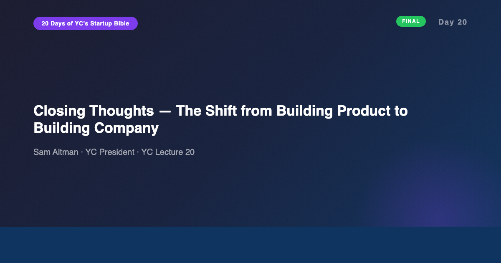
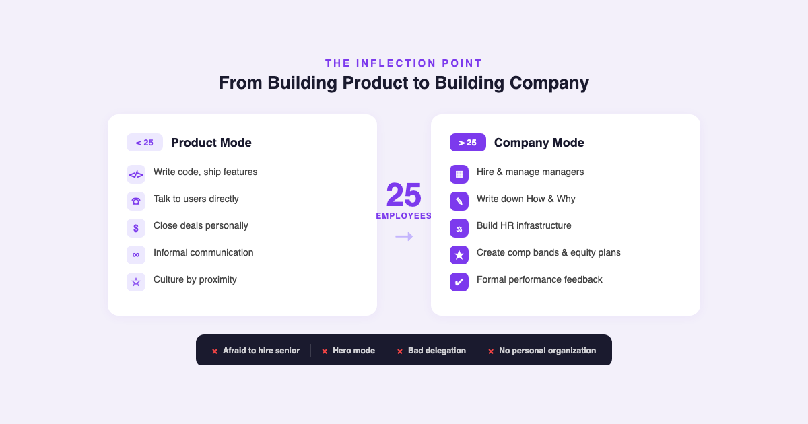
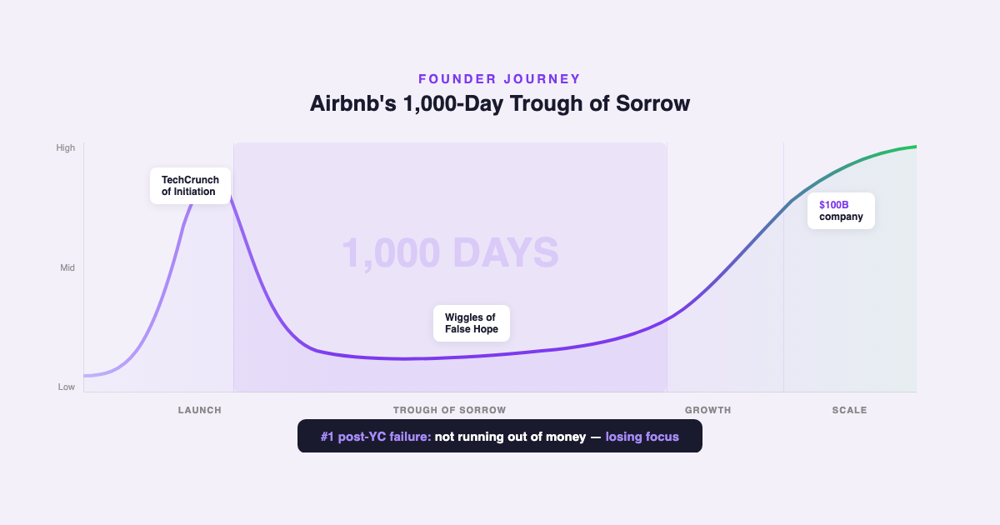

# YC's Startup Lesson #20: Closing Thoughts — The Shift from Building Product to Building Company

## Sam Altman on the 25-employee inflection point, founder psychology, the 1000-day trough of sorrow, and why you should never hire a professional CEO

---

This is Day 20 — the FINAL day of my 20-day series breaking down YC's legendary startup lecture series. Today Sam Altman returns, the same person who opened Lecture 1 with "why you should start a startup." I've spent 10+ years building data and AI products, I'm finishing my MBA at NYU Stern, and I guest lecture in CS. Twenty lectures later, the circle closes: Altman started by telling us what makes a great idea. He ends by telling us what happens to the founder after the idea works.

On Day 19, Bosmeny and the YC partners taught us how to sell and pitch — the outward-facing skills that keep a company alive. Today, Altman turns inward. This lecture is not about product, market, or strategy. It is about the founder — the human being who has to survive the transition from maker to manager, from builder to leader, from the person who does everything to the person who ensures everything gets done.

---

## The 25-Employee Inflection Point

Altman opens with a number: 25. That is the threshold where everything changes.

Below 25 employees, the founder is the product. They write code, talk to users, close deals, fix bugs. The management structure is simple because it barely exists — everyone reports to the founder, communication is informal, and culture propagates by proximity.

At 25, the founder's job transforms. You stop building the product and start building the company. You hire managers. You create processes. You write down the How and the Why — because if you don't, someone else will, and their version won't match yours.

Altman identifies four management failures that kill companies at this stage:

1. **Afraid to hire senior people.** Founders who were employee #1 sometimes resist bringing in experienced executives because it feels like admitting they can't do it all. But the skills that got you to 25 are not the skills that get you to 250.

2. **Hero mode.** The founder who still does everything themselves — pulling all-nighters to fix bugs, personally handling every customer escalation — creates a bottleneck and signals to the team that their contributions don't matter.

3. **Bad delegation.** Handing off tasks without context, checking in too frequently, or not checking in at all. Delegation is a skill, not a handoff.

4. **No personal organization.** At 25+ employees, a founder without a system for tracking commitments, priorities, and communications will drown. The chaos that felt scrappy at 5 people feels dysfunctional at 25.

This resonated deeply. In my decade building data products, I've watched this transition happen at multiple companies. The pattern is always the same: the founder who built the product resists the shift to building the company, keeps pulling themselves back into technical work, and eventually becomes the bottleneck they were trying to avoid. The best founders I've worked with made the shift deliberately — not because they wanted to, but because they understood the company needed them to.

---

## Productivity, Alignment, and the "10 Employees" Test

Here is the insight from this lecture that I keep coming back to: **productivity declines with the square of employees.**

Double the team from 5 to 10, and you don't lose 2x productivity to coordination overhead — you lose 4x. The math is brutal. Every new person adds communication channels, alignment meetings, and decision-making complexity. The company that felt fast at 10 people feels slow at 40 — not because the people are worse, but because the coordination cost is exponential.

Altman's solution is alignment. Not the corporate-speak version of "alignment" — the real, operational kind. Does every person in the company know what the top three priorities are? Can any employee explain why the company exists and what it's building toward?

He proposes a test: pull any 10 employees aside and ask them what the company's top three priorities are. If they can't all give you the same answer, your organization has an alignment problem — and alignment problems compound with every hire.

This is why writing down the How and the Why matters. Not as a corporate exercise. As a scaling tool. At 5 people, the founder can communicate priorities through daily conversation. At 50, conversation doesn't scale. The written word does.

---

## HR as a Strategic Function

This section surprised me. Altman — known for product vision and big-picture thinking — spends significant time on HR mechanics. The message is clear: HR is not overhead. It is infrastructure.

**Performance feedback.** Not annual reviews — continuous feedback loops. The founders who say "we don't do formal reviews, we just talk" are the same founders whose employees have no idea where they stand. Ambiguity about performance is more demoralizing than negative feedback.

**Compensation bands.** Standardized salary ranges for each role and level. Without them, compensation becomes a negotiation game where the best negotiators get paid the most — regardless of performance. Bands create fairness and reduce the political maneuvering that Horowitz warned about in Day 15.

**Continuous equity grants.** Altman advocates for refresher equity grants of 3-5% per year for top performers. The standard 4-year vesting schedule means that by year 3, your best people are halfway to fully vested and getting recruited. Refresher grants keep the golden handcuffs refreshed — and more importantly, they signal that the company values ongoing contribution, not just the decision to join.

From my MBA classes at Stern, the organizational behavior courses spend entire modules on equity compensation design. The academic frameworks are sophisticated. Altman's version is simpler and more actionable: pay people fairly, give them equity that vests continuously, and tell them how they're doing. The companies that get this right retain talent. The ones that don't lose their best people to competitors who do.

---

## Founder Psychology and the Trough of Sorrow

This is the section that will stay with me long after this series ends.

Altman shares Airbnb's journey: 1,000 days in the "trough of sorrow" — the phase after launch where nothing seems to work, growth is flat, and the emotional weight of the journey accumulates. One thousand days. Almost three years.

And the data point that reframes everything: **the #1 reason companies fail after YC is not running out of money, not building the wrong product, not getting outcompeted. It is the founder losing focus.** Distraction kills more startups than failure does.

The distractions Altman warns about are specific:

- **M&A conversations.** When a larger company expresses acquisition interest, founders spend weeks or months in discussions that almost never close — and even when they do, the distraction of the process has already damaged the company. Altman's advice is blunt: avoid M&A conversations entirely unless you're genuinely ready to sell.

- **PR and conference circuits.** Founders who spend more time speaking at events than building product. The dopamine hit of being on stage is addictive and completely uncorrelated with company progress.

- **Hiring a professional CEO.** Altman's strongest advice in the entire lecture: never do this. The professional CEO doesn't have the founder's vision, context, or emotional investment. Every successful YC company that tried this regretted it. The founder must become the CEO the company needs — not outsource the role.

And the prescription for founder psychology: **take vacations.** Not performative "I took a weekend off" vacations. Real vacations. Altman argues that founder burnout is not a productivity problem — it is a judgment problem. A burned-out founder makes worse decisions, and those decisions compound. The vacation is not a luxury. It is a recalibration tool.

---

## PR, BD, and Owning Your Narrative

Altman's advice on public relations and business development rounds out the operational picture.

**PR:** Own your messaging. Know journalists personally — not through a PR firm, but directly. The founders who have relationships with 3-5 key journalists in their space can shape their narrative proactively. The ones who outsource PR to agencies get generic coverage at best and misrepresentation at worst.

**Business development:** Altman distills BD into four elements:
1. **Personal connection.** BD deals happen between people, not companies. The human relationship precedes the business relationship.
2. **Competitive dynamics.** Use the existence of alternatives to create urgency. Not dishonestly — but awareness of competition accelerates decision-making.
3. **Persistence.** Like Bosmeny's 60-touchpoint sales cycle from Day 19 — BD requires showing up repeatedly.
4. **Ask.** Make a specific, concrete request. "We should work together sometime" is not an ask. "Can we run a 30-day pilot with your enterprise team starting March 1?" is an ask.

---

## The AI/Data Angle

Altman gave this lecture in 2014, before leading the company that would build GPT-4. The irony is thick. But the advice is more relevant, not less, in the AI era — because AI compresses every timeline he describes.

**The 25-employee inflection now hits earlier.** In 2026, a team of 10 people with the right AI tools produces the output of a 2014 team of 40. The shift from product to company doesn't wait for headcount to reach 25 — it happens when organizational complexity reaches a threshold, and AI accelerates the arrival of that complexity. I've seen teams of 8 that already need formal management structures because their AI-powered output generates enough customer relationships, product surface area, and operational demands to overwhelm informal communication.

**Productivity decline with AI is different.** The square-of-employees productivity loss assumes human-to-human coordination overhead. AI collaboration tools — shared context windows, automated standup summaries, AI-generated documentation — reduce coordination cost per employee. But they introduce a new cost: alignment verification. When AI generates outputs, someone needs to verify those outputs align with company direction. The alignment problem Altman describes doesn't go away with AI. It transforms.

**Founder psychology in the AI era is harder.** The tools are so powerful that execution speed is no longer the bottleneck. Judgment is. A founder with access to AI can prototype, test, and ship faster than ever. But deciding WHAT to build — maintaining focus when the capability set is infinite — requires more discipline, not less. The trough of sorrow may be shorter in calendar time, but it is steeper in intensity because the pace of everything has accelerated.

**"Write down the How and Why" is now AI-critical.** Altman says if you don't write it down, someone else will. In the AI era, the "someone else" might be an LLM that ingests your Slack messages and generates its own interpretation of your company's priorities. Documentation isn't just a management tool — it is the training data for every AI system your company uses. The quality of your written strategy directly determines the quality of AI-assisted decisions throughout the organization.

---

## What Surprised Me Most

What surprised me most, across the full 20-day arc, is how little the core advice has changed. The 2014 lectures could be given today with minimal edits. Ideas still need to be something the founder genuinely needs. Products still need to be loved, not liked. Teams still need alignment around a small number of priorities. Culture still needs to be intentional. Management still requires seeing decisions through everyone's eyes. Sales still starts with listening. And the founder's psychology still determines the company's ceiling.

The tools have changed. The timelines have compressed. The technology is unrecognizable. But the human dynamics — the messy, difficult, deeply personal work of building something from nothing with other people — those haven't moved an inch.

Altman closes with a line that captures the entire course: the journey is long, but it's doable. Airbnb spent 1,000 days in the trough. Then they became a $100 billion company. The distance between those two states is not talent, luck, or timing. It is the founder's refusal to lose focus.

---

## Key Takeaways

- **25 employees = the shift.** From building product to building company. Simple management structure becomes mandatory.
- **Four management failures:** afraid to hire senior people, hero mode, bad delegation, no personal organization.
- **Productivity declines with the square of employees.** Alignment is the only counterforce. Use the "10 employees" test.
- **Write down the How and Why.** If you don't define your culture and priorities, someone else will — and their version won't match yours.
- **HR is infrastructure.** Performance feedback, comp bands, continuous equity (3-5%/year refreshers). Retain talent or lose it.
- **Founder psychology is the ceiling.** Losing focus is the #1 post-YC failure mode. Take real vacations. Protect your judgment.
- **Never hire a professional CEO.** Become the CEO the company needs. Every founder who outsourced this role regretted it.
- **Avoid M&A conversations.** The distraction alone is lethal. Only engage if you're genuinely ready to sell.
- **Airbnb's 1000-day trough of sorrow.** The journey is brutally long. But it's doable.

---

## Series Reflection

Twenty days. Twenty lectures. Twenty articles. And the full arc is clear.

Day 1 started with ideas. Day 20 ends with the founder. The entire course — from Altman's opening to his closing — is a story about a person transforming: from someone with an idea, to someone who builds a product, to someone who builds a team, to someone who builds a company, to someone who sustains a company through the years it takes to win.

The lectures don't teach you how to start a startup. They teach you how to become the person who can.

---

## Thank You

If you've been reading along with this series — whether from Day 1 or just a few entries — thank you. This project started as a personal exercise: revisiting foundational startup thinking against a decade of building data and AI products. It became something bigger. The intersection of 2014 wisdom and 2026 reality produced insights I didn't expect, and the discipline of writing about them daily sharpened my own thinking in ways I couldn't have predicted.

I've spent 20 days studying these lectures. If you're working through your own startup idea — at any stage, in any industry — and want to talk it through, I'm here. Practitioner to practitioner. [Book a time on my Calendly].

And if you want to go deeper, with angles I don't publish on Medium, [subscribe to my newsletter](https://substack.com/@jiazhenzhu). The final Week 4 compilation is coming — covering the full arc from user interviews to closing thoughts, with exclusive content on what changed in my thinking across all 20 days.

---

## Resources

- **Video:** [YC Lecture 20 — Closing Thoughts and Later Stage Advice](https://www.youtube.com/watch?v=59ZQ-rf6iIc)
- **Transcript:** [Sam Altman Lecture 20 (Annotated) — Genius](https://genius.com/Sam-altman-lecture-20-closing-thoughts-and-later-stage-advice-annotated)